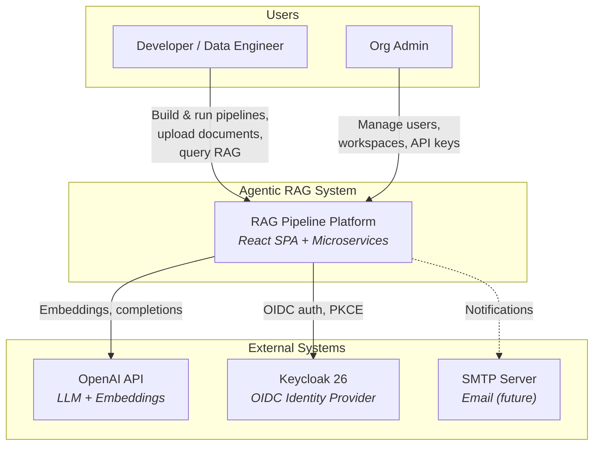

# 1. System Context

## Overview

The Agentic RAG System is a multi-tenant platform that allows teams to build, configure, and execute Retrieval Augmented Generation (RAG) pipelines through a visual editor. It supports document ingestion, chunking, embedding, retrieval, and LLM-based generation — all orchestrated through composable pipeline components.

## System Context Diagram (C4 Level 1)

## Stakeholders

| Role | Responsibilities | Interaction |
|------|-----------------|-------------|
| **Developer / Data Engineer** | Builds RAG pipelines, uploads documents, queries the system | Frontend visual editor, API |
| **Org Admin** | Manages organization, users, workspaces, API keys, reviews audit logs | Admin panels in frontend |
| **Platform Operator** | Deploys and monitors infrastructure | Docker Compose, Traefik dashboard |

## External Dependencies

| System | Purpose | Protocol | Required |
|--------|---------|----------|----------|
| OpenAI API | LLM completions (`gpt-4o-mini`) and embeddings (`text-embedding-3-small`) | HTTPS REST | Yes |
| Keycloak 26 | OIDC identity provider with PKCE, realm roles, user federation | HTTPS | Yes |
| PostgreSQL 16 | Primary relational data store (auth + pipeline schemas) | TCP (asyncpg) | Yes |
| Redis 7 | Caching, rate limiting, job queue (DB 0: auth, DB 1: ingestion) | TCP | Yes |
| Neo4j 5 | Knowledge graph storage (entities, relations, subgraphs) | Bolt (7687) | Yes |
| MinIO | S3-compatible object storage for uploaded documents | HTTP (9000) | Yes |
| OpenSearch 2.17 | Full-text + hybrid (BM25 + vector) search | HTTP (9200) | Yes |
| Qdrant v1.13 | Dedicated vector database for embeddings | HTTP (6333) | Yes |
| SMTP | Email notifications and invitations | SMTP/TLS | Future |

## Quality Attributes

| Attribute | Target | Approach |
|-----------|--------|----------|
| **Multi-tenancy** | Complete data isolation between orgs | Org/workspace-scoped queries, RBAC |
| **Extensibility** | New pipeline components without core changes | Component registry with plugin pattern |
| **Observability** | Request tracing, audit trail | Request IDs, comprehensive audit logs |
| **Security** | Enterprise-grade auth | JWT + refresh tokens, rate limiting, ForwardAuth |
| **Developer Experience** | Visual pipeline building | XYFlow editor, Monaco config editor, real-time job streaming |
