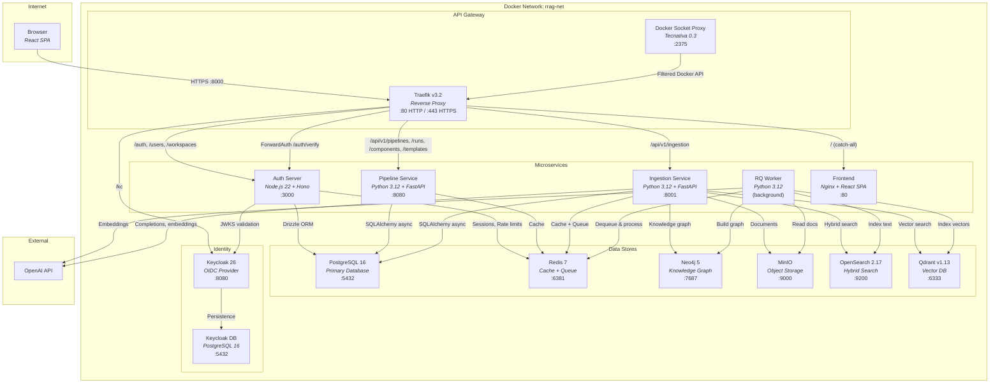
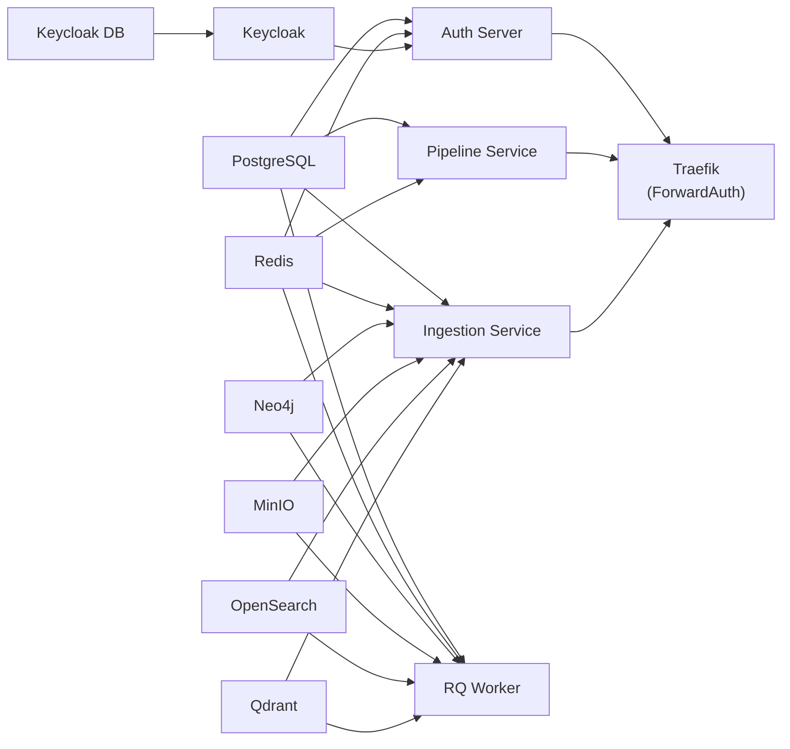

# 2. Container Architecture

## Container Diagram (C4 Level 2)

## Service Descriptions

### Traefik (API Gateway)

- **Image**: `traefik:v3.2`
- **Role**: Reverse proxy, request routing, TLS termination, ForwardAuth middleware
- **Configuration**: `rrag-auth-server/traefik/traefik.yml` and the `rrag-auth-server/traefik/dynamic/` config directory
- **Key Feature**: ForwardAuth middleware calls `/auth/verify` on the auth server before forwarding requests to protected services. Injects `X-Auth-*` headers (including `X-Auth-Platform-Admin`) for downstream consumption.
- **Docker API**: In production, Traefik connects to the Docker API via a filtered proxy (Tecnativa docker-socket-proxy) instead of the raw Docker socket.
- **TLS**: Let's Encrypt certificates via ACME HTTP-01 challenge; self-signed fallback for staging.

### Docker Socket Proxy

- **Image**: `tecnativa/docker-socket-proxy:0.3`
- **Role**: Read-only, filtered proxy for the Docker Engine API. Limits exposed endpoints to CONTAINERS and NETWORKS only (no POST, no SERVICES).
- **Security**: Prevents Traefik from having direct access to the full Docker daemon API, mitigating container escape risks.

### Auth Server

- **Stack**: Node.js 22 + Hono 4.6 + Drizzle ORM + PostgreSQL + Redis
- **Responsibilities**: Keycloak JWT validation (JWKS, dual-issuer), user auto-provisioning from KC claims, RBAC with platform admin, team/workspace management, API key auth, audit logging
- **Database**: Owns 12 PostgreSQL tables (organizations, users, teams, team_members, workspaces, workspace_members, sessions, api_keys, audit_logs, sso_configs, user_invitations, workspace_access_grants)
- **Dockerfile**: Multi-stage build, runs Drizzle migrations on startup

### Pipeline Service

- **Stack**: Python 3.12 + FastAPI + SQLAlchemy 2.0 (async) + asyncpg
- **Responsibilities**: Visual pipeline CRUD, version management, pipeline execution, component registry (ADR-0016), **composite-component framework** (ADR-0026 — `@component`/`@step` decorators, AST scanner, MinIO-backed `ComponentLoader`), **admin component management with append-only versioning** (ADR-0030), template library, SSE per-step run streaming (ADR-0017)
- **Database**: Owns 6 PostgreSQL tables (pipelines, pipeline_versions, pipeline_runs, components, pipeline_templates, component_versions)
- **Cache**: Redis cache-aside layer for read-heavy paths (TTL 60s–300s); component cache invalidated on upload
- **Dockerfile**: Uses `uv` for dependency management, runs Alembic migrations on startup

### Ingestion Service

- **Stack**: Python 3.12 + FastAPI + SQLAlchemy 2.0 (async) + asyncpg + Redis (RQ) + MinIO + Qdrant + OpenSearch + Neo4j
- **Responsibilities**: Document upload/storage, ingestion pipeline execution, chunking, embedding, RAG querying, SSE job streaming, chat with tool-calling, knowledge-base management (ADR-0028), published API-key endpoints (ADR-0029)
- **Database**: Owns 5 PostgreSQL tables (documents, datastores/knowledge_bases, jobs, query_pipelines, published_endpoints) — migrated from Redis for durability (ADR-0023)
- **Storage**: MinIO for document files, **Qdrant** for vector similarity (live), **OpenSearch** for BM25/hybrid (provisioned but no shipped pipeline writes to it yet — see ADR-0009 Implementation Status), Neo4j for knowledge graphs
- **LLM access**: Unified via `services/llm_service.py` (LiteLLM) — switches between OpenAI / vLLM / Ollama via `LLM_PROVIDER` (ADR-0027)
- **Cache**: Redis cache-aside layer for read-heavy paths (TTL 30s–300s); conversations and live job progress remain in Redis
- **Dockerfile**: Includes build dependencies for PDF/doc parsing libraries, installs `.[docker]` extras

### RQ Worker

- **Stack**: Same image as Ingestion Service
- **Command**: `rq worker --with-scheduler -u {REDIS_URL} ingestion`
- **Role**: Processes async ingestion jobs from the Redis queue
- **Health Check**: Redis ping

### Frontend

- **Stack**: React 19 + TypeScript + Vite 7 + Tailwind CSS 4 + XYFlow + Monaco Editor
- **Deployment**: Multi-stage Docker build (Node build -> Nginx serve)
- **Routing**: Nginx SPA fallback — all routes serve `index.html` for client-side routing
- **State**: Zustand for auth and pipeline editor state

### PostgreSQL

- **Image**: `postgres:16-alpine`
- **Volume**: `pgdata` (persistent)
- **Shared by**: Auth server (Drizzle), Pipeline service (SQLAlchemy/Alembic), and Ingestion service (SQLAlchemy `create_all`)
- **Note**: All three services manage their own tables via independent migration tools (Drizzle Kit, Alembic, SQLAlchemy metadata)

### Redis

- **Image**: `redis:7-alpine`
- **Volume**: `redisdata` (persistent)
- **DB 0**: Auth server (sessions, rate limiting, token blacklist, entity cache) + Pipeline service (entity cache)
- **DB 1**: Ingestion service (job queue, live progress, conversations, entity cache)
- **Note**: Production requires authentication via `--requirepass`.

### Neo4j

- **Image**: `neo4j:5-community`
- **Volume**: `neo4jdata` (persistent)
- **Plugins**: APOC
- **Auth**: Configured via `NEO4J_AUTH` environment variable (no hardcoded defaults).
- **Ports**: 7474 (browser), 7687 (Bolt)
- **Used by**: Ingestion service + RQ worker for knowledge graph storage

### MinIO (Object Storage)

- **Image**: `minio/minio:latest`
- **Volumes**: `minio_data` (persistent)
- **Credentials**: `minioadmin/minioadmin` (configurable)
- **Ports**: 9000 (API), 9001 (console)
- **Bucket**: `rrag-documents` (auto-created on service startup)
- **Used by**: Ingestion service for document file storage

### OpenSearch

- **Image**: `opensearchproject/opensearch:2.17.0`
- **Volume**: `opensearch_data` (persistent)
- **Ports**: 9200 (HTTP)
- **Security**: Enabled in production (admin password required); disabled in development via overlay.
- **Used by**: Ingestion service — BM25 + kNN-hybrid retriever code (`opensearch_indexer.py`, `opensearch_retriever.py`) is implemented but **not yet referenced by any shipped pipeline YAML**. Live vector retrieval today is via Qdrant; OpenSearch is provisioned for the future mutual-index / BM25-hybrid path (ADR-0009, ADR-0010).

### Qdrant

- **Image**: `qdrant/qdrant:v1.13.2`
- **Volume**: `qdrant_data` (persistent)
- **Ports**: 6333 (HTTP), 6334 (gRPC)
- **Auth**: API key authentication enabled via `QDRANT__SERVICE__API_KEY` environment variable.
- **Used by**: Ingestion service for dedicated vector similarity search

### Keycloak

- **Image**: `quay.io/keycloak/keycloak:26.0`
- **Command**: `start --import-realm`
- **Ports**: 8180 (mapped to internal 8080)
- **Database**: Separate PostgreSQL (`rrag-keycloak-db`)
- **Realm**: `rrag` (auto-imported from `keycloak/rrag-realm.json`)
- **Clients**: `rrag-frontend` (public, PKCE), `rrag-backend` (confidential)
- **Theme**: Custom `rrag` theme mounted from `keycloak/themes/rrag/` (login pages with branded CSS/JS)
- **Note**: Development uses `start-dev` via the dev overlay.

## Startup Dependencies

All services wait for their data store health checks before starting (Docker Compose `depends_on` with `condition: service_healthy`).

## Volume Map

| Volume | Mount Path | Service | Purpose |
|--------|-----------|---------|---------|
| `pgdata` | `/var/lib/postgresql/data` | PostgreSQL | Application database files |
| `redisdata` | `/data` | Redis | RDB/AOF persistence |
| `neo4jdata` | `/data` | Neo4j | Knowledge graph data |
| `ingestion_data` | `/data/documents` | Ingestion + RQ Worker | Local document cache |
| `configs_data` | `/app/configs` | Ingestion + RQ Worker | Pipeline YAML configs |
| `keycloak_pgdata` | `/var/lib/postgresql/data` | Keycloak DB | Keycloak database persistence |
| `minio_data` | `/data` | MinIO | Object storage for documents |
| `opensearch_data` | `/usr/share/opensearch/data` | OpenSearch | Search index data |
| `qdrant_data` | `/qdrant/storage` | Qdrant | Vector index storage |

## Network

All 15 containers communicate over the `rrag-net` Docker bridge network using container names as hostnames (e.g., `postgres`, `redis`, `auth-server`, `minio`, `opensearch`, `qdrant`).

## Container Hardening

All containers run with `read_only: true`, `security_opt: [no-new-privileges:true]`, and `cap_drop: [ALL]` in production. Development overlay relaxes `read_only` for convenience.
