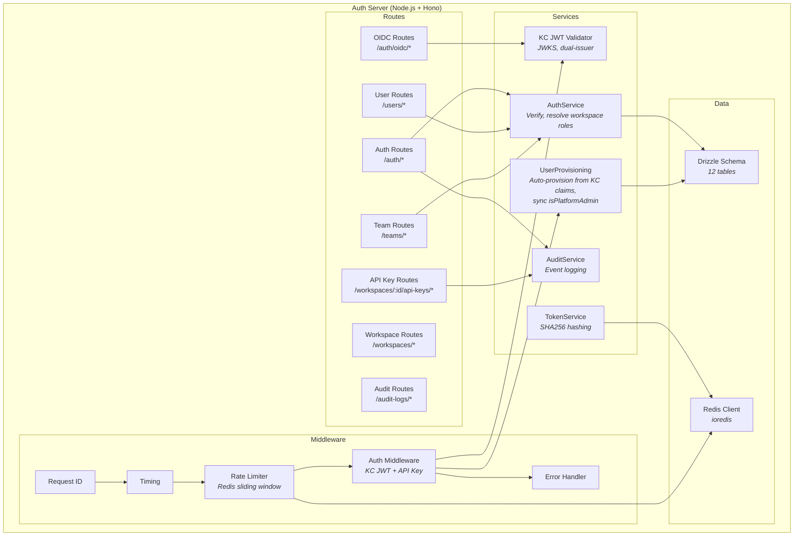
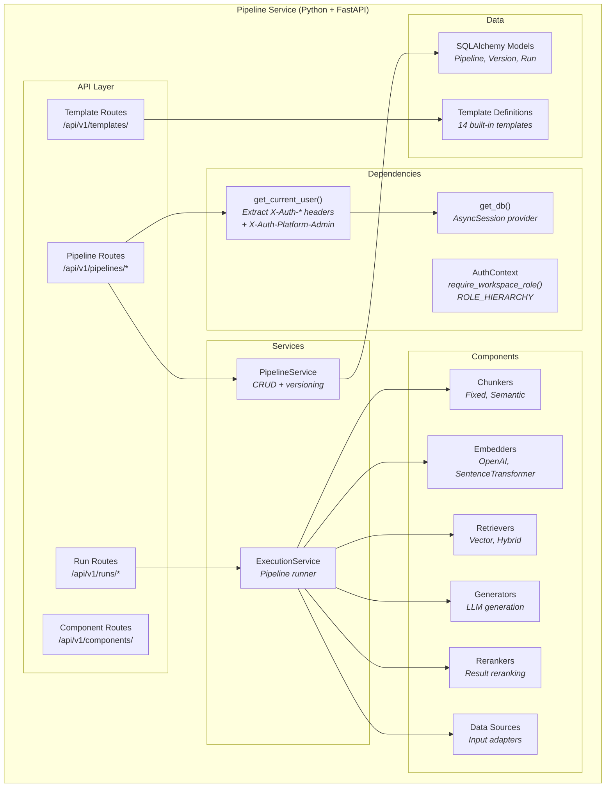
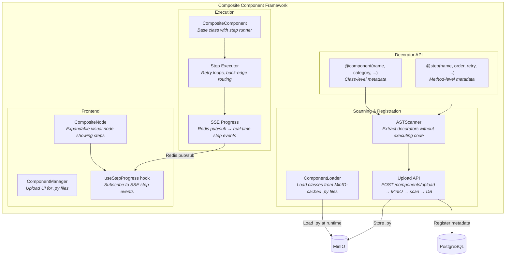
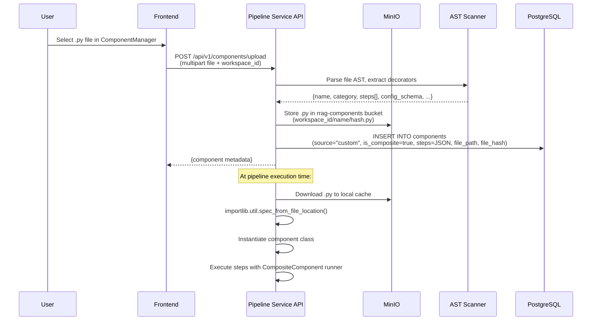
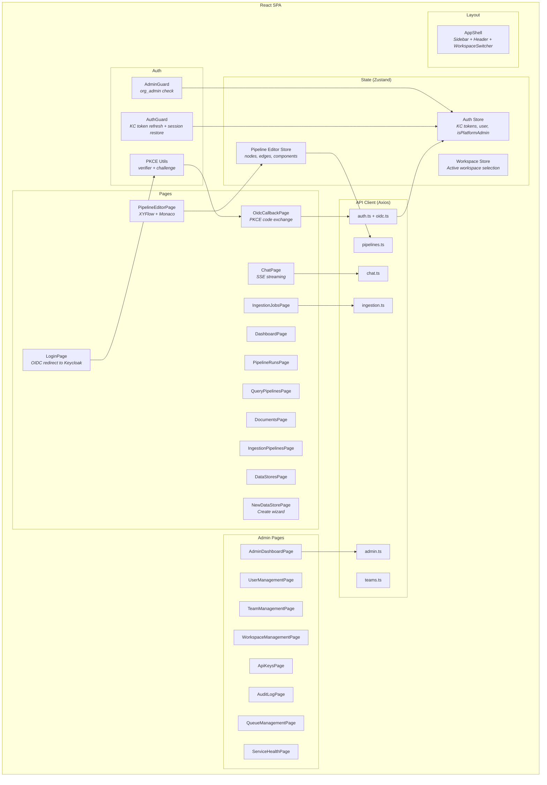

# 3. Component Architecture

## Auth Server Components (C4 Level 3)



### Middleware Stack (execution order)

1. **Inject DB/Redis** — Sets `db` and `redis` on request context
2. **CORS** — Allow all origins (configurable), expose rate limit headers
3. **Request ID** — Generates unique ID, sets `X-Request-ID` header
4. **Timing** — Tracks response time, sets `X-Process-Time` header
5. **Rate Limiter** — Redis sorted-set sliding window; three tiers (unauthenticated/authenticated/API key)
6. **Auth** — Validates Keycloak JWT (JWKS, dual-issuer) or X-API-Key, auto-provisions user via `resolveOrProvision()`, populates `AuthContext` with `isPlatformAdmin`
7. **Error Handler** — Catches errors, returns standardized JSON responses

### Key Services

| Service | Responsibility |
|---------|---------------|
| `UserProvisioning` | Auto-provision users from Keycloak claims (create org + user + personal workspace), sync `isPlatformAdmin` on every auth |
| `AuthService` | Verify endpoints, resolve workspace roles (direct + personal + team-derived), build AuthContext |
| `KC JWT Validator` | JWKS-based RS256 signature verification with dual-issuer support (internal Docker URL + public proxy URL) |
| `TokenService` | SHA256 token hashing for API keys and refresh tokens |
| `AuditService` | Writes audit events to `audit_logs` table with full context |

---

## Pipeline Service Components (C4 Level 3)



### Pipeline Component System

All components inherit from `BaseComponent`:

```python
class BaseComponent(ABC):
    async def execute(self, input_data: dict, config: dict) -> dict: ...
```

| Category | Count | Examples |
|----------|-------|---------|
| **Agents** | 9 | query_router, reflection_agent, deep_rag_agent, adaptive_retrieval_controller, rag_evaluator, self_cognition_gate |
| **Chunkers** | 8 | recursive_chunker, semantic_chunker, token_chunker, proposition_chunker, hierarchical_chunker, document_structure_chunker |
| **Embedders** | 9 | openai_embedder, sentence_transformer, bge_m3, multimodal_embedder |
| **Extractors** | 4 | entity_extractor, schema_free_extractor, subquery_decomposer |
| **Generators** | 3 | llm_generator, speculative_generator, vision_generator |
| **Graph Builders** | 2 | lightrag_graph_builder, kag_subgraph_builder |
| **Indexers** | 2 | faiss_indexer, milvus_indexer |
| **Parsers** | 3 | file_loader, multi_parser, web_scraper |
| **Planners** | 3 | corag_planner, mcts_planner, kag_planner |
| **Rerankers** | 5 | cross_encoder_reranker, cohere_reranker, llm_listwise_reranker, context_compressor |
| **Retrievers** | 7 | dense_retriever, hybrid_retriever, graph_retriever, streaming_retriever, table_retriever |
| **Storage** | 3 | kv_store, vector_store, graph_store |
| **Total** | **58** | — |

### Composite Component Framework

In addition to atomic components (single `execute()` method), the system supports **composite components** — multi-step components that encapsulate an entire sub-pipeline within a single node. This enables complex patterns like LightRAG ingestion/retrieval and agentic RAG loops to be packaged as reusable, self-contained units.

#### Architecture Overview



#### Decorator API

Composite components are defined using two decorators that attach metadata to Python classes and methods:

```python
from rrag_pipeline.decorators import component, step

@component(
    name="lightrag_ingestion",
    category="composite",
    description="LightRAG 5-step ingestion pipeline",
    config_schema={"chunk_size": {"type": "integer", "default": 1200}},
)
class LightRAGIngestion(CompositeComponent):

    @step(name="chunk", order=1, retry=2)
    async def chunk_documents(self, input_data, config):
        ...

    @step(name="extract_entities", order=2, retry=1)
    async def extract_entities(self, input_data, config):
        ...

    @step(name="merge_graph", order=3)
    async def merge_graph(self, input_data, config):
        ...

    @step(name="store_graph", order=4)
    async def store_graph(self, input_data, config):
        ...

    @step(name="store_vectors", order=5)
    async def store_vectors(self, input_data, config):
        ...
```

The `@component` decorator captures class-level metadata (name, category, description, config schema, input/output ports). The `@step` decorator captures method-level metadata (step name, execution order, retry count, optional routing back-edges).

#### AST Scanner

The AST scanner extracts decorator metadata **without executing user code**. It parses the `.py` file into an abstract syntax tree and walks the tree to find `@component` and `@step` decorators, extracting their keyword arguments as static metadata.

This approach is critical for security: user-uploaded component files are never imported or executed during the registration phase. Only the decorator metadata is read.

**Limitations:** The scanner can only extract literal values (strings, numbers, dicts, lists) from decorator arguments. Dynamic expressions or variable references in decorator arguments are not captured.

#### CompositeComponent Base Class

All composite components inherit from `CompositeComponent`, which provides:

- **Step discovery** — Reads `@step`-annotated methods and sorts them by `order`
- **Step execution loop** — Runs steps sequentially, passing output of one step as input to the next
- **Retry logic** — Retries failed steps up to the configured `retry` count with exponential backoff
- **Back-edge routing** — Steps can declare routing targets (e.g., "go back to step 2"), enabling loops such as agentic evaluate-and-retry cycles
- **SSE progress publishing** — After each step completes, publishes a progress event to Redis pub/sub

#### Component Upload and Loading



The `ComponentLoader` caches downloaded `.py` files locally and uses `file_hash` to detect changes. Files are only re-downloaded when the hash changes.

#### SSE Step Progress

During composite component execution, each step completion publishes a progress event:

```
Channel: rrag:run:{run_id}:steps
Event data: {"step": "extract_entities", "order": 2, "total": 5, "status": "completed", "duration_ms": 1230}
```

The frontend `useStepProgress` hook subscribes to the SSE endpoint `GET /api/v1/pipelines/{id}/runs/{run_id}/stream` and updates the `CompositeNode` UI in real time, showing which step is active, completed, or failed.

#### Concrete Composite Components

| Component | Category | Steps | Back-edges | Description |
|-----------|----------|-------|------------|-------------|
| **LightRAG Ingestion** | ingestion | 5 (chunk, extract, merge, store graph, store vectors) | None | Full LightRAG ingestion: chunking, entity extraction, graph merge, dual storage |
| **LightRAG Retrieval** | retrieval | 5 (keywords, graph search, vector search, assemble, generate) | assemble → keywords (on low confidence) | Dual-mode retrieval with keyword extraction, graph + vector search, assembly, and generation |
| **Agentic RAG Retrieval** | retrieval | 6 (analyze, plan, execute tools, assemble evidence, evaluate & decide, generate) | evaluate → plan (agent loop) | Agent-driven retrieval with tool execution, evidence assembly, and iterative refinement loop |

#### Frontend: Expandable CompositeNode

Composite components render as expandable nodes in the pipeline editor canvas. When collapsed, they appear as a single node with a step count badge. When expanded, they reveal their internal steps with status indicators:

- **Idle** — Step has not started (gray)
- **Running** — Step is currently executing (blue, animated)
- **Completed** — Step finished successfully (green, with duration)
- **Failed** — Step encountered an error (red, with error message)
- **Retrying** — Step failed and is being retried (amber)

The `ComponentManager` page provides a UI for uploading custom `.py` component files, viewing registered custom components, and deleting them.

### Built-in Templates (23)

| Template | Description |
|----------|-------------|
| `vanilla_rag` | Basic retrieve-and-generate pipeline |
| `rag_with_reranker` | RAG with result reranking step |
| `knowledge_graph` | Graph-based retrieval |
| `agentic_rag` | Agent-driven multi-step RAG |
| `kag_three_layer` | Three-layer knowledge augmented generation |
| `deep_research` | Multi-hop research pipeline |
| `e2e_vanilla_rag` | End-to-end vanilla RAG with ingestion |
| `e2e_hybrid_search` | End-to-end with hybrid (vector + BM25) search |
| `e2e_graphrag` | End-to-end graph RAG |
| `e2e_agentic_rag` | End-to-end agentic RAG |
| `parent_child_chunking` | Hierarchical chunking strategy |
| `multimodal_ingestion` | Multi-format document ingestion |
| `corrective_rag` | RAG with self-correction loop |
| `self_rag` | Self-reflective RAG |
| `deep_rag_reasoning` | Deep reasoning with iterative retrieval |
| `speculative_rag` | Speculative generation with parallel drafts |
| `adaptive_retrieval` | Complexity-based adaptive retrieval routing |
| `streaming_rag` | Real-time streaming RAG pipeline |
| `table_qa` | Table-aware question answering |
| `vision_rag` | Vision-augmented RAG for image+text |
| `mcts_deep_research` | Monte Carlo tree search research pipeline |
| `contextual_ingestion` | Context-enriched document ingestion |
| `proposition_ingestion` | Proposition-based chunking ingestion |

---

## Ingestion Service Components (C4 Level 3)

```mermaid
graph TB
    subgraph "Ingestion Service (Python + FastAPI)"
        subgraph "API Layer"
            DocAPI["Document Routes<br/>/api/v1/ingestion/documents/*"]
            JobAPI["Job Routes<br/>/api/v1/ingestion/jobs/*"]
            QueryAPI["Query Routes<br/>/api/v1/ingestion/query/*"]
            ChatAPI["Chat Routes<br/>/api/v1/ingestion/chat/*"]
            PipeAPI["Pipeline Routes<br/>/api/v1/ingestion/pipelines/*"]
            DSAPI["DataStore Routes<br/>/api/v1/ingestion/datastores/*"]
            QPAPI["QueryPipeline Routes<br/>/api/v1/ingestion/query-pipelines/*"]
            CompRegAPI["Component Routes<br/>/api/v1/ingestion/components/*"]
            AdminAPI["Admin Routes<br/>/api/v1/ingestion/admin/*"]
        end

        subgraph "Dependencies"
            IngAuthDep["get_current_user()<br/><i>AuthContext from X-Auth-*</i>"]
            IngRBAC["AuthContext<br/><i>require_workspace_role()<br/>ROLE_HIERARCHY</i>"]
        end

        subgraph "Core"
            Registry["ComponentRegistry<br/><i>Auto-discovery</i>"]
            Queue["Queue System<br/><i>RQ + Redis</i>"]
            PipeEngine["PipelineEngine<br/><i>Step execution</i>"]
            FAISS["FAISS Index<br/><i>Vector search</i>"]
        end

        subgraph "Services"
            QPStore["QueryPipelineStore<br/><i>PostgreSQL CRUD (workspace-scoped)</i>"]
            QueryExec["QueryExecutor<br/><i>Retrieve + rerank + generate</i>"]
            LLMSvc["LLM Service<br/><i>OpenAI, function-calling</i>"]
        end

        subgraph "Cache"
            CacheLayer["Cache-Aside Layer<br/><i>Redis TTL 30s–300s<br/>rrag:ing:{entity}:{ws_id}:{id}</i>"]
        end

        subgraph "SSE"
            JobStream["Job Stream<br/><i>GET /jobs/stream</i>"]
            QueryStream["Query Stream<br/><i>POST /query/stream</i>"]
            ChatStream["Chat Stream<br/><i>POST /chat/stream</i>"]
        end

        subgraph "Storage"
            PGStore["PostgreSQL<br/><i>documents, datastores,<br/>jobs, query_pipelines</i>"]
            RedisStore["Redis<br/><i>Queue, live progress,<br/>conversations</i>"]
            MinIOStore["MinIO<br/><i>S3 bucket: rrag-documents</i>"]
            QdrantStore["Qdrant<br/><i>Vector collections</i>"]
            OSStore["OpenSearch<br/><i>Hybrid search indexes</i>"]
            Neo4jStore["Neo4j<br/><i>Knowledge graph</i>"]
        end
    end

    subgraph "RQ Worker (separate container)"
        Worker["Worker Process<br/><i>Dequeue & execute</i>"]
    end

    IngAuthDep --> IngRBAC
    DocAPI --> IngRBAC
    JobAPI --> IngRBAC
    ChatAPI --> IngRBAC
    AdminAPI --> IngRBAC
    DocAPI --> MinIOStore & PGStore
    JobAPI --> Queue
    QueryAPI --> QueryExec
    ChatAPI --> LLMSvc --> QueryExec
    QPAPI --> QPStore
    DSAPI --> PGStore
    QPStore --> PGStore
    Queue --> RedisStore
    PGStore -.->|"cache-aside"| CacheLayer
    Worker --> PGStore & Neo4jStore & QdrantStore & OSStore & MinIOStore
    Worker -->|"Process pipeline"| PipeEngine --> Registry
    JobStream -.->|"SSE"| RedisStore
    QueryStream -.->|"SSE tokens"| QueryAPI
    ChatStream -.->|"SSE tokens"| ChatAPI
```



### Real-time Features

| Feature | Mechanism | Endpoint |
|---------|-----------|----------|
| Job monitoring | SSE (polling Redis every 2s) | `GET /api/v1/ingestion/jobs/stream?workspace_id=` |
| Streaming query | SSE with token-by-token LLM output | `POST /api/v1/ingestion/query/stream?workspace_id=` |
| Streaming chat | SSE with LLM tool-calling + token streaming | `POST /api/v1/ingestion/chat/stream?workspace_id=` |
| Conversation | Multi-turn with conversation_id tracking | `GET /chat/conversations/{id}?workspace_id=` |

---

## Frontend Components (C4 Level 3)



### Route Structure

```
/login                  → LoginPage (public, OIDC redirect)
/oidc/callback          → OidcCallbackPage (public, PKCE exchange)
/                       → DashboardPage (protected)
/chat                   → ChatPage (protected)
/query-pipelines        → QueryPipelinesPage (protected)
/query-pipelines/:id/edit → PipelineEditorPage (protected)
/pipelines/:id/edit     → PipelineEditorPage (protected)
/pipelines/:id/runs     → PipelineRunsPage (protected)
/ingestion/documents    → DocumentsPage (protected)
/ingestion/pipelines    → IngestionPipelinesPage (protected)
/ingestion/jobs         → IngestionJobsPage (protected)
/ingestion/jobs/:id     → IngestionJobDetailPage (protected)
/ingestion/datastores   → DataStoresPage (protected)
/ingestion/datastores/new → NewDataStorePage (protected)
/admin                  → AdminDashboardPage (admin only)
/admin/users            → UserManagementPage (admin only)
/admin/teams            → TeamManagementPage (admin only)
/admin/workspaces       → WorkspaceManagementPage (admin only)
/admin/api-keys         → ApiKeysPage (admin only)
/admin/audit-logs       → AuditLogPage (admin only)
/admin/queues           → QueueManagementPage (admin only)
/admin/health           → ServiceHealthPage (admin only)
/admin/settings         → SystemSettingsPage (admin only)
```

Protected routes are wrapped in `AuthGuard` + `AppShell` layout.
Admin routes add `AdminGuard` (checks `orgRole === 'org_admin'`).
