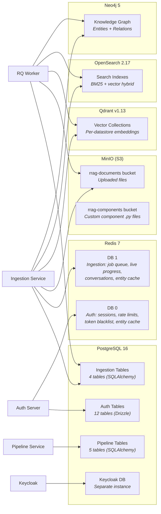
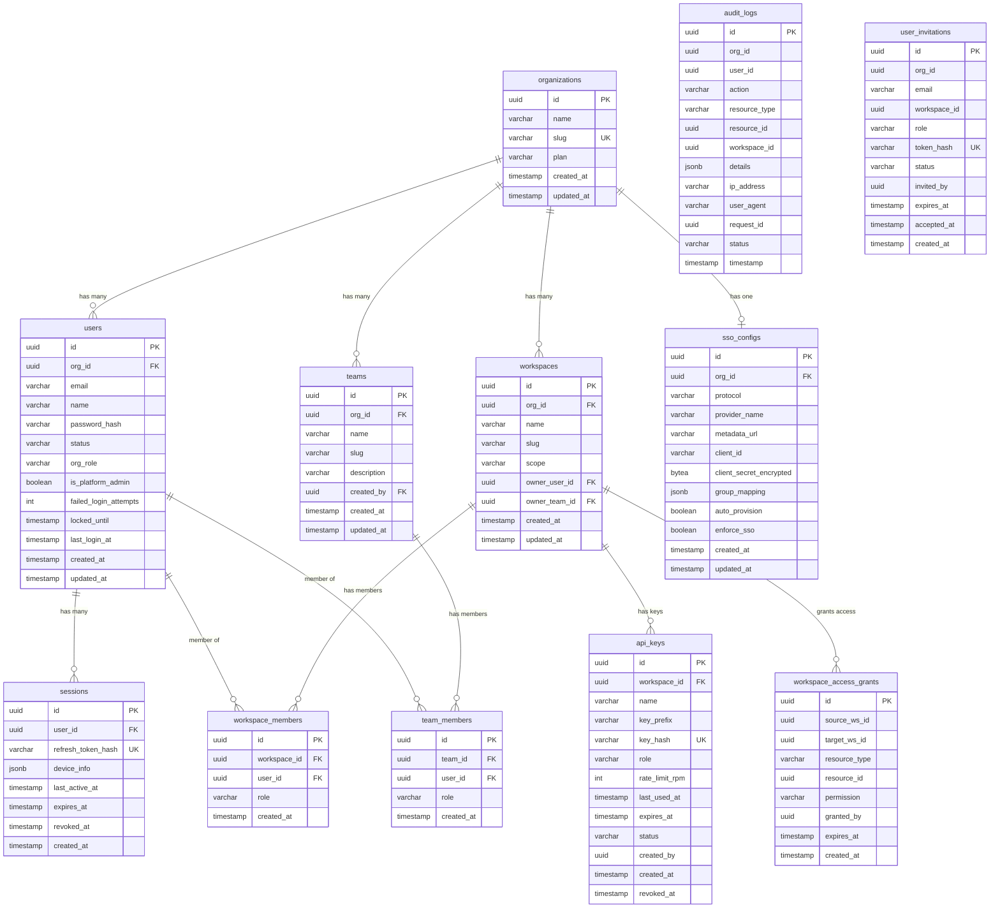
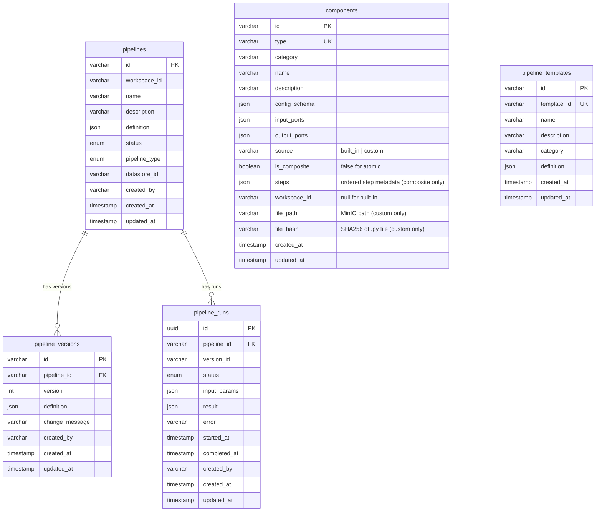
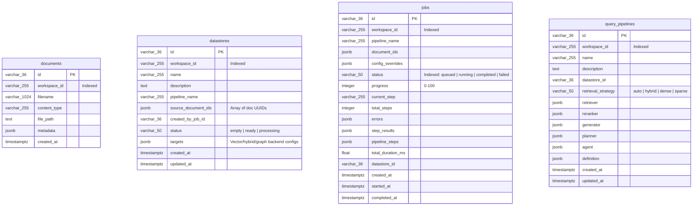
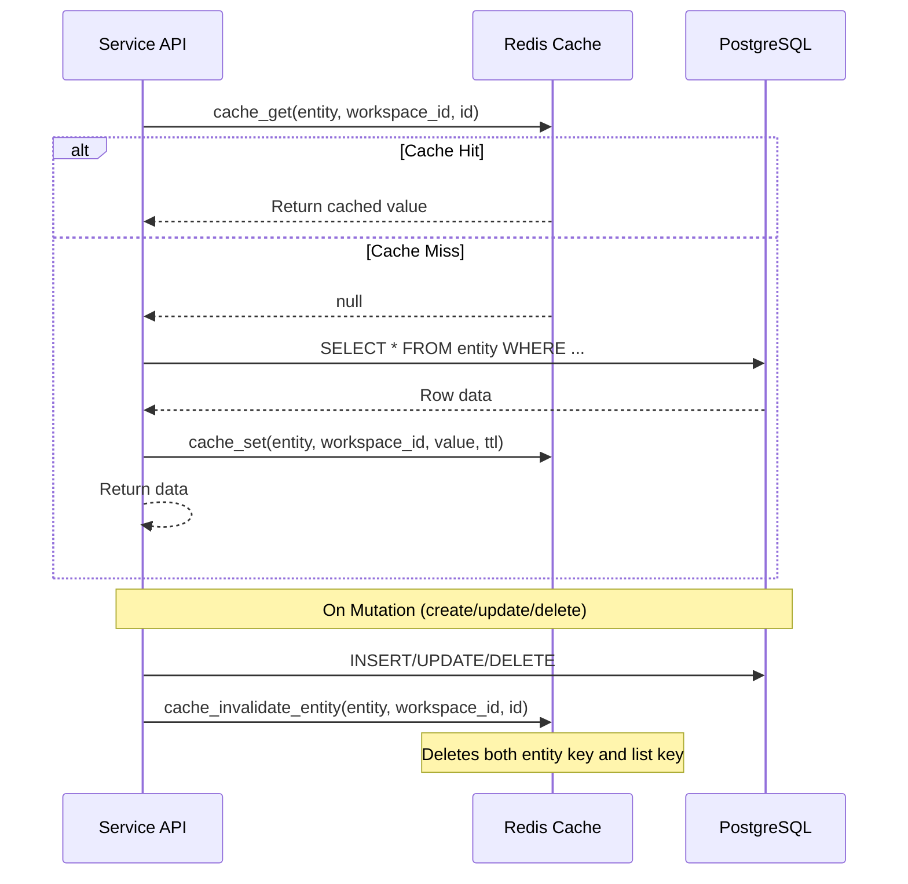
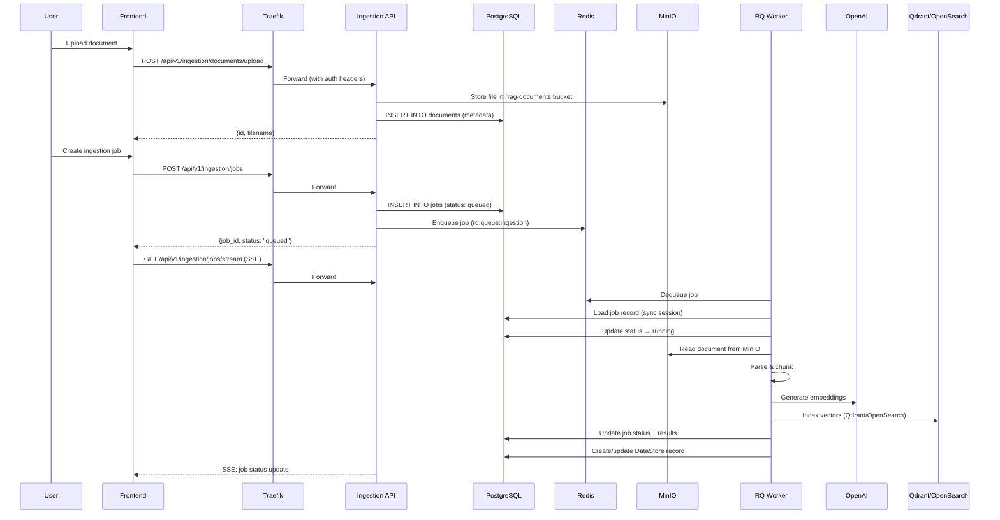
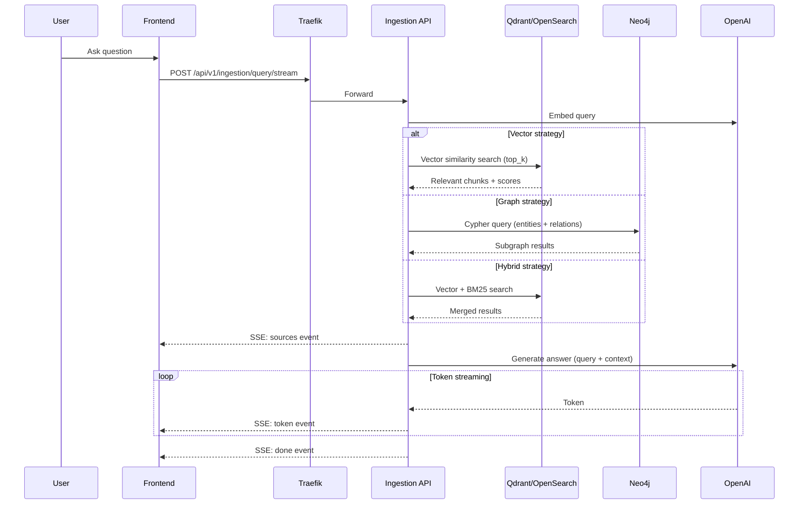

# 4. Data Architecture

## Database Topology



## PostgreSQL Schema

### Auth Server Tables (Drizzle ORM)

#### Entity Relationship Diagram



### Pipeline Service Tables (SQLAlchemy)



### Ingestion Service Tables (SQLAlchemy)



**DataStore targets** encode backend-specific configuration:
```json
[
  {"type": "vector", "backend": "qdrant", "config": {"url": "...", "collection_name": "..."}, "stats": {"records_stored": 1200}},
  {"type": "hybrid", "backend": "opensearch", "config": {"host": "...", "index_name": "..."}, "stats": {}},
  {"type": "graph", "backend": "neo4j", "config": {"uri": "...", "label_prefix": "..."}, "stats": {}}
]
```

**Component model — new fields for composite components:**

| Field | Type | Description |
|-------|------|-------------|
| `source` | `varchar` | `"built_in"` for registry components, `"custom"` for user-uploaded `.py` files |
| `is_composite` | `boolean` | `true` for multi-step composite components, `false` for atomic components |
| `steps` | `json` | Ordered array of step metadata extracted by AST scanner (composite only): `[{"name": "chunk", "order": 1, "retry": 2}, ...]` |
| `workspace_id` | `varchar` | Workspace scope for custom components; `null` for built-in components |
| `file_path` | `varchar` | MinIO object path for the uploaded `.py` file (custom only): `{workspace_id}/{type}/{hash}.py` |
| `file_hash` | `varchar` | SHA-256 hash of the `.py` file; used by `ComponentLoader` to detect changes and invalidate local cache |

**MinIO buckets:**

| Bucket | Purpose | Key Pattern |
|--------|---------|-------------|
| `rrag-documents` | Uploaded user documents (PDF, DOCX, TXT, etc.) | `{workspace_id}/{document_id}/{filename}` |
| `rrag-components` | Custom composite component Python files | `{workspace_id}/{component_type}/{file_hash}.py` |

**Database access modes:**
- **Async** (FastAPI endpoints): `asyncpg` + `async_sessionmaker`, pool_size=10, max_overflow=20
- **Sync** (RQ workers): Standard `psycopg2` sessions for background job processing

### Status Enums

| Model | Values |
|-------|--------|
| `Pipeline.status` | `draft`, `published`, `archived` |
| `Pipeline.pipeline_type` | `ingestion`, `query` |
| `PipelineRun.status` | `pending`, `running`, `completed`, `failed` |
| `User.status` | `active`, `suspended`, `deactivated` |
| `ApiKey.status` | `active`, `revoked` |
| `UserInvitation.status` | `pending`, `accepted`, `expired` |
| `AuditLog.status` | `success`, `denied`, `error` |
| `DataStore.status` | `empty`, `ready`, `processing` |
| `Job.status` | `queued`, `running`, `completed`, `failed` |
| `QueryPipeline.retrieval_strategy` | `auto`, `hybrid`, `dense`, `sparse` |

## Redis Data Structures

### DB 0 — Auth Server

| Key Pattern | Type | Purpose | TTL |
|-------------|------|---------|-----|
| `ratelimit:{ip}:{window}` | Sorted Set | Sliding window rate limiting | 60s |
| `blacklist:{jti}` | String | Revoked access token JTI | Token's remaining TTL |
| `session:{token_hash}` | String | Active refresh token reference | Refresh token TTL |
| `rrag:auth:{entity}:{scope}:{suffix}` | String (JSON) | Cache-aside entity/list cache | 60–1800s |

### DB 1 — Ingestion Service

Persistent state (documents, datastores, jobs, query pipelines) has been **migrated to PostgreSQL**. Redis DB 1 now holds only ephemeral data, cache, and the job queue.

| Key Pattern | Type | Purpose | TTL |
|-------------|------|---------|-----|
| `rrag:ing:{entity}:{workspace_id}:{id}` | String (JSON) | Cache-aside entity cache | 30–300s |
| `rrag:ing:{entity}:{workspace_id}:list` | String (JSON) | Cache-aside list cache | 30–120s |
| `rrag:progress:{job_id}` | Hash | Live job progress (current_step, %) | 24h |
| `rrag:conv:{workspace_id}:{conv_id}` | Hash | Conversation history (messages, tool traces) | 24h |
| `rq:queue:ingestion` | List | Pending ingestion jobs | None |
| `rrag:run:{run_id}:steps` | Pub/Sub Channel | Composite component step progress events | N/A (pub/sub) |

### Cache-Aside Layer (All Services)

All three backend services implement a **cache-aside** (lazy-loading) pattern with Redis:



**Key patterns by service:**

| Service | Key Prefix | Example |
|---------|-----------|---------|
| Auth Server | `rrag:auth:{entity}:{scope}:{suffix}` | `rrag:auth:user:org123:list` |
| Pipeline Service | `rrag:ps:{entity}:{workspace_id}:{suffix}` | `rrag:ps:pipeline:ws1:abc123` |
| Ingestion Service | `rrag:ing:{entity}:{workspace_id}:{suffix}` | `rrag:ing:ds:ws1:list` |

**TTL configuration:**

| TTL Tier | Auth (s) | Pipeline (s) | Ingestion (s) | Use Case |
|----------|----------|-------------|---------------|----------|
| SHORT | 60 | 60 | 30 | Frequently changing (jobs, runs) |
| MEDIUM | 180 | 120 | 120 | List queries |
| LONG | 300 | 300 | 300 | Individual entities |
| STATIC | 1800 | 1800 | 1800 | Near-static data (components, templates) |

**Design principles:**
- All cache failures are **non-fatal** — errors are logged but requests proceed against PostgreSQL
- Invalidation is **write-through**: every mutation deletes both the entity key and the corresponding list key
- Cache is **workspace-scoped**: keys include `workspace_id` for multi-tenant isolation

## Data Flow

### Document Ingestion Pipeline



### RAG Query Flow



## Migration Strategy

| Service | Tool | Location | Execution |
|---------|------|----------|-----------|
| Auth Server | Drizzle Kit | `rrag-auth-server/drizzle/migrations/` | `entrypoint.sh` on container start |
| Pipeline Service | Alembic | `rrag-pipeline-service/alembic/versions/` | `alembic upgrade head` on container start |
| Ingestion Service | SQLAlchemy `create_all` | `rrag-ingestion/src/rrag_ingestion/db/models.py` | `Base.metadata.create_all()` on FastAPI startup |

## Data Isolation

All data is scoped by organization, workspace, and optionally team:

- **Organization level**: `users`, `workspaces`, `teams`, `sso_configs`, `audit_logs`
- **Workspace level**: `pipelines`, `pipeline_runs`, `api_keys`, `documents`, `jobs`, `datastores`, `query_pipelines`, `conversations`
- **Team level**: `team_members`, team-owned workspaces (`scope='team'`, `owner_team_id`)
- **Cross-workspace**: `workspace_access_grants` enables controlled sharing

**Enforcement:**
- Pipeline service: `AuthContext.require_workspace_role(workspace_id, min_role)` on every endpoint
- Ingestion service: `workspace_id` query param required on every endpoint; PostgreSQL `WHERE workspace_id = :ws_id` on all queries; Neo4j graph queries scoped by datastore label; file paths include workspace_id
- Platform admins and org admins bypass workspace membership checks (resolve to "admin" role)

**Workspace scopes:**
| Scope | Owner | Auto-created |
|-------|-------|-------------|
| `personal` | `owner_user_id` | On user provisioning |
| `organization` | — | Manually created |
| `team` | `owner_team_id` | Manually created |
