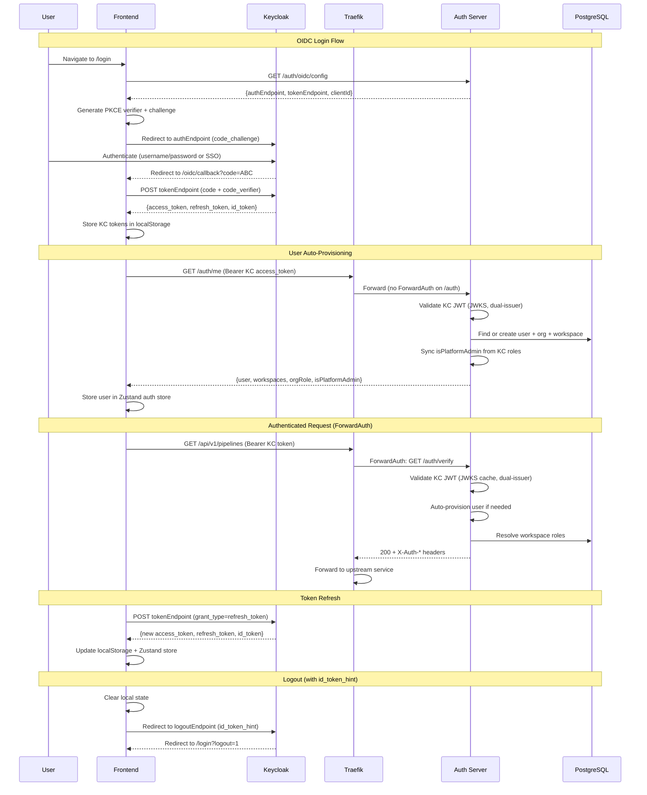
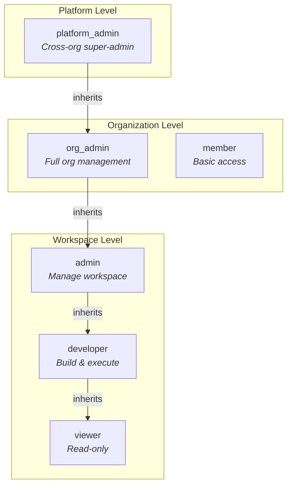
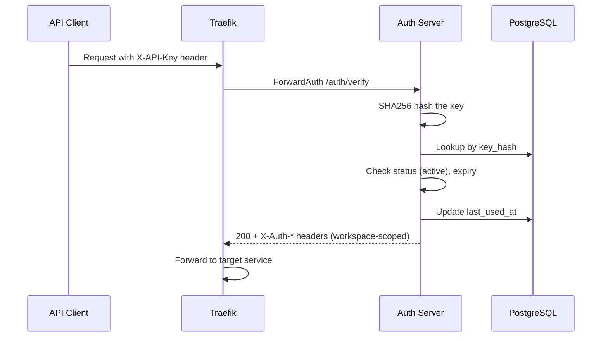
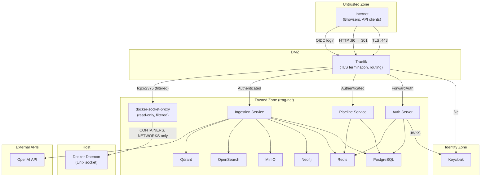

# 5. Security Architecture

## Authentication Flow (Keycloak OIDC + PKCE)

Authentication is delegated to **Keycloak** as the external OIDC identity provider. The frontend uses the Authorization Code flow with PKCE (public client, no client secret in browser).



**Key design decisions:**
- **Dual-issuer JWT validation**: Auth server accepts tokens with `iss` matching either the internal Docker URL (`http://keycloak:8080/kc/realms/rrag`) or the public proxy URL (`http://localhost:8000/kc/realms/rrag`)
- **Auto-provisioning**: Users are created in PostgreSQL on first login from Keycloak claims (email, name, preferred_username)
- **Platform admin sync**: The `rrag_platform_admin` Keycloak realm role is synced to `users.is_platform_admin` on every auth verification
- **id_token_hint logout**: Frontend sends the id_token to Keycloak's logout endpoint for proper session termination, then redirects to `/login?logout=1` to prevent auto-redirect loops

## Authorization Model (RBAC)

### Role Hierarchy



**Platform Admin** (`rrag_platform_admin` Keycloak realm role):
- Transcends organization boundaries — has `org_admin` access across all orgs
- Stored as `is_platform_admin` boolean in the `users` table
- Synced from Keycloak on every authentication (not just first login)
- Propagated to downstream services via `X-Auth-Platform-Admin` header

**Role hierarchy enforcement** (used by both pipeline-service and ingestion-service):
```
ROLE_HIERARCHY = {"viewer": 0, "developer": 1, "admin": 2}
```
`require_workspace_role(workspace_id, min_role)` checks that the user's effective role meets the minimum. Platform admins and org admins always resolve to "admin".

### Permission Matrix

| Resource | Action | org_admin | ws_admin | developer | viewer |
|----------|--------|-----------|----------|-----------|--------|
| Users | List/manage | Yes | No | No | No |
| Users | Invite | Yes | No | No | No |
| Workspaces | Create | Yes | No | No | No |
| Workspace members | Manage | Yes | Yes | No | No |
| API keys | Create/revoke | Yes | Yes | No | No |
| API keys | List | Yes | Yes | Yes | Yes |
| Pipelines | Create/edit | Yes | Yes | Yes | No |
| Pipelines | Execute | Yes | Yes | Yes | No |
| Pipelines | View | Yes | Yes | Yes | Yes |
| Documents | Upload/delete | Yes | Yes | Yes | No |
| Documents | View | Yes | Yes | Yes | Yes |
| Audit logs | View | Yes | Yes | No | No |

### ForwardAuth Middleware

Traefik's ForwardAuth calls the auth server's `/auth/verify` endpoint before forwarding requests to protected services. The auth server validates the token and returns user context as response headers:

| Header | Content |
|--------|---------|
| `X-Auth-User-Id` | User UUID |
| `X-Auth-Org-Id` | Organization UUID |
| `X-Auth-Org-Role` | `org_admin` or `member` |
| `X-Auth-Email` | User email |
| `X-Auth-Workspace-Roles` | JSON: `{"ws_id": "role", ...}` |
| `X-Auth-Platform-Admin` | `"true"` or `"false"` |

Downstream services extract these headers via dependency injection (`get_current_user()`) and never handle JWT validation directly. Both pipeline-service and ingestion-service have an `AuthContext` dataclass with methods:
- `require_workspace_access(workspace_id)` — checks membership or org/platform admin bypass
- `require_workspace_role(workspace_id, min_role)` — checks hierarchical role (viewer < developer < admin)
- `require_org_admin()` — checks org_admin or platform_admin

## API Key Authentication



API keys are workspace-scoped with configurable:
- **Role**: admin, developer, viewer
- **Rate limit**: Custom RPM per key (default 600)
- **Expiration**: Optional TTL
- **Prefix**: Stored in plaintext for UI display; full key shown only on creation

## Rate Limiting

Redis-backed sliding window algorithm with three tiers:

| Tier | Default RPM | Identifier |
|------|-------------|------------|
| Unauthenticated | 20 | Client IP |
| Authenticated (JWT) | 300 | User ID |
| API Key | 600 (configurable per key) | Key hash |

**Response headers** on every request:
- `X-RateLimit-Limit` — Maximum requests per window
- `X-RateLimit-Remaining` — Remaining requests
- `Retry-After` — Seconds until reset (only on 429)

## Password Security

| Control | Configuration |
|---------|--------------|
| Hashing | bcryptjs with auto-generated salt |
| Min length | 12 characters (configurable) |
| Max failed attempts | 5 (configurable) |
| Lockout duration | 15 minutes (configurable) |
| Reset | Counter resets on successful login |

## Session Management

- Sessions tracked in PostgreSQL `sessions` table
- Each session records device info (IP, User-Agent) as JSONB
- Refresh token hashed (SHA256) before storage
- Individual session revocation via `DELETE /auth/sessions/:id`
- Bulk revocation via `POST /auth/logout/all`
- Access token blacklisting via Redis JTI entries

## Audit Logging

Every security-relevant action is logged to the `audit_logs` table:

| Event | Trigger |
|-------|---------|
| `user_register` | New account creation |
| `login` | Successful authentication |
| `login_failed` | Failed password attempt |
| `logout` | Session termination |
| `logout_all` | All sessions revoked |
| `session_revoke` | Individual session revoked |
| `user_invite` | Invitation sent |
| `user_role_change` | Organization role updated |
| `user_suspend` / `user_activate` | Account status change |
| `member_add` / `member_remove` | Workspace membership change |
| `member_role_change` | Workspace role updated |
| `api_key_create` / `api_key_revoke` | API key lifecycle |

Each log entry includes: `org_id`, `user_id`, `action`, `resource_type`, `resource_id`, `workspace_id`, `details` (JSONB), `ip_address`, `user_agent`, `request_id`, `status`, `timestamp`.

Indexed for fast queries on: `(org_id, timestamp)`, `(user_id, timestamp)`, `(resource_type, resource_id)`, `(action)`.

## Workspace-Scoped Data Isolation

All data in the ingestion service is partitioned by `workspace_id`:

| Data Type | Primary Storage | Cache | Object/Index Storage |
|-----------|----------------|-------|---------------------|
| Documents | PostgreSQL `documents` table | `rrag:ing:doc:{ws_id}:{id}` | MinIO: `rrag-documents/{ws_id}/{doc_id}/` |
| Jobs | PostgreSQL `jobs` table | `rrag:ing:job:{ws_id}:{id}` | — |
| DataStores | PostgreSQL `datastores` table | `rrag:ing:ds:{ws_id}:{id}` | Qdrant/OpenSearch collections per datastore |
| Query Pipelines | PostgreSQL `query_pipelines` table | `rrag:ing:qp:{ws_id}:{id}` | — |
| Conversations | Redis `rrag:conv:{ws_id}:{conv_id}` | — | — |
| Knowledge Graphs | Neo4j (datastore-scoped labels) | — | — |
| Pipeline YAMLs | — | — | `configs/pipelines/{ws_id}/` |

**Enforcement points:**
1. Every ingestion API endpoint requires `workspace_id` as a query parameter
2. `AuthContext.require_workspace_role()` validates the user has sufficient role for the requested workspace
3. PostgreSQL queries include `WHERE workspace_id = :ws_id`; Neo4j queries are scoped by datastore label prefix; file paths are constructed server-side from the validated workspace_id
4. Redis cache keys include workspace_id for tenant-isolated caching
5. Admin/platform admin endpoints can pass `workspace_id=None` for cross-workspace access

## Trust Boundaries



- **Internet → Traefik**: TLS termination (Let's Encrypt / self-signed), rate limiting at gateway; HTTP redirects permanently to HTTPS
- **Internet → Keycloak** (via Traefik `/kc`): OIDC login, token issuance
- **Traefik → Services**: ForwardAuth validates every protected request
- **Traefik → docker-socket-proxy**: Traefik no longer mounts the raw Docker socket; service discovery goes through the filtered proxy (`tcp://docker-socket-proxy:2375`)
- **docker-socket-proxy → Docker Daemon**: Read-only access restricted to `CONTAINERS` and `NETWORKS` API endpoints only
- **Auth Server → Keycloak**: JWKS key fetching for JWT validation (dual-issuer: internal + public URL)
- **Service → Service**: Trust headers set by ForwardAuth (no direct JWT handling)
- **Service → Data Stores**: Internal network only, no external exposure
- **Service → OpenAI**: API key stored as environment variable, HTTPS

---

## Container Hardening

Every container in the stack is hardened with the following defaults applied via `docker-compose.yml`:

**Seccomp / capability restrictions (all containers):**
```yaml
read_only: true
security_opt:
  - no-new-privileges:true
cap_drop:
  - ALL
```

**Writable paths are provided via `tmpfs` mounts** rather than relaxing the read-only root filesystem:

| Container | tmpfs mounts |
|-----------|-------------|
| All | `/tmp` |
| PostgreSQL | `/run/postgresql`, `/tmp` |
| Nginx (frontend) | `/var/cache/nginx`, `/var/run`, `/tmp` |
| Redis | `/tmp` |
| Keycloak | `/tmp` |

**Non-root users** are enforced where the upstream image supports it:

| Service | UID:GID |
|---------|---------|
| PostgreSQL | `999:999` |
| Neo4j | `7474:7474` |
| MinIO | `1000:1000` |

**Traefik exception**: Traefik needs to bind privileged ports 80 and 443, so it receives one targeted capability back:
```yaml
cap_drop:
  - ALL
cap_add:
  - NET_BIND_SERVICE
```

---

## TLS Termination

All external traffic is encrypted. Traefik owns TLS at the edge; internal service-to-service communication stays on the private Docker network.

### Production (Let's Encrypt ACME)
- Traefik uses the **HTTP-01 challenge** to obtain and auto-renew certificates from Let's Encrypt
- Certificates are stored in an ACME JSON file mounted into the Traefik container
- All routers are configured with `entrypoints=websecure` and `tls=true`

### Staging / Local (self-signed fallback)
- A separate Traefik static configuration (`traefik-selfsigned.yml`) swaps in a self-signed certificate
- Activated via the dev overlay (`docker-compose.dev.yml`); the production compose file always uses ACME

### HTTP → HTTPS Redirect
Port 80 is exposed only to issue a **permanent 301 redirect** to HTTPS. No plaintext content is served.

```yaml
# Traefik entrypoints config (excerpt)
web:
  address: ":80"
  http:
    redirections:
      entryPoint:
        to: websecure
        scheme: https
        permanent: true
websecure:
  address: ":443"
```

### TLS Protocol and Cipher Hardening
Configured in `dynamic/tls.yml` mounted into Traefik:
- **Minimum TLS version**: 1.2
- **Preferred version**: 1.3
- Curated cipher suite list excludes weak ciphers (no RC4, no 3DES, no export ciphers)

---

## Docker Socket Proxy

The raw Docker socket (`/var/run/docker.sock`) is **no longer mounted directly into Traefik**. Instead, a [Tecnativa docker-socket-proxy](https://github.com/Tecnativa/docker-socket-proxy) sidecar sits between Traefik and the Docker daemon.

**Why this matters**: A compromised Traefik container with access to the raw socket could enumerate all containers, read environment variables (including secrets), create privileged containers, or escape to the host. The proxy eliminates this attack surface.

**Proxy configuration:**
```yaml
docker-socket-proxy:
  image: tecnativa/docker-socket-proxy
  read_only: true
  security_opt:
    - no-new-privileges:true
  cap_drop:
    - ALL
  environment:
    CONTAINERS: 1   # Traefik needs container labels for routing
    NETWORKS: 1     # Traefik needs network membership info
    # Everything else defaults to 0 (denied):
    # SERVICES, TASKS, NODES, VOLUMES, IMAGES, INFO, etc.
  volumes:
    - /var/run/docker.sock:/var/run/docker.sock:ro
```

**Traefik provider configuration:**
```yaml
providers:
  docker:
    endpoint: "tcp://docker-socket-proxy:2375"
    exposedByDefault: false
```

Traefik never touches the host socket directly; all Docker API calls are proxied and filtered.

---

## Security Headers

### Frontend (Nginx)

The Nginx configuration serving the React SPA sets the following response headers on all requests:

| Header | Value |
|--------|-------|
| `Content-Security-Policy` | `default-src 'self'; script-src 'self'; style-src 'self' 'unsafe-inline'; img-src 'self' data:; connect-src 'self' https://${DOMAIN} http://${DOMAIN}; font-src 'self'; frame-ancestors 'none'` |
| `X-Frame-Options` | `DENY` |
| `X-Content-Type-Options` | `nosniff` |
| `Referrer-Policy` | `strict-origin-when-cross-origin` |
| `Permissions-Policy` | `camera=(), microphone=(), geolocation=()` |
| `Strict-Transport-Security` | `max-age=31536000; includeSubDomains` |

`server_tokens off` is also set so Nginx does not expose its version in error pages or the `Server` header.

**CSP rationale**: `style-src 'unsafe-inline'` is required for CSS-in-JS used by the component library. All other directives are locked to `'self'`; `connect-src` allows the configured domain for API calls. `frame-ancestors 'none'` replaces `X-Frame-Options` for modern browsers while the header is kept for legacy support.

### FastAPI Services (Ingestion, Pipeline)

A response middleware is registered on both services to inject headers on every reply:

```python
@app.middleware("http")
async def security_headers(request: Request, call_next):
    response = await call_next(request)
    response.headers["X-Content-Type-Options"] = "nosniff"
    response.headers["X-Frame-Options"] = "DENY"
    return response
```

---

## Infrastructure Authentication

All backing services require authentication. No service accepts anonymous connections from within the Docker network.

| Service | Mechanism | Configuration |
|---------|-----------|--------------|
| **Redis** | Password (`requirepass`) | `REDIS_PASSWORD` env var; connection URLs include the password (`redis://:password@redis:6379`) |
| **Qdrant** | API key | `QDRANT__SERVICE__API_KEY` env var; clients pass the key in the `api-key` header |
| **OpenSearch** | Internal user database (Security plugin) | `OPENSEARCH_INITIAL_ADMIN_PASSWORD` env var; single-node so inter-node TLS is disabled, but HTTP basic auth is required |
| **Neo4j** | Username / password | `NEO4J_AUTH` env var (`username/password`); no hardcoded defaults |
| **PostgreSQL** | Username / password | `POSTGRES_PASSWORD` env var; clients use connection strings from env vars |
| **MinIO** | Access key / secret key | `MINIO_ROOT_USER` / `MINIO_ROOT_PASSWORD` env vars |
| **Keycloak** | Admin username / password | `KC_BOOTSTRAP_ADMIN_USER` / `KC_BOOTSTRAP_ADMIN_PASSWORD` env vars |

**Fail-fast credential loading**: Application code uses `os.environ["KEY"]` (raises `KeyError` at startup) rather than `os.environ.get("KEY", "default")`. This ensures a misconfigured deployment fails immediately rather than running with insecure defaults.

---

## CORS Hardening

All services derive their allowed origins from the `CORS_ORIGINS` environment variable (comma-separated list). An empty value blocks all cross-origin requests.

**Auth server (Hono/TypeScript):**
```typescript
const corsOrigins = (process.env.CORS_ORIGINS ?? "")
  .split(",")
  .map(o => o.trim())
  .filter(Boolean);

app.use("*", cors({ origin: corsOrigins, credentials: true }));
```

**FastAPI services (ingestion, pipeline):**
```python
_cors_origins = [
    o.strip()
    for o in os.environ.get("CORS_ORIGINS", "").split(",")
    if o.strip()
]

app.add_middleware(
    CORSMiddleware,
    allow_origins=_cors_origins,
    allow_credentials=True,
    allow_methods=["*"],
    allow_headers=["*"],
)
```

In production, `CORS_ORIGINS` is set to the public frontend URL only (e.g., `https://app.example.com`). The dev overlay sets a permissive localhost list.

---

## Credential Management

### Production Secrets

- All secrets live in a **`.env.prod`** file at the repository root
- File permissions are set to **`600`** (owner read/write only) — never committed to version control
- `.env.prod` is listed in `.gitignore`

### Templates

Two template files are committed to the repository:

| File | Purpose |
|------|---------|
| `.env.prod.example` | Production template with placeholder values and comments |
| `.env.dev.example` | Development template with safe local defaults |

Developers copy the appropriate template and populate real values before starting the stack.

### Dev Overlay

`docker-compose.dev.yml` is an override file that relaxes certain production-hardened defaults (e.g., permissive CORS, Traefik self-signed cert, debug log levels). It is never used in production. Run with:

```bash
docker compose -f docker-compose.yml -f docker-compose.dev.yml up
```

### No Hardcoded Defaults

No configuration file, Dockerfile, or application source contains hardcoded credential defaults. Any missing required secret causes an immediate startup failure (see fail-fast pattern above).
