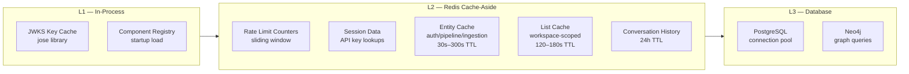
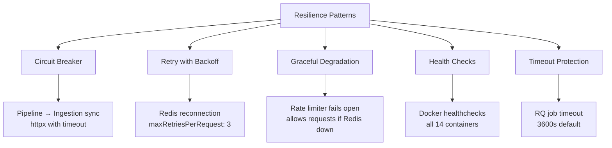
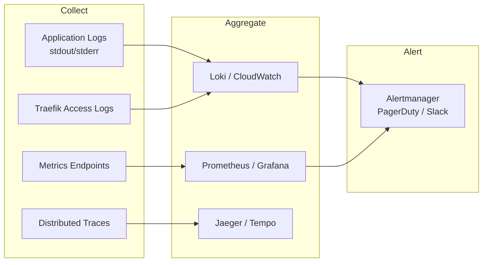

# 08 — Quality Attributes & Cross-Cutting Concerns

> Performance, reliability, observability, maintainability, and disaster recovery characteristics of the RRAG system.

---

## 1. Performance

### Response Time Targets

| Operation | Target (p95) | Current Mechanism |
|-----------|-------------|-------------------|
| Auth token validation (ForwardAuth) | < 50ms | JWKS cache + in-memory key set |
| Pipeline CRUD | < 200ms | Async SQLAlchemy + connection pool |
| Component registry lookup | < 100ms | DB query with index |
| Document upload (10MB) | < 3s | Streaming multipart → disk |
| Ingestion job enqueue | < 500ms | Redis LPUSH |
| RAG query (end-to-end) | < 5s | Retriever → Reranker → Generator |
| Chat stream (first token) | < 2s | SSE with LLM streaming |
| Frontend page load | < 1.5s | Nginx + code-split bundles |

### Throughput

| Metric | Value | Constraint |
|--------|-------|-----------|
| Authenticated requests/min | 300 per user | Redis sliding-window rate limiter |
| API key requests/min | 600 per key | Redis sliding-window rate limiter |
| Unauthenticated requests/min | 20 per IP | Redis sliding-window rate limiter |
| Concurrent ingestion jobs | 1 per worker | RQ single-threaded workers (scale horizontally) |
| Max upload size | 100MB | Configurable via `RRAG_MAX_UPLOAD_SIZE_MB` |

### Caching Strategy



**Cache-Aside Pattern (all services):**
All three backend services (auth, pipeline, ingestion) implement a Redis cache-aside layer:
- **Read path**: Check Redis → on miss, query PostgreSQL → populate Redis with TTL
- **Write path**: Mutate PostgreSQL → invalidate both entity key and list key in Redis
- **Failure mode**: All cache errors are non-fatal (logged, request proceeds against DB)
- **Key format**: `rrag:{service}:{entity}:{workspace_id}:{suffix}`

**TTL tiers:**
| Tier | Duration | Use Case |
|------|----------|----------|
| SHORT | 30–60s | Jobs, pipeline runs (frequently changing) |
| MEDIUM | 120–180s | List queries |
| LONG | 300s | Individual entities |
| STATIC | 1800s | Components, templates (near-static) |

**Other cache invalidation:**
- JWKS keys: Refreshed automatically by `jose` library when signature verification fails
- Rate limit counters: Self-expiring via Redis ZRANGEBYSCORE + EXPIRE
- Conversations: 24-hour TTL

---

## 2. Reliability & Availability

### Failure Modes and Recovery

| Failure | Impact | Recovery |
|---------|--------|----------|
| PostgreSQL down | All three services fail (auth, pipeline, ingestion) | Docker restart policy, healthcheck triggers |
| Redis down | Rate limiting disabled, jobs fail to enqueue, cache unavailable (services degrade to DB-only) | Docker restart, RQ worker reconnects |
| Neo4j down | Graph operations fail, ingestion jobs fail | Docker restart, jobs retry from queue |
| MinIO down | Document uploads/downloads fail | Docker restart, data persisted in volume |
| OpenSearch down | Hybrid search unavailable, fallback to Qdrant | Docker restart, indexes rebuilt from source |
| Qdrant down | Vector search unavailable | Docker restart, snapshots in volume |
| Keycloak down | New logins fail, existing tokens valid until expiry | Docker restart, tokens cached client-side |
| Auth Server down | All ForwardAuth requests fail → 502 | Docker restart, Traefik retries |
| Ingestion Worker down | Jobs stay queued, no processing | Docker restart, jobs picked up by new worker |
| Traefik down | Complete service outage | Docker restart policy |

### Resilience Patterns



**Key patterns in use:**
- **Healthchecks**: Every container has a healthcheck; `depends_on` with `condition: service_healthy` ensures proper startup ordering
- **Timeout protection**: RQ jobs have a 1-hour timeout; HTTP requests use httpx with configurable timeouts
- **Graceful degradation**: Pipeline-to-ingestion sync failures are logged but don't block pipeline CRUD
- **Fire-and-forget**: API key `last_used_at` updates don't block the request

### Data Durability

| Data Store | Persistence | Backup Strategy |
|-----------|-------------|-----------------|
| PostgreSQL | Docker volume `pgdata` | pg_dump scheduled backups |
| Redis | Docker volume `redisdata` (RDB snapshots) | Redis RDB/AOF persistence |
| Neo4j | Docker volume `neo4jdata` | neo4j-admin dump |
| MinIO | Docker volume `minio_data` | `mc mirror` to backup location |
| OpenSearch | Docker volume `opensearch_data` | Snapshot API to S3/MinIO |
| Qdrant | Docker volume `qdrant_data` | Snapshot API |
| Keycloak DB | Docker volume `keycloak_pgdata` | pg_dump |

---

## 3. Observability

### Current Instrumentation

| Signal | Implementation | Coverage |
|--------|---------------|----------|
| **Request ID** | `X-Request-ID` header (UUID v4) | Auth Server (all requests) |
| **Request Timing** | `X-Process-Time` header | Auth Server (all requests) |
| **Rate Limit Headers** | `X-RateLimit-Limit`, `X-RateLimit-Remaining` | Auth Server |
| **Audit Logging** | `audit_logs` table (PostgreSQL) | Auth Server (auth events, CRUD) |
| **Job Progress** | Redis + SSE streaming | Ingestion Service |
| **Error Logging** | `console.error` / `pino` logger | Auth Server |
| **Traefik Access Logs** | Configurable in traefik.yml | Gateway |

### Audit Log Schema

```
audit_logs:
  - org_id, user_id, action, resource_type, resource_id
  - workspace_id, details (JSONB)
  - ip_address, user_agent, status
  - created_at (indexed: org_time, user_time, resource, action)
```

**Tracked Actions:**
- Authentication: login, logout, token_refresh, login_failed
- User Management: user_invited, user_role_updated, user_status_changed
- Workspace: workspace_created, member_added/removed/updated
- API Keys: key_created, key_revoked
- Teams: team_created/updated/deleted, member_added/removed

### Recommended Additions



**Priority additions:**
1. **Structured logging** — Migrate `console.error` to structured JSON (pino already in deps)
2. **Prometheus metrics** — Add `/metrics` endpoint to each service (request count, latency histograms, error rates)
3. **Distributed tracing** — Propagate `X-Request-ID` through all services; add OpenTelemetry SDK
4. **Dashboard** — Grafana dashboards for service health, request rates, error rates, job throughput

---

## 4. Maintainability

### Code Organization Patterns

| Service | Pattern | Key Benefit |
|---------|---------|-------------|
| Auth Server | **Layered architecture** (routes → services → db) | Clear separation of HTTP handling and business logic |
| Pipeline Service | **Clean Architecture** (api → services → models) | Testable service layer, DB models isolated |
| Ingestion Service | **Plugin architecture** (registry → components) | New components added without changing core |
| Frontend | **Feature-based** (pages + components + stores) | Colocated feature code |

### Testing Strategy

| Layer | Framework | Current Coverage |
|-------|-----------|-----------------|
| Auth Server unit tests | Vitest | 28/61 pass (33 need test DB) |
| Pipeline Service tests | pytest + aiosqlite | 29/29 pass |
| Ingestion Service tests | pytest + Redis | 91/91 pass |
| Frontend tests | — | 0 tests (gap) |
| E2E UI tests | pytest + Playwright | `test_e2e_ui.py` — 35/35 pass (requires running stack + Keycloak) |

### Dependency Management

| Service | Package Manager | Lock File | Vulnerability Scanning |
|---------|----------------|-----------|----------------------|
| Auth Server | npm | package-lock.json | `npm audit` |
| Pipeline Service | uv | uv.lock | `pip-audit` |
| Ingestion Service | uv | — | `pip-audit` |
| Frontend | npm | package-lock.json | `npm audit` |

### Database Migration Strategy

| Service | Tool | Approach |
|---------|------|----------|
| Auth Server | Drizzle Kit | Generate → migrate (runs on startup) |
| Pipeline Service | Alembic | `alembic upgrade head` (runs on startup) |
| Ingestion Service | SQLAlchemy `create_all` | `Base.metadata.create_all()` on FastAPI startup |
| Keycloak | Built-in | Auto-migrate on startup |

---

## 5. Security Quality Attributes

See **[05-security-architecture.md](./05-security-architecture.md)** for the full security model. Summary:

| Attribute | Implementation |
|-----------|---------------|
| Authentication | Keycloak OIDC (PKCE) + API key fallback |
| Authorization | RBAC with 4-tier role hierarchy |
| Transport | HTTPS via Traefik TLS termination (production) |
| Rate Limiting | Redis sliding window (3 tiers) |
| Input Validation | Zod (auth server), Pydantic (Python services) |
| Password Security | bcrypt (12 rounds), 12-char minimum |
| Session Management | KC tokens (15-min access, longer refresh) |
| Audit Trail | PostgreSQL audit_logs with JSONB details |

---

## 6. Scalability Characteristics

### Horizontal Scaling Analysis

| Component | Stateless? | Horizontally Scalable? | Bottleneck |
|-----------|-----------|----------------------|------------|
| Auth Server | Yes (JWT validation) | Yes | Redis for rate limiting |
| Pipeline Service | Yes | Yes | PostgreSQL connections |
| Ingestion API | Yes | Yes | PostgreSQL connections |
| RQ Workers | Yes (per job) | Yes | Redis queue throughput |
| Frontend | Yes (static) | Yes (CDN) | None |
| PostgreSQL | No | Vertical first, then replicas | Write throughput |
| Redis | No | Cluster mode | Memory |
| Neo4j | No | Causal clustering | Write throughput |

### Estimated Capacity (Single Host, 16GB RAM)

| Metric | Estimate |
|--------|----------|
| Concurrent users | ~50 |
| Documents stored | ~10,000 |
| Knowledge graph entities | ~100,000 |
| Pipelines | ~500 |
| Daily ingestion jobs | ~200 |
| Chat queries/day | ~5,000 |

---

## 7. Disaster Recovery

### Recovery Point Objective (RPO)

| Data | RPO | Mechanism |
|------|-----|-----------|
| User accounts, workspaces | < 1 hour | PostgreSQL WAL + scheduled pg_dump |
| Pipeline definitions | < 1 hour | PostgreSQL WAL |
| Knowledge graph | < 24 hours | Neo4j dump |
| Uploaded documents | < 24 hours | Volume backup |
| Job history | < 1 hour | PostgreSQL WAL (migrated from Redis) |
| Conversations | Ephemeral (24h TTL) | Not backed up (Redis) |

### Recovery Time Objective (RTO)

| Scenario | RTO | Steps |
|----------|-----|-------|
| Single container crash | < 1 min | Docker restart policy |
| Host reboot | < 5 min | `docker compose up -d` |
| Data corruption | < 1 hour | Restore from backup + replay |
| Full rebuild | < 30 min | Fresh `docker compose up` + restore data |

### Backup Procedure (Recommended)

```bash
# PostgreSQL (daily)
docker exec rrag-postgres pg_dump -U $POSTGRES_USER $POSTGRES_DB > backup.sql

# Neo4j (daily)
docker exec rrag-neo4j neo4j-admin database dump neo4j --to-path=/backups

# Document files (daily)
docker cp rrag-ingestion:/data/documents ./backup-documents/

# Keycloak DB (weekly)
docker exec rrag-keycloak-db pg_dump -U keycloak keycloak > keycloak-backup.sql
```
