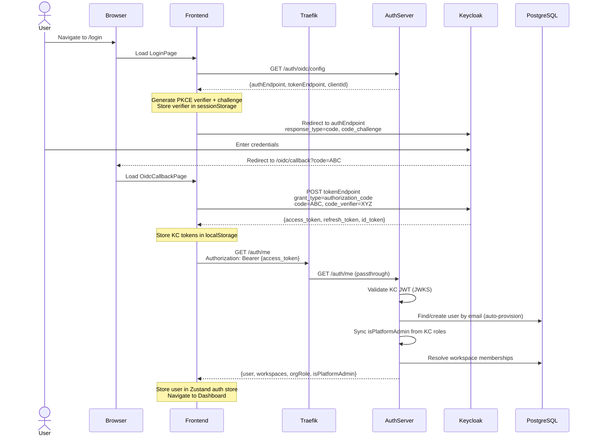
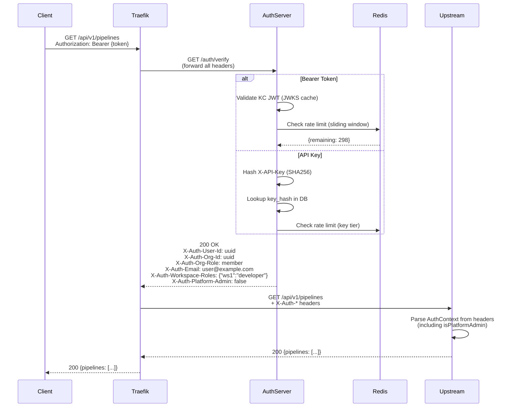
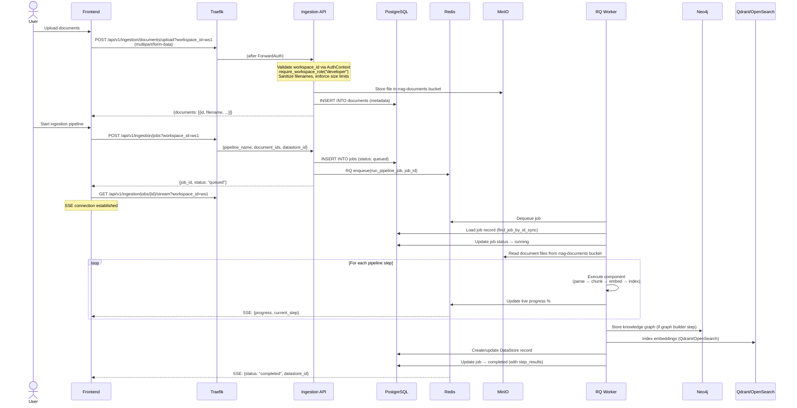
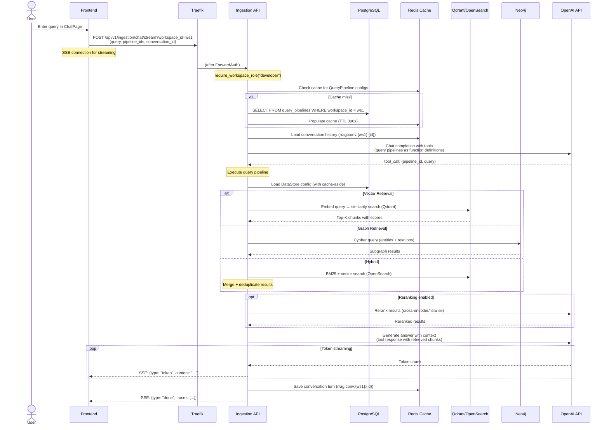
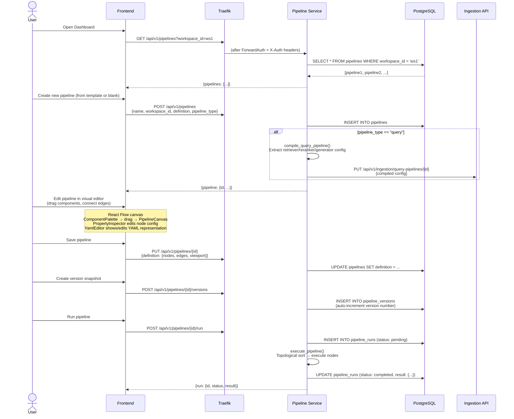
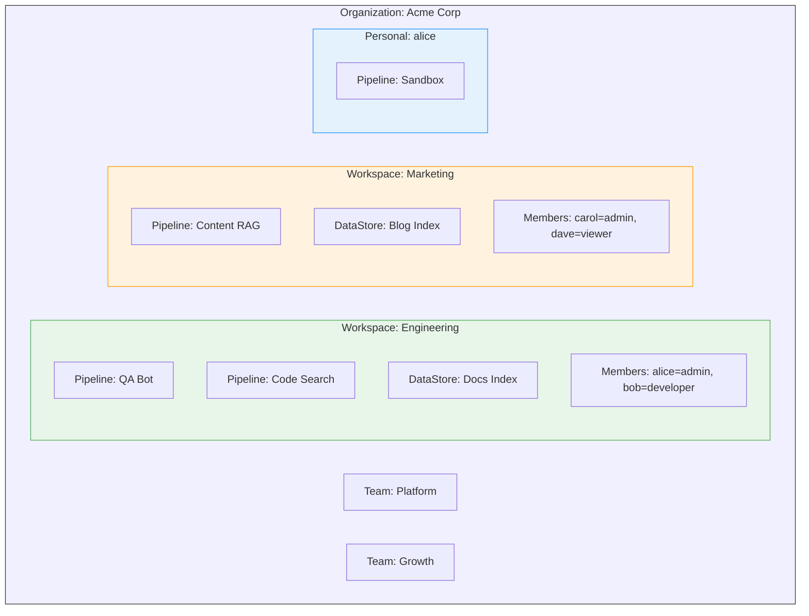
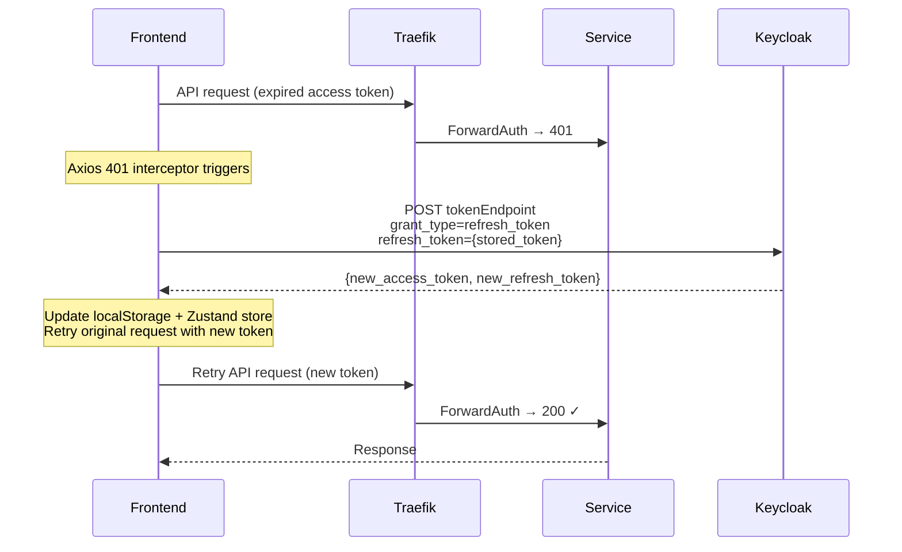
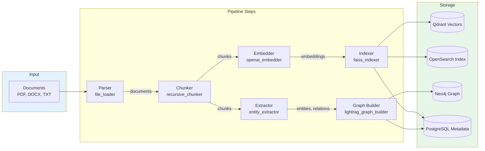
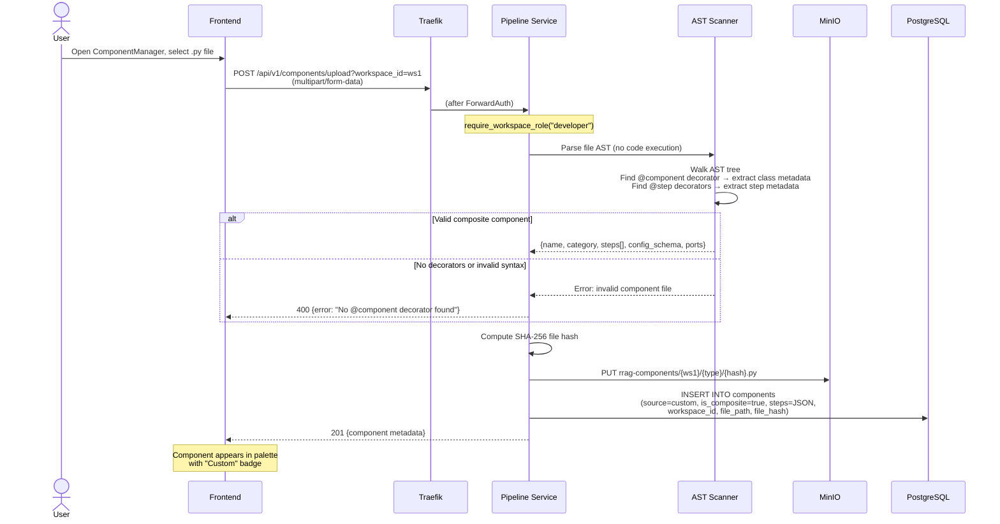
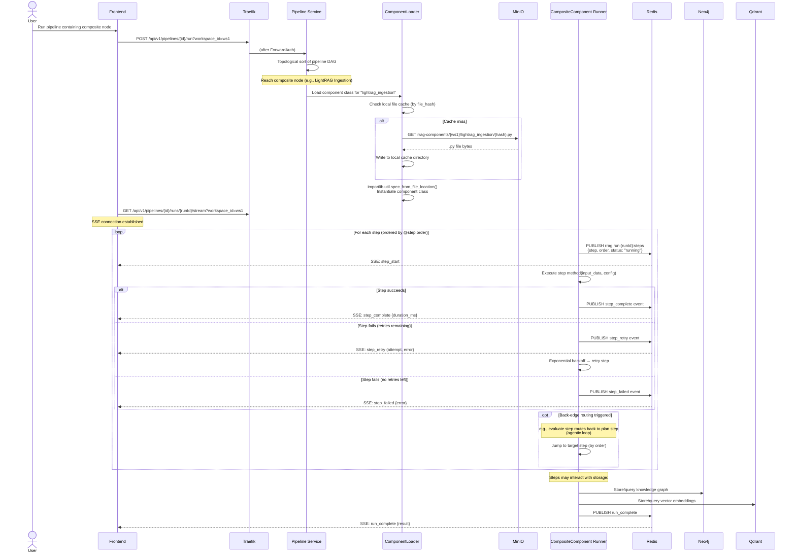

# 09 — Data Flow Diagrams

> End-to-end data flows for authentication, document ingestion, RAG query, pipeline management, and chat.

---

## 1. Authentication Flow (OIDC + PKCE)

---

## 2. Request Authentication (ForwardAuth)

---

## 3. Document Ingestion Flow

---

## 4. RAG Query Flow

---

## 5. Pipeline Builder Flow

---

## 6. Multi-Tenant Data Isolation

**Isolation enforced at:**
1. **Gateway**: Traefik ForwardAuth → Auth Server validates token and resolves workspace roles
2. **Auth Server**: `X-Auth-Workspace-Roles` header contains JSON map of `{workspace_id: role}`, `X-Auth-Platform-Admin` flag
3. **Upstream services**: `AuthContext.require_workspace_role(workspace_id, min_role)` checks membership with hierarchical RBAC (viewer < developer < admin)
4. **Pipeline service**: `WHERE workspace_id = :ws_id` on all SQL queries
5. **Ingestion service**: `WHERE workspace_id = :ws_id` on all PostgreSQL queries, workspace-scoped cache keys (`rrag:ing:{entity}:{ws_id}:{id}`), workspace-scoped file paths (`/data/documents/{ws_id}/`), datastore-scoped Neo4j graph queries
6. **Platform admin / Org admin bypass**: Resolves to "admin" role for any workspace

---

## 7. Token Refresh Flow

**Concurrency handling:** The frontend queues concurrent 401 responses and only refreshes once, then replays all queued requests.

---

## 8. Component Pipeline Execution (Ingestion Worker)

---

## 9. Custom Component Upload Flow

---

## 10. Composite Component Execution Flow

**Data transformations at each step:**

| Step | Input | Output | Typical Size |
|------|-------|--------|-------------|
| Parser | Raw file bytes | `Document(raw_text, metadata)` | 1 doc → 10-500KB text |
| Chunker | Document text | `Chunk(content, tokens, order_index)` | 1 doc → 10-200 chunks |
| Embedder | Chunk text | `EmbeddingResult(vector, text)` | 1 chunk → 1536-dim float32 |
| Extractor | Chunk text | `Entity(name, type, description)` | 1 doc → 20-100 entities |
| Graph Builder | Entities + Relations | `SubGraph(nodes, edges)` | 1 doc → 50-500 edges |
| Indexer | Embeddings | Qdrant collection / OpenSearch index | N vectors × 1536 dims |
