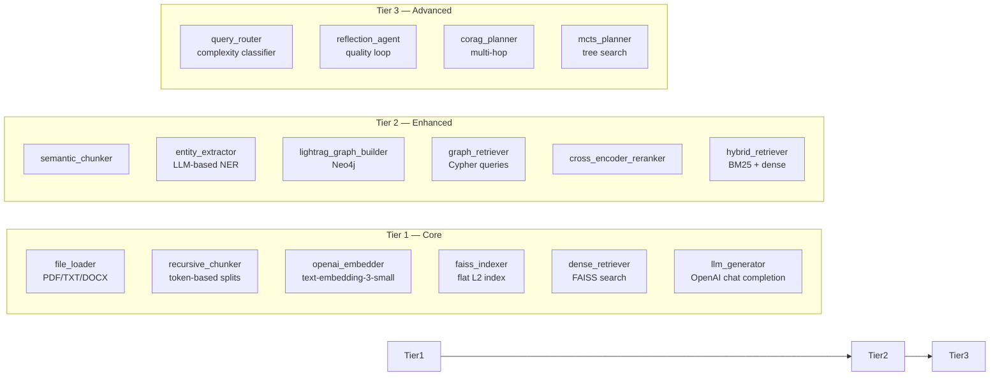
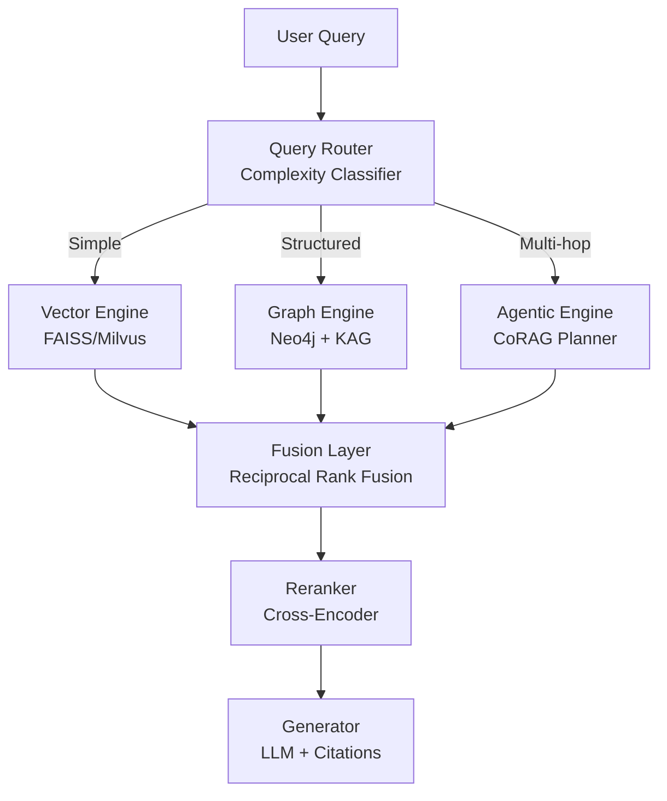
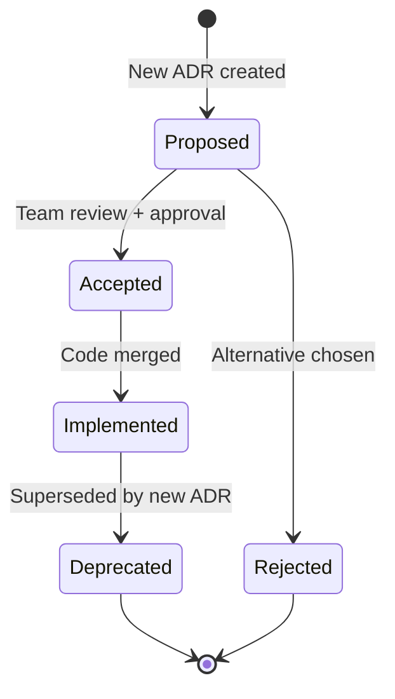

# 10 — Architecture Evolution Roadmap

> Phased strategy for evolving the RRAG system from development prototype to production-grade platform.

---

## Current State Assessment

### What's Built (Phase 0 — Foundation)

| Layer | Status | Notes |
|-------|--------|-------|
| Auth (Keycloak OIDC + RBAC) | **Complete** | 12 DB tables, ForwardAuth, API keys, teams |
| Pipeline Service (CRUD + visual builder) | **Complete** | 58 components, 23 templates, DAG execution |
| Ingestion Service (document pipeline) | **Complete** | Upload (MinIO), chunking, embedding, graph (Neo4j), vector (Qdrant), hybrid search (OpenSearch) |
| Frontend (React SPA) | **Complete** | Pipeline editor, chat, admin pages |
| Infrastructure (Docker Compose) | **Complete** | 15 containers (incl. docker-socket-proxy), Traefik gateway with TLS, MinIO, OpenSearch, Qdrant |
| Research survey | **Complete** | 40+ papers, 11 new component types |

### Known Gaps

| Area | Gap | Impact |
|------|-----|--------|
| Frontend testing | 0 unit test files (E2E: 35/35 via Playwright) | Medium — unit tests missing |
| Auth server tests | 33/61 need test DB | Medium — partial CI coverage |
| Observability | Basic audit logs only | High — no metrics, no tracing |
| Pipeline execution | Simulated outputs | High — components don't run real logic |
| Composite components | **Complete** (ADR-0026) | Decorator framework, AST scanner, MinIO upload, expandable nodes, SSE step progress |
| TLS | ~~HTTP only (dev mode)~~ | **Resolved** (Let's Encrypt TLS at Traefik) |
| Keycloak | ~~`start-dev` mode~~ | **Resolved** (production mode with `start`) |

---

## Phase 1 — Hardening (Weeks 1-4)

**Goal:** Production-ready infrastructure and testing.

### 1.1 Testing & Quality

```
Priority  Task                                          Target
━━━━━━━━━━━━━━━━━━━━━━━━━━━━━━━━━━━━━━━━━━━━━━━━━━━━━━━━━━━━━━
P0        Add frontend test suite (Vitest + RTL)        >60% coverage
P0        Fix auth server test DB dependency            61/61 passing
P1        Add E2E tests (Playwright)                    Critical flows
P1        Add CI pipeline (GitHub Actions)              Lint + test + build
P2        Add integration test suite                    Service-to-service
```

### 1.2 Security Hardening

```
Priority  Task                                          Target
━━━━━━━━━━━━━━━━━━━━━━━━━━━━━━━━━━━━━━━━━━━━━━━━━━━━━━━━━━━━━━
P0   ~~TLS termination at Traefik~~              ✅ Let's Encrypt ACME
P0   ~~Keycloak production mode~~                ✅ start (not start-dev)
P0   ~~Remove debug ports from compose~~         ✅ Prod: only 80/443 exposed
P1   ~~Content Security Policy headers~~         ✅ Nginx + FastAPI middleware
P1   CSRF protection for frontend               SameSite + CSRF token
P2   Dependency vulnerability scanning           npm audit + pip-audit
```

### 1.3 Observability

```
Priority  Task                                          Target
━━━━━━━━━━━━━━━━━━━━━━━━━━━━━━━━━━━━━━━━━━━━━━━━━━━━━━━━━━━━━━
P0        Structured logging (all services)             JSON stdout
P1        Prometheus metrics endpoints                  /metrics per service
P1        Grafana dashboards                            Request rate, errors, latency
P2        OpenTelemetry distributed tracing             Request ID propagation
P2        Alerting (Alertmanager)                       Error rate, service down
```

---

## Phase 2 — Real Pipeline Execution (Weeks 5-10)

**Goal:** Components execute real logic instead of simulated outputs.

### 2.1 Component Implementation



| Tier | Components | Timeline | Dependency |
|------|-----------|----------|------------|
| Tier 1 | 6 core components | Weeks 5-6 | OpenAI API |
| Tier 2 | 6 enhanced components | Weeks 7-8 | Neo4j, FAISS |
| Tier 3 | 4 agentic components | Weeks 9-10 | Tier 1 + 2 |

### 2.2 Pipeline Execution Engine

- Replace simulated execution in `execution_service.py` with real component invocation
- Wire `PipelineEngine` from ingestion service into pipeline service
- ~~Add execution result streaming (SSE from pipeline runs)~~ **Resolved** (ADR-0026: SSE step progress for composite components)
- ~~Add retry logic for transient failures (LLM rate limits, network errors)~~ **Resolved** (ADR-0026: `@step(retry=N)` with exponential backoff)

### 2.3 Composite Component Framework (Complete)

The hierarchical composite component framework (ADR-0026) has been implemented, providing:

- **Decorator-based authoring** — `@component` and `@step` decorators for code-first component definition
- **Safe registration** — AST scanning extracts metadata without executing user code
- **MinIO-backed storage** — Custom `.py` files stored in `rrag-components` bucket, loaded at execution time
- **Step execution engine** — Sequential step runner with retry loops and back-edge routing for agent cycles
- **Real-time progress** — Redis pub/sub → SSE streaming of step-level progress to the frontend
- **Visual integration** — Expandable `CompositeNode` in the pipeline editor, `ComponentManager` upload UI
- **3 concrete components** — LightRAG Ingestion (5 steps), LightRAG Retrieval (5 steps with routing), Agentic RAG Retrieval (6 steps with agent loop)

**Next steps for composite components:**
- Sandboxed execution environment for user-uploaded code (container isolation or WASM)
- Component versioning (multiple versions of the same custom component)
- Component marketplace (share components across workspaces/organizations)
- Step-level caching (skip re-execution of unchanged steps on re-run)

---

## Phase 3 — Advanced Retrieval (Weeks 11-16)

**Goal:** Implement research-backed retrieval strategies from the survey.

### 3.1 Three-Engine Fusion (ADR-0007)



### 3.2 Key Milestones

| Week | Milestone | ADR |
|------|-----------|-----|
| 11-12 | Milvus vector database integration | ADR-0009 |
| 12-13 | Adaptive complexity routing | ADR-0008 |
| 13-14 | CoRAG multi-hop planner | ADR-0013 |
| 14-15 | Hallucination guard with iterative revision | ADR-0015 |
| 15-16 | Multi-level caching (L1-L4) | ADR-0014 |

---

## Phase 4 — Scale & Operations (Weeks 17-20)

**Goal:** Production deployment and operational readiness.

### 4.1 Infrastructure

```
Task                                          Implementation
━━━━━━━━━━━━━━━━━━━━━━━━━━━━━━━━━━━━━━━━━━━━━━━━━━━━━━━━━━━━
Kubernetes migration                          Helm charts for all 14 containers
Managed PostgreSQL                            RDS / Cloud SQL
Managed Redis                                 ElastiCache / Memorystore
Managed object storage                        S3 / GCS (replace MinIO)
CDN for frontend                              CloudFront / Cloud CDN
Auto-scaling RQ workers                       HPA on queue depth
Blue-green deployments                        Traefik canary routing
```

### 4.2 Operational Tooling

```
Task                                          Implementation
━━━━━━━━━━━━━━━━━━━━━━━━━━━━━━━━━━━━━━━━━━━━━━━━━━━━━━━━━━━━
Automated backups                             CronJob: pg_dump + neo4j dump
Log aggregation                               Loki + Grafana
Runbooks                                      Incident response for each failure mode
SLA monitoring                                Uptime checks + SLO dashboards
Capacity planning                             Load testing with k6
```

---

## Phase 5 — Research Integration (Weeks 21-24)

**Goal:** Integrate cutting-edge RAG techniques from the research survey.

| Feature | Research Basis | ADR |
|---------|---------------|-----|
| Self-Cognition Gate | Self-RAG (Asai et al.) | ADR-0008 |
| Speculative Generation | Speculative RAG (Wang et al.) | ADR-0021 |
| Test-Time Compute Scaling | Reasoning-enhanced RAG | ADR-0013 |
| Incremental Knowledge Update | GraphRAG + Incremental | ADR-0011 |
| vLLM Inference Server | Prefix caching, continuous batching | ADR-0018 |
| Semantic Chunking | Proposition-based, 1200-token windows | ADR-0019 |

---

## Architecture Decision Lifecycle



**Current ADR status:**
- 12 Accepted (foundation + infrastructure: ADR-0001 to ADR-0006, ADR-0017, ADR-0022 to ADR-0026)
- 14 Proposed (research-backed — pending implementation: ADR-0007 to ADR-0016, ADR-0018 to ADR-0021)
- 0 Rejected
- 0 Deprecated

---

## Technical Debt Register

| ID | Debt Item | Severity | Remediation Phase |
|----|-----------|----------|-------------------|
| TD-01 | No frontend tests | High | Phase 1 |
| TD-02 | Simulated pipeline execution | High | Phase 2 |
| TD-03 | No structured logging | Medium | Phase 1 |
| TD-04 | No distributed tracing | Medium | Phase 1 |
| TD-05 | ~~HTTP-only (no TLS)~~ | ~~High~~ | **Resolved** (TLS via Let's Encrypt) |
| TD-06 | ~~Keycloak dev mode~~ | ~~High~~ | **Resolved** (production mode) |
| TD-07 | Single-host deployment | Medium | Phase 4 |
| TD-08 | No automated backups | Medium | Phase 4 |
| TD-09 | ~~Redis as primary store for ingestion~~ | ~~Low~~ | **Resolved** (ADR-0023: migrated to PostgreSQL) |
| TD-10 | Component config schemas incomplete | Low | Phase 2 |
| TD-11 | Custom component code runs unsandboxed | Medium | Phase 4 |
| TD-12 | No component versioning (custom uploads overwrite) | Low | Phase 3 |
