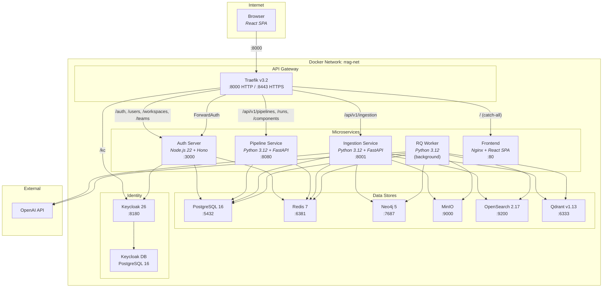
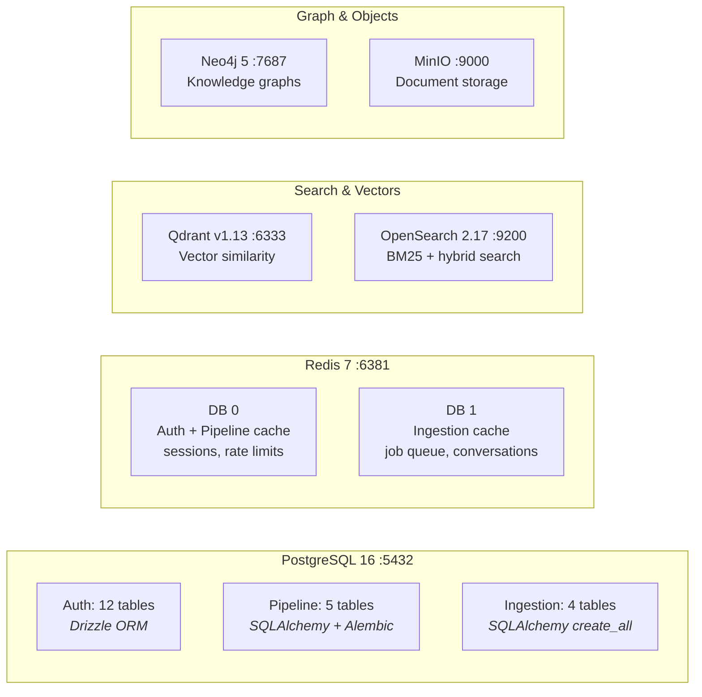
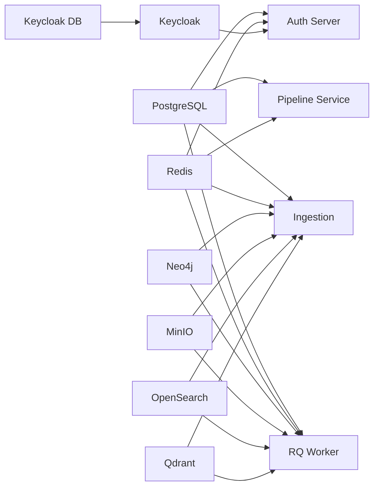

# Microservices Architecture Overview

> Single-page reference for the RRAG platform — 14 containers, 5 microservices, 8 data stores.

---

## System Topology



---

## Service Cards

### 1. Auth Server

| | |
|---|---|
| **Stack** | Node.js 22 + Hono 4.6 + Drizzle ORM |
| **Port** | 3000 |
| **Database** | 12 PostgreSQL tables (Drizzle migrations) |
| **Cache** | Redis DB 0 — sessions, rate limits, token blacklist, entity cache |
| **Source** | `rrag-auth-server/` |

**Responsibilities:** Keycloak JWT validation (JWKS, dual-issuer), user auto-provisioning from KC claims, RBAC with platform admin, team/workspace management, API key authentication, audit logging, ForwardAuth endpoint for Traefik.

**API Surface:**

| Route Prefix | Endpoints | Auth |
|-------------|-----------|------|
| `/auth/*` | OIDC config, verify, me, logout, sessions | Bearer / None |
| `/users/*` | List, invite, role change, suspend | org_admin |
| `/workspaces/*` | CRUD, members, access grants | ws_admin+ |
| `/teams/*` | CRUD, members | org_admin / lead |
| `/workspaces/:id/api-keys/*` | Create, list, revoke | ws_admin |
| `/audit-logs` | Query events | admin |
| `/health` | Health check | None |

**Key Tables:** organizations, users, teams, team_members, workspaces, workspace_members, sessions, api_keys, audit_logs, sso_configs, user_invitations, workspace_access_grants

---

### 2. Pipeline Service

| | |
|---|---|
| **Stack** | Python 3.12 + FastAPI + SQLAlchemy 2.0 (async) + asyncpg |
| **Port** | 8080 |
| **Database** | 5 PostgreSQL tables (Alembic migrations) |
| **Cache** | Redis DB 0 — entity/list cache (TTL 60s–300s) |
| **Source** | `rrag-pipeline-service/` |

**Responsibilities:** Visual pipeline CRUD with XYFlow canvas, version management (immutable snapshots), pipeline execution engine, component registry (58 components across 13 categories), template library (23 built-in templates), query pipeline compilation and sync to ingestion service.

**API Surface:**

| Route Prefix | Endpoints | Min Role |
|-------------|-----------|----------|
| `/api/v1/pipelines` | CRUD, run, versions | viewer (read), developer (write) |
| `/api/v1/runs` | Get run status, list runs | viewer |
| `/api/v1/components` | List registered components | viewer |
| `/api/v1/templates` | List/get pipeline templates | viewer |
| `/health` | Health check | None |

**Key Tables:** pipelines, pipeline_versions, pipeline_runs, components, pipeline_templates

---

### 3. Ingestion Service

| | |
|---|---|
| **Stack** | Python 3.12 + FastAPI + SQLAlchemy 2.0 (async) + asyncpg |
| **Port** | 8001 |
| **Database** | 4 PostgreSQL tables (SQLAlchemy `create_all`) |
| **Cache** | Redis DB 1 — entity cache (TTL 30s–300s), job queue, conversations |
| **Backends** | MinIO, Qdrant, OpenSearch, Neo4j, OpenAI |
| **Source** | `rrag-ingestion/` |

**Responsibilities:** Document upload and storage (MinIO), ingestion pipeline execution (parse → chunk → embed → index), RAG query execution (vector/hybrid/graph retrieval → rerank → generate), SSE streaming for jobs and queries, multi-turn chat with function-calling, datastore management, query pipeline CRUD.

**API Surface:**

| Route Prefix | Endpoints | Min Role |
|-------------|-----------|----------|
| `/api/v1/ingestion/documents` | Upload, list, get, delete | viewer (read), developer (write) |
| `/api/v1/ingestion/jobs` | Create, list, get, cancel, SSE stream | viewer (read), developer (write) |
| `/api/v1/ingestion/query` | Sync query, SSE stream, conversations | developer |
| `/api/v1/ingestion/chat` | Chat, SSE stream, conversations | developer |
| `/api/v1/ingestion/datastores` | CRUD, retrieval strategies | viewer (read), developer (write) |
| `/api/v1/ingestion/query-pipelines` | CRUD, tool schema | viewer (read), developer (write) |
| `/api/v1/ingestion/pipelines` | CRUD, validate YAML configs | viewer (read), developer (write) |
| `/api/v1/ingestion/components` | List, by type, details | viewer |
| `/api/v1/ingestion/admin` | Stats, queue, config, health | org_admin |
| `/health` | Health check | None |

**Key Tables:** documents, datastores, jobs, query_pipelines

---

### 4. RQ Worker

| | |
|---|---|
| **Stack** | Same Docker image as Ingestion Service |
| **Command** | `rq worker --with-scheduler -u {REDIS_URL} ingestion` |
| **Database** | PostgreSQL (sync sessions via psycopg2) |
| **Queue** | Redis DB 1 (`rq:queue:ingestion`) |
| **Source** | `rrag-ingestion/` (shared codebase) |

**Responsibilities:** Dequeues and executes async ingestion jobs: document parsing, chunking, embedding generation (OpenAI), vector indexing (Qdrant), full-text indexing (OpenSearch), knowledge graph construction (Neo4j), datastore creation/update.

**No API surface** — runs as a background worker process only.

---

### 5. Frontend

| | |
|---|---|
| **Stack** | React 19 + TypeScript + Vite 7 + Tailwind CSS 4 + XYFlow 12 + Monaco Editor |
| **Port** | 80 (Nginx) |
| **State** | Zustand (auth, workspace, pipeline editor) |
| **Auth** | Keycloak OIDC + PKCE (public client) |
| **Source** | `rrag-frontend/` |

**Responsibilities:** Single Page Application with 22 pages spanning core features (dashboard, chat, pipeline editor, documents, datastores, jobs, query pipelines) and admin pages (user/team/workspace management, API keys, audit logs, queue management, service health).

**Pages (22):**

| Section | Pages |
|---------|-------|
| **Auth** | Login, OIDC Callback |
| **Core** | Dashboard, Chat, Documents, DataStores, NewDataStore, IngestionPipelines, IngestionJobs, IngestionJobDetail, QueryPipelines, PipelineEditor, PipelineRuns |
| **Admin** | AdminDashboard, UserManagement, TeamManagement, WorkspaceManagement, ApiKeys, AuditLog, QueueManagement, ServiceHealth, SystemSettings |

---

## Infrastructure Services

### Traefik (API Gateway)

| | |
|---|---|
| **Image** | `traefik:v3.2` |
| **Ports** | 8000 (HTTP), 8443 (HTTPS), 8888 (Dashboard) |
| **Config** | `rrag-auth-server/traefik/traefik.yml` |

**Route Map:**

| Path | Target | Priority | Auth |
|------|--------|----------|------|
| `/auth/*` | auth-server:3000 | 100 | No |
| `/users/*` | auth-server:3000 | 100 | Yes |
| `/workspaces/*` | auth-server:3000 | 100 | Yes |
| `/teams/*` | auth-server:3000 | 100 | Yes |
| `/audit-logs/*` | auth-server:3000 | 100 | Yes |
| `/kc/*` | keycloak:8080 | 100 | No |
| `/api/v1/pipelines*`, `/api/v1/runs*`, `/api/v1/components*`, `/api/v1/templates*` | pipeline-service:8080 | 200 | ForwardAuth |
| `/api/v1/ingestion*` | ingestion:8001 | 200 | ForwardAuth |
| `/` (catch-all) | frontend:80 | 1 | No |

**ForwardAuth** calls `GET /auth/verify` on auth-server → injects `X-Auth-User-Id`, `X-Auth-Org-Id`, `X-Auth-Email`, `X-Auth-Org-Role`, `X-Auth-Workspace-Roles`, `X-Auth-Platform-Admin` headers.

### Keycloak (Identity Provider)

| | |
|---|---|
| **Image** | `quay.io/keycloak/keycloak:26.0` |
| **Port** | 8180 → internal 8080 |
| **Realm** | `rrag` (auto-imported from `keycloak/rrag-realm.json`) |
| **Clients** | `rrag-frontend` (public, PKCE), `rrag-backend` (confidential) |
| **Theme** | Custom `rrag` theme (`keycloak/themes/rrag/`) |
| **Database** | Separate PostgreSQL instance (`rrag-keycloak-db`) |

---

## Data Store Map



| Store | Service(s) | Purpose | Volume |
|-------|-----------|---------|--------|
| **PostgreSQL 16** | Auth, Pipeline, Ingestion | Primary database (21 tables total) | `pgdata` |
| **Redis 7** | All three services + RQ Worker | Cache-aside, rate limits, job queue, conversations | `redisdata` |
| **Neo4j 5** | Ingestion, RQ Worker | Knowledge graph (entities + relations) | `neo4jdata` |
| **MinIO** | Ingestion, RQ Worker | S3-compatible document file storage | `minio_data` |
| **OpenSearch 2.17** | Ingestion, RQ Worker | Full-text + hybrid (BM25 + vector) search | `opensearch_data` |
| **Qdrant v1.13** | Ingestion, RQ Worker | Dedicated vector similarity search | `qdrant_data` |
| **Keycloak DB** | Keycloak | Identity provider persistence | `keycloak_pgdata` |

---

## Cross-Cutting Concerns

### Authentication Flow

```
Browser → Keycloak (OIDC + PKCE) → KC tokens in localStorage
       → API request with Bearer token
       → Traefik ForwardAuth → Auth Server validates JWT (JWKS)
       → X-Auth-* headers injected → Upstream service
```

### RBAC Hierarchy

```
platform_admin → org_admin → ws_admin → developer → viewer
```

### Cache-Aside Pattern (all services)

```
Read:  Redis cache → miss → PostgreSQL → populate cache (TTL)
Write: PostgreSQL → invalidate entity + list cache keys
Error: Log → continue (non-fatal)
```

| Key Prefix | Service | TTL Range |
|-----------|---------|-----------|
| `rrag:auth:{entity}:{scope}:{suffix}` | Auth Server | 60–1800s |
| `rrag:ps:{entity}:{ws_id}:{suffix}` | Pipeline Service | 60–1800s |
| `rrag:ing:{entity}:{ws_id}:{suffix}` | Ingestion Service | 30–1800s |

### Multi-Tenant Isolation

All data is **workspace-scoped**:
- PostgreSQL: `WHERE workspace_id = :ws_id` on every query
- Redis cache: Keys include `workspace_id`
- Neo4j: Graph queries scoped by datastore label
- MinIO: File paths include `workspace_id`
- Search indexes: Per-datastore collections

### SSE Streaming Endpoints

| Endpoint | Service | Purpose |
|----------|---------|---------|
| `GET /api/v1/ingestion/jobs/stream` | Ingestion | Real-time job progress |
| `POST /api/v1/ingestion/query/stream` | Ingestion | Token-by-token RAG response |
| `POST /api/v1/ingestion/chat/stream` | Ingestion | Chat with tool-calling |

---

## Port Reference

| Port | Service | Access |
|------|---------|--------|
| **8000** | Traefik HTTP | Public gateway |
| **8443** | Traefik HTTPS | Public gateway (TLS) |
| **8888** | Traefik Dashboard | Admin |
| **3000** | Auth Server | Internal |
| **8080** | Pipeline Service | Internal |
| **8001** | Ingestion Service | Internal |
| **5432** | PostgreSQL | Internal |
| **6381** | Redis | Internal |
| **7474** | Neo4j Browser | Admin |
| **7687** | Neo4j Bolt | Internal |
| **9000** | MinIO API | Internal |
| **9001** | MinIO Console | Admin |
| **9200** | OpenSearch | Internal |
| **6333** | Qdrant HTTP | Internal |
| **6334** | Qdrant gRPC | Internal |
| **8180** | Keycloak Admin | Admin |

---

## Startup Order



All dependencies enforced via Docker Compose `depends_on` with `condition: service_healthy`.
