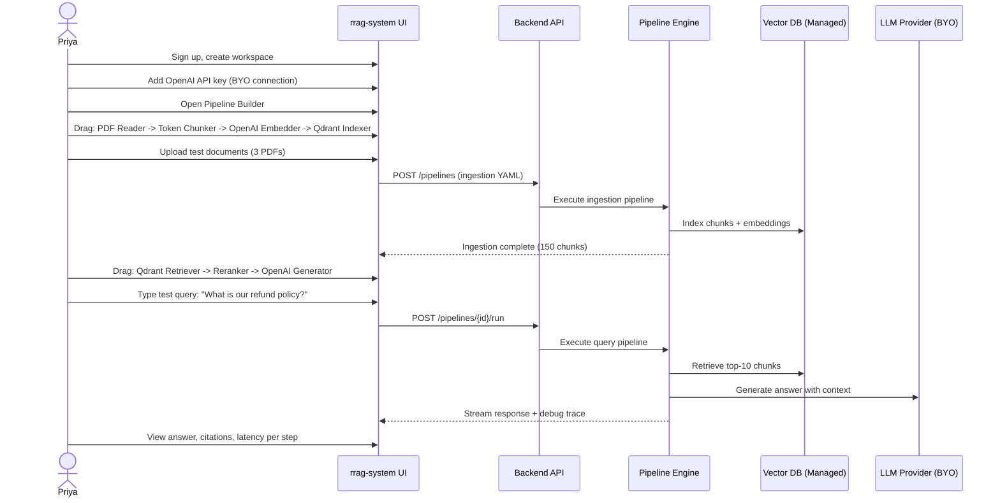
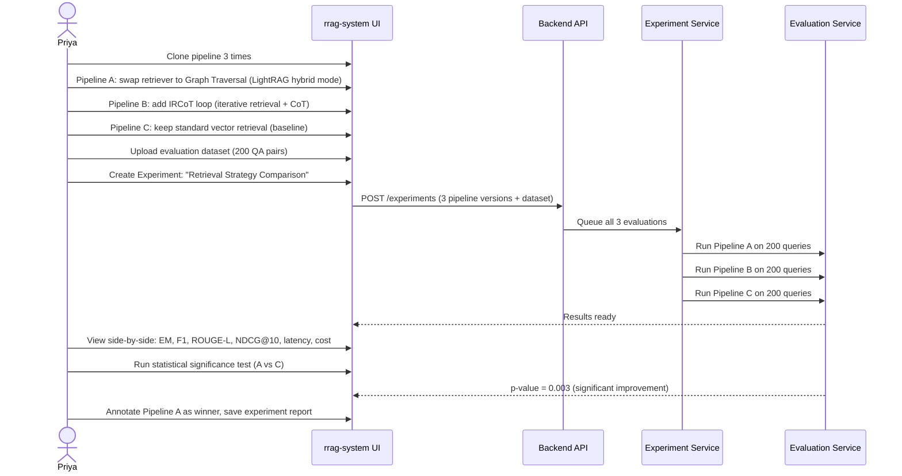
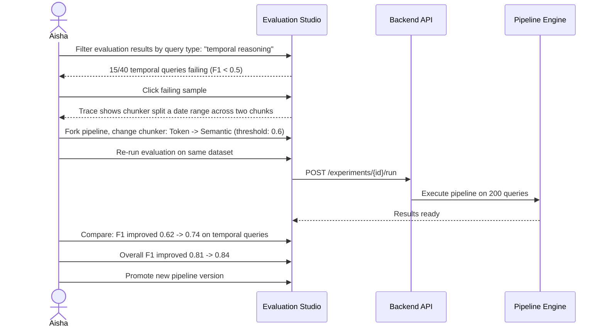
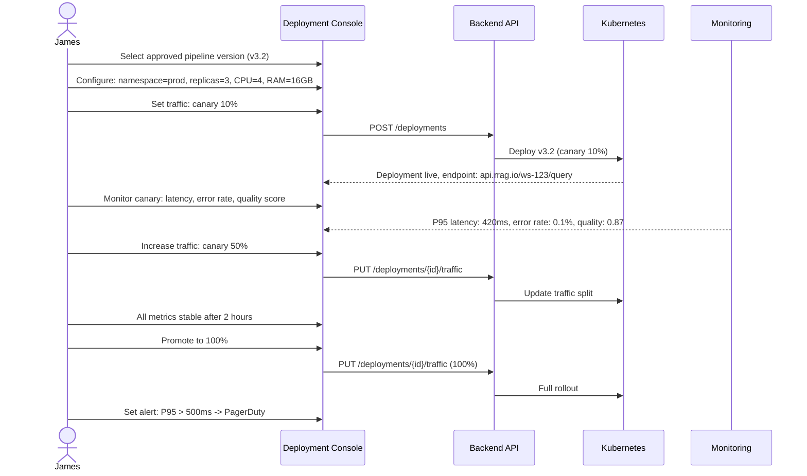
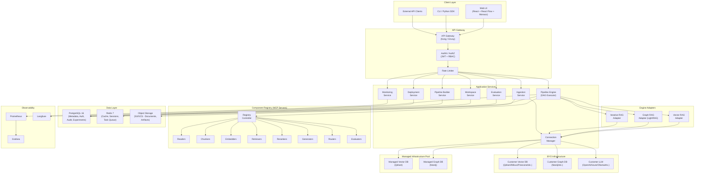
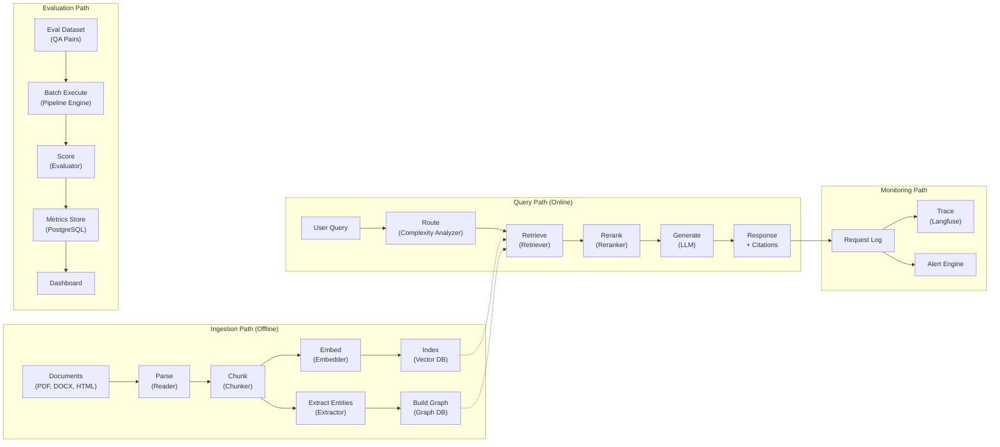
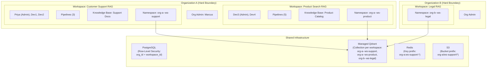
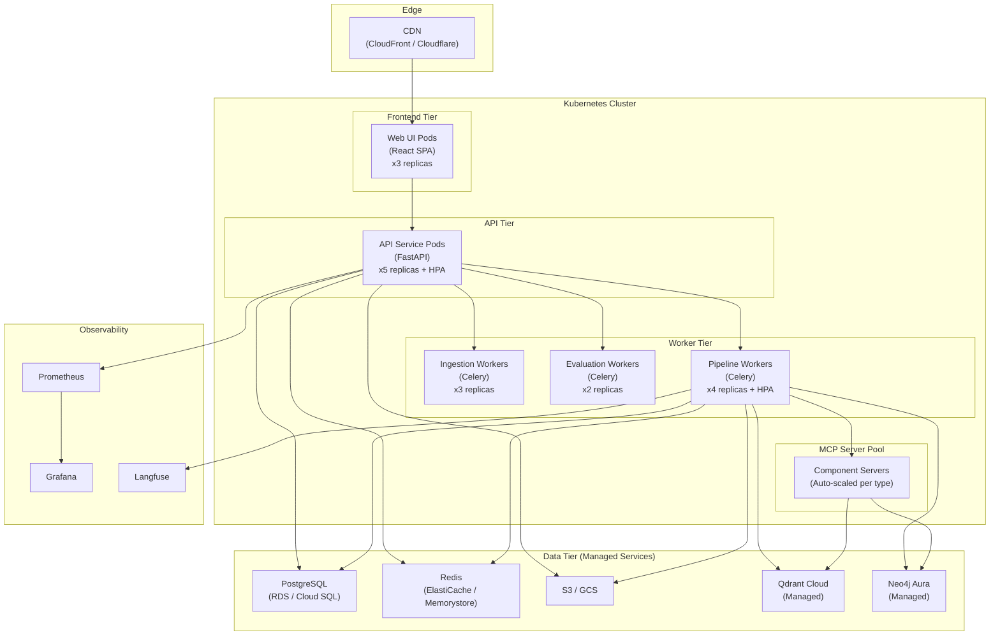
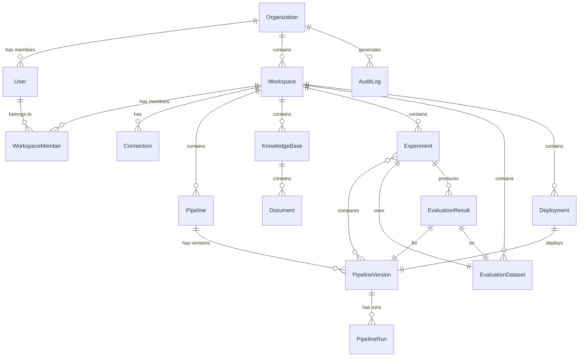
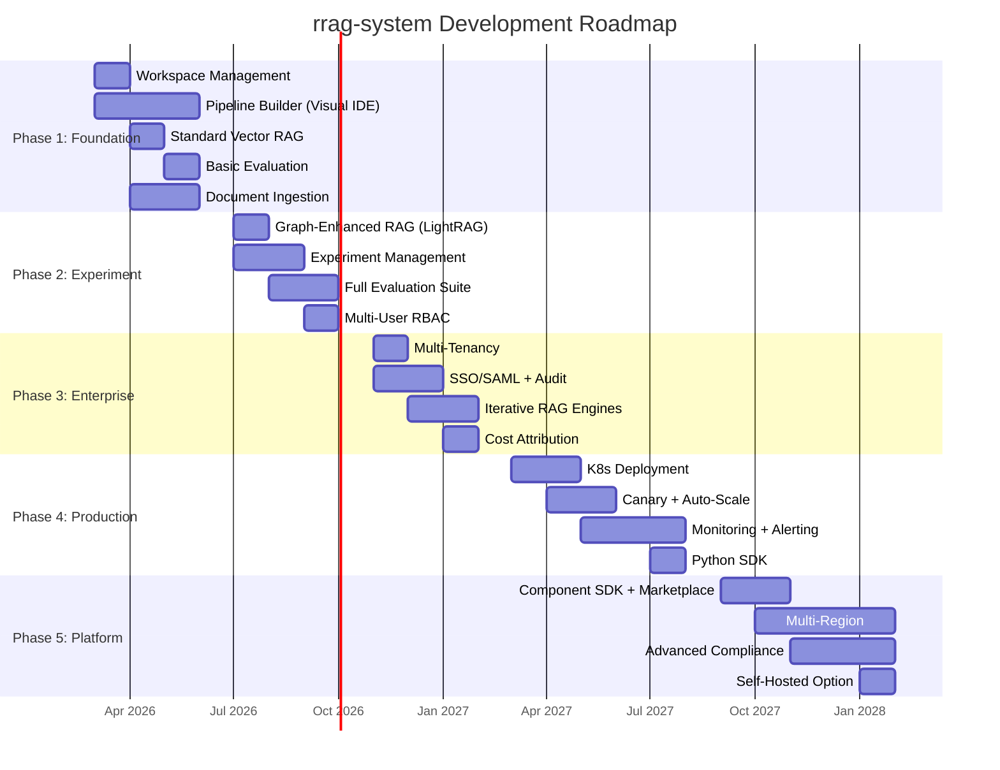

# Product Requirements Document: rrag-system

**Product Name:** rrag-system -- RAG Research & Experimentation Platform
**Version:** 1.0
**Date:** 2026-02-22
**Author:** Vinayaka Jyothi
**Status:** Draft

---

## Table of Contents

1. [Executive Summary](#1-executive-summary)
2. [Problem Statement](#2-problem-statement)
3. [Product Vision & Goals](#3-product-vision--goals)
4. [Target Personas](#4-target-personas)
5. [User Journeys](#5-user-journeys)
6. [Feature Requirements](#6-feature-requirements)
7. [System Architecture](#7-system-architecture)
8. [Data Model](#8-data-model)
9. [API Design](#9-api-design)
10. [Technology Stack](#10-technology-stack)
11. [Non-Functional Requirements](#11-non-functional-requirements)
12. [Phased Roadmap](#12-phased-roadmap)
13. [Success Metrics & KPIs](#13-success-metrics--kpis)
14. [Competitive Landscape](#14-competitive-landscape)
15. [Risks & Mitigations](#15-risks--mitigations)

---

## 1. Executive Summary

**rrag-system** is the first enterprise SaaS platform covering the **entire RAG lifecycle** -- from data ingestion through experimentation, evaluation, deployment, and production monitoring -- in a single product.

### The Gap

Existing tools each address only a slice of the RAG workflow:

- **Pipeline builders** (Langflow, Flowise) let you wire components but lack built-in evaluation and production deployment
- **Evaluation frameworks** (RAGAS, DeepEval) score outputs but don't help you build or deploy pipelines
- **LLM observability tools** (LangSmith, Langfuse) trace production traffic but don't help you experiment or evaluate pre-deployment
- **None** offer multi-engine experimentation (compare graph-enhanced RAG vs. iterative RAG vs. standard vector RAG on the same dataset with statistical significance testing)

### The Product

rrag-system unifies the entire workflow:

```
Ingest Documents -> Build Pipeline (Visual IDE) -> Run Experiments -> Evaluate (EM, F1, ROUGE, NDCG, RAGAS) -> Deploy (K8s, Canary) -> Monitor (Latency, Quality, Cost)
```

### Business Model

Multi-tenant cloud SaaS with a **BYO + Managed** hybrid infrastructure model. Users bring their own LLM API keys, vector databases, and embedding models -- or use platform-managed defaults. Enterprise pricing is subscription-based with usage-based overages.

### Research Foundation

Built on patterns proven in open-source RAG research:
- **Graph-enhanced RAG** -- Knowledge graph construction, entity extraction, multi-mode retrieval (local, global, hybrid, mix, naive) with pluggable storage backends and LLM providers
- **MCP-based composability** -- Model Context Protocol for standardized component interfaces, YAML-first pipeline orchestration with loop/branch/parallel control flow
- **Visual pipeline design** -- Bidirectional canvas-to-code sync enabling both visual and textual pipeline editing
- **Built-in evaluation** -- QA metrics (EM, F1, ROUGE) and IR metrics (MRR, MAP, NDCG, Precision, Recall) as first-class pipeline components

### Target Outcomes

- Reduce RAG development cycle from weeks to hours
- Provide reproducible experiment tracking with 1-click metric dashboards
- Enable enterprise teams to govern, audit, and scale RAG systems with confidence

---

## 2. Problem Statement

### 2.1 Fragmented Tooling

Teams stitch together 4-6 tools for a single RAG pipeline: a document parser, a chunking library, an embedding service, a vector DB, an LLM API, and a separate evaluation script. There is no single pane of glass.

Open-source RAG frameworks bundle chunking, entity extraction, graph construction, and multi-mode retrieval -- but they remain Python libraries, not platforms. MCP-based tools add composability and YAML pipelines -- but they're CLI/SDK tools, not enterprise SaaS.

### 2.2 No Experiment Reproducibility

When comparing chunking strategies (token-based vs. semantic), embedding models (`BAAI/bge-m3` vs. `text-embedding-3-large`), or retrieval modes (local entity-centric vs. global community vs. hybrid vs. naive vector), teams lack:

- Version control for pipeline configurations
- Snapshotted metrics alongside configuration versions
- Side-by-side comparison tooling
- Statistical significance testing

Results end up in scattered notebooks and Slack threads.

### 2.3 Evaluation is an Afterthought

Most pipeline builders treat evaluation as external. Some open-source RAG frameworks implement QA metrics (EM, F1, ROUGE) and IR metrics (MRR, MAP, NDCG) -- but these are only available via CLI or standalone scripts, not integrated into the pipeline design experience.

Evaluation must be a **first-class citizen** woven into every pipeline run, not bolted on after deployment.

### 2.4 No Enterprise Governance

Most open-source RAG frameworks have basic JWT with user/guest roles. This does not meet enterprise needs:

- **RBAC**: Role-based access control with granular permissions per workspace
- **Audit trails**: Immutable logs of who did what, when, on what data
- **SSO/SAML**: Enterprise identity provider integration
- **Data isolation**: Multi-tenant namespace separation with zero data leakage
- **Compliance**: SOC2, GDPR, HIPAA readiness

### 2.5 Production Deployment Gap

Building a pipeline in a notebook is fundamentally different from running it in production. No existing open-source RAG framework bridges this gap with:

- Container packaging with health checks
- Canary deployments and A/B routing
- Latency/cost dashboards with alerting
- Continuous quality monitoring on production traffic
- Auto-scaling based on load

---

## 3. Product Vision & Goals

### Vision Statement

> Enable any enterprise team to build, compare, evaluate, and operate RAG systems with the rigor of ML experimentation and the governance of enterprise software.

### 3-Year North Star

Become the default platform enterprises choose when building knowledge-augmented AI applications -- analogous to what Databricks did for data engineering or what Weights & Biases did for ML experiment tracking.

### Strategic Goals (SMART)

| # | Goal | Metric | Timeline |
|---|------|--------|----------|
| 1 | Reduce time-to-first-RAG-pipeline | From 2 weeks to < 2 hours for an enterprise data engineer | GA |
| 2 | Reproducible experiment comparison | 1-click metric dashboards with version-controlled pipelines | GA + 4 months |
| 3 | Multi-engine support | 3+ RAG architectures (graph-enhanced, iterative, standard vector) within a single workspace | GA + 8 months |
| 4 | Enterprise compliance | SOC2 Type II certification | GA + 18 months |
| 5 | Market adoption | 50 enterprise customers | GA + 24 months |

### Design Principles

1. **YAML-First, Canvas-Second** -- The canonical pipeline definition is a human-readable YAML file. The visual canvas is a synchronized view. YAML diffs cleanly in git, is reproducible, and portable.

2. **Bring Your Own Everything** -- LLMs, vector databases, graph databases, embedding models. The platform is the orchestration and evaluation layer, not a vendor lock-in trap. Managed defaults exist for quick starts.

3. **Evaluation is Not Optional** -- Every pipeline run can produce metrics. Evaluation datasets, benchmark management, and metric dashboards are core features, not plugins.

4. **Composability via MCP** -- Components are MCP (Model Context Protocol) servers with standardized interfaces. New components register without modifying the platform. Third-party extensions are first-class citizens.

5. **Enterprise from Day One** -- RBAC, audit trails, data isolation, and SSO are designed into the architecture, not retrofitted.

---

## 4. Target Personas

### 4.1 Priya -- The RAG Engineer (Primary)

| Attribute | Detail |
|-----------|--------|
| **Role** | Senior ML/AI Engineer |
| **Company** | Mid-to-large enterprise (500+ employees) |
| **Goals** | Rapidly prototype and iterate on RAG architectures; compare retrieval strategies; ship production-quality RAG |
| **Pain Points** | Writing bespoke Python scripts gluing LangChain, ChromaDB, and OpenAI; no reproducibility; evaluation is manual and ad-hoc |
| **Feature Needs** | Visual pipeline builder, YAML export, multi-engine comparison (graph RAG vs. iterative vs. vector), built-in evaluation with EM/F1/ROUGE/IR metrics, debug trace viewer |
| **Success Metric** | Reduces pipeline iteration cycle from days to hours |

### 4.2 Marcus -- The Data Platform Lead

| Attribute | Detail |
|-----------|--------|
| **Role** | Engineering Manager, AI/Data Infrastructure |
| **Company** | Large enterprise (2000+ employees), multiple AI teams |
| **Goals** | Standardize RAG infrastructure across teams; ensure governance and cost control |
| **Pain Points** | Every team uses different tools; no central component registry; no audit trail; no cost visibility |
| **Feature Needs** | Workspace management, RBAC, component registry, shared templates, usage analytics, cost attribution per team |
| **Success Metric** | Single platform adopted by 5+ teams within 6 months |

### 4.3 Dr. Aisha -- The Evaluation Scientist

| Attribute | Detail |
|-----------|--------|
| **Role** | ML Researcher / QA Specialist focused on RAG quality |
| **Company** | Enterprise or research lab |
| **Goals** | Run systematic evaluations across benchmark datasets; publish reproducible results; identify and fix quality regressions |
| **Pain Points** | Writing custom eval scripts; no standard benchmark integration; results scattered in notebooks; no statistical significance testing |
| **Feature Needs** | Evaluation studio with benchmark dataset management, metric comparison dashboards, statistical significance testing (permutation tests), leaderboard views, per-sample drill-down |
| **Success Metric** | Can run a full TREC-style evaluation across 3 pipeline variants in under 1 hour |

### 4.4 James -- The DevOps/MLOps Engineer

| Attribute | Detail |
|-----------|--------|
| **Role** | Infrastructure Engineer responsible for deploying and monitoring AI services |
| **Company** | Enterprise with Kubernetes-based infrastructure |
| **Goals** | Deploy RAG pipelines to production with observability; manage scaling; ensure SLA compliance |
| **Pain Points** | RAG pipelines are Jupyter notebooks; no container packaging; no health checks; no A/B testing infrastructure |
| **Feature Needs** | One-click deployment to Kubernetes, canary rollouts, latency/cost dashboards, alerting, auto-scaling, rollback |
| **Success Metric** | P99 latency under SLA; zero untracked deployments |

### 4.5 Sarah -- The Compliance Officer

| Attribute | Detail |
|-----------|--------|
| **Role** | CISO / VP of Security and Compliance |
| **Company** | Regulated enterprise (financial services, healthcare) |
| **Goals** | Ensure AI systems meet regulatory requirements; audit data access; prevent PII exposure |
| **Pain Points** | No visibility into what data RAG systems access; no PII detection; no audit logs; no data residency controls |
| **Feature Needs** | Complete audit trail, PII scanning on ingestion, data residency controls, SSO/SAML integration, encryption at rest and in transit, compliance reporting |
| **Success Metric** | Passes SOC2 Type II audit; zero compliance incidents |

---

## 5. User Journeys

### 5.1 First Pipeline Creation

**Persona:** Priya (RAG Engineer)
**Trigger:** Signs up, creates first workspace



**Outcome:** Working RAG pipeline in under 30 minutes. Priya sees the full debug trace showing retrieval scores and generation latency.

### 5.2 Multi-Engine Experiment

**Persona:** Priya (RAG Engineer)
**Trigger:** Wants to compare graph-enhanced RAG vs. iterative RAG vs. standard vector RAG



**Outcome:** Data-driven engine selection with statistical rigor. Full audit trail of what was compared and why.

### 5.3 Evaluation-Driven Iteration

**Persona:** Dr. Aisha (Evaluation Scientist)
**Trigger:** Identifies low F1 scores on a specific query category



**Outcome:** Systematic quality improvement loop. Every change is tracked, every metric is versioned.

### 5.4 Production Deployment

**Persona:** James (DevOps/MLOps Engineer)
**Trigger:** Pipeline version approved for production



**Outcome:** Zero-downtime canary deployment with full observability. Rollback available at any point.

### 5.5 Knowledge Base Management

**Persona:** Priya (RAG Engineer)
**Trigger:** Needs to ingest and manage a large document corpus

**Steps:**
1. Create Knowledge Base in workspace ("Customer Support Docs")
2. Upload 500 documents (PDF, DOCX, HTML)
3. Configure ingestion pipeline: Docling Parser -> Semantic Chunker -> OpenAI Embedder -> Qdrant Indexer + LightRAG Graph Builder
4. Monitor ingestion progress (document status: pending -> processing -> completed/failed)
5. Browse indexed documents, inspect chunks and extracted entities
6. Run test queries against knowledge base
7. Schedule weekly incremental re-indexing for new documents

**Outcome:** Managed, queryable knowledge base with full lineage from source document to chunk to entity to embedding.

### 5.6 Team Collaboration & Governance

**Persona:** Marcus (Data Platform Lead)
**Trigger:** Onboarding a new AI team

**Steps:**
1. Create team workspace ("Product Search RAG")
2. Invite 5 team members, assign roles: 1 Admin, 3 Developers, 1 Viewer
3. Set resource quotas: 500K LLM tokens/month, 10GB vector storage
4. Share pipeline templates from organization's component registry
5. Review audit log: who created which pipeline, who ran which experiment
6. Set data access policies: this workspace can only access "Product Catalog" knowledge base
7. View cross-team usage analytics: token spend, pipeline count, query volume

**Outcome:** Governed multi-team RAG development with clear visibility and cost control.

### 5.7 BYO Infrastructure Connection

**Persona:** James (DevOps/MLOps Engineer)
**Trigger:** Enterprise has existing Qdrant cluster and Azure OpenAI deployment

**Steps:**
1. Navigate to Workspace Settings -> Connections
2. Add Vector DB: select "Qdrant", provide endpoint URL, API key, collection name
3. Add LLM: select "Azure OpenAI", provide endpoint, API key, deployment name
4. Add Embedding: select "Azure OpenAI Embedding", provide deployment name
5. Test all connections (green checkmarks)
6. These connections now appear as options in Pipeline Builder node configurations
7. All data stays within customer's infrastructure -- zero data egress

**Outcome:** Full BYO support. Enterprise maintains data sovereignty while benefiting from platform orchestration and evaluation.

---

## 6. Feature Requirements

### 6.1 Workspace Management

| Priority | Feature | Description | Acceptance Criteria |
|----------|---------|-------------|---------------------|
| **P0** | Workspace CRUD | Create, rename, archive, delete workspaces with metadata | User can create workspace with name/description; archived workspaces are read-only |
| **P0** | Project organization | Group pipelines, knowledge bases, experiments, deployments under a workspace | Dashboard shows all assets grouped by type |
| **P0** | Connection management | Store and manage BYO credentials (LLM, vector DB, embedding, graph DB) | Credentials encrypted with per-workspace keys; connection test endpoint; never logged in plaintext |
| **P1** | Templates | Workspace templates for common RAG patterns (Q&A, Search, Summarization) | User can create workspace from template; template pre-configures pipeline + KB |
| **P1** | Resource quotas | Per-workspace LLM token budgets, storage limits, concurrent pipeline limits | Quota enforcement with warning at 80% and hard stop at 100% |
| **P2** | Workspace cloning | Clone workspace with all pipelines and configs (without data) | New workspace created with all pipeline YAMLs; no data copied |

### 6.2 Data Ingestion

| Priority | Feature | Description | Acceptance Criteria |
|----------|---------|-------------|---------------------|
| **P0** | Document upload | Support PDF, DOCX, HTML, Markdown, plain text, CSV | Drag-and-drop upload; batch upload; 100MB per file limit |
| **P0** | Chunking strategies | Token-based, semantic, paragraph, recursive, sliding window | Configurable via pipeline builder; preview chunks before indexing |
| **P0** | Embedding generation | Multi-provider: OpenAI, HuggingFace, Azure, Ollama, Jina | Provider selection in connection settings; batch processing |
| **P0** | Vector indexing | Create and update vector indices with progress tracking | Real-time progress bar; incremental updates without full rebuild |
| **P0** | Document status tracking | Track processing status per document (pending/processing/completed/failed) | Status visible in UI; failed documents show error reason; retry button |
| **P1** | Knowledge graph construction | Entity extraction and relationship building (LightRAG-style) | Extracted entities visible in graph explorer; supports deduplication |
| **P1** | Multimodal ingestion | Images, tables, charts from PDFs | Table content preserved; images OCR'd or described |
| **P2** | Web crawling | URL-based ingestion with configurable depth | Crawl up to N pages; respect robots.txt |
| **P2** | Scheduled re-ingestion | Periodic document refresh on schedule | Cron-like scheduling; only new/changed documents re-processed |

### 6.3 Pipeline Builder (Visual IDE)

| Priority | Feature | Description | Acceptance Criteria |
|----------|---------|-------------|---------------------|
| **P0** | Canvas editor | React Flow based drag-and-drop pipeline builder | Zoom, pan, node drag, edge connect; responsive on 1080p+ screens |
| **P0** | YAML bidirectional sync | Every pipeline is a YAML document; edits in canvas update YAML and vice versa | Changes reflect within 300ms; no data loss in round-trip |
| **P0** | Component palette | Searchable, categorized list of available components | Categories: Readers, Chunkers, Embedders, Retrievers, Rerankers, Generators, Routers, Evaluators |
| **P0** | Property inspector | Per-node parameter configuration with form UI | Generated from component JSON Schema; supports text, dropdown, number, boolean, file picker |
| **P0** | Typed connector protocol | Ports declare input/output types; only compatible connections allowed | Incompatible ports gray out during drag; type mismatch shows error tooltip |
| **P0** | Control flow: sequential | Steps execute in order; outputs flow to next step | Default execution mode |
| **P0** | Control flow: loop | Repeat steps N times or until condition met | Visual loop node wrapping sub-pipeline; configurable max iterations and terminal condition |
| **P0** | Control flow: branch | Route execution based on router decision | Visual branch node with named paths; router output determines path |
| **P1** | Control flow: parallel | Execute multiple branches simultaneously, merge results | asyncio.gather(); merger node combines outputs |
| **P1** | Pipeline versioning | Git-like version history for pipeline configurations | Version list with diff view; rollback to any version |
| **P1** | Pipeline templates | Pre-built templates: Vanilla RAG, Graph RAG, Iterative RAG, Hybrid Search | Template gallery modal; one-click creation; customizable after creation |
| **P1** | Debug trace viewer | Step-by-step execution inspection | Shows inputs/outputs at each node, latency per step, token usage; click step to highlight node on canvas |
| **P1** | YAML code editor | Monaco Editor with syntax highlighting, autocomplete, error annotations | Bidirectional sync with canvas; validation errors shown inline |
| **P2** | Pipeline import/export | Export as YAML, Docker Compose, Python script | All formats produce runnable output |
| **P2** | Keyboard shortcuts | Ctrl+S save, Ctrl+Z undo, Ctrl+Enter run, Delete remove node | Discoverable via Cmd+K palette |

### 6.4 Evaluation Studio

| Priority | Feature | Description | Acceptance Criteria |
|----------|---------|-------------|---------------------|
| **P0** | QA metrics | Exact Match, F1, Accuracy, Cover-EM, String-EM | Computed automatically when evaluator node present; matches reference implementations |
| **P0** | Text generation metrics | ROUGE-1, ROUGE-2, ROUGE-L | Standard ROUGE scoring |
| **P0** | IR metrics | MRR, MAP, NDCG@k, Precision@k, Recall@k | Configurable k values (1, 3, 5, 10, 20); TREC-compatible |
| **P0** | RAGAS metrics | Faithfulness, Answer Relevance, Context Recall, Context Precision | Integration with RAGAS library |
| **P0** | Benchmark dataset management | Upload QA pairs (JSON/CSV), TREC format datasets | Dataset versioning; preview samples; train/test split |
| **P0** | Experiment creation | Link N pipeline versions + 1 evaluation dataset = 1 experiment | Run all variants; results stored together |
| **P0** | Side-by-side comparison | Compare metrics across pipeline variants in one view | Table view + bar charts; highlight best performer per metric |
| **P1** | Statistical significance | Permutation tests for p-values comparing two systems | Two-sided test; configurable significance level (default 0.05) |
| **P1** | Per-sample drill-down | Inspect individual query results across variants | Click sample to see query, expected answer, generated answer, retrieved chunks, metrics |
| **P1** | Evaluation scheduling | Run evaluations on schedule or triggered by pipeline changes | Cron scheduling; webhook trigger; email notification on completion |
| **P2** | Custom metrics | User-defined evaluation functions (Python) | Upload Python function conforming to evaluator interface; auto-registered |
| **P2** | Human evaluation workflows | Annotation interface for human judges | Rate responses on Likert scale; inter-annotator agreement (Cohen's kappa) |
| **P2** | LLM-as-Judge | Use LLM to evaluate response quality | Configurable rubric; multiple judge models for cross-validation |

### 6.5 Multi-Engine Support

| Priority | Feature | Description | Acceptance Criteria |
|----------|---------|-------------|---------------------|
| **P0** | Standard vector RAG | Dense retrieval from vector store | Works with Qdrant, Milvus, Faiss, pgvector |
| **P0** | BM25 retrieval | Sparse keyword-based retrieval | OpenSearch or built-in BM25 index |
| **P0** | Hybrid retrieval | Dense + BM25 with configurable fusion weight | Alpha parameter (0-1) for dense vs. sparse weighting |
| **P0** | Graph-enhanced RAG | LightRAG-style with knowledge graph, entity extraction, multi-mode retrieval | Supports local (entity-centric), global (community), hybrid, and mix modes |
| **P1** | Iterative RAG (IRCoT) | Loop-based retrieval with chain-of-thought reasoning | Configurable max iterations; terminal condition based on answer completeness |
| **P1** | Iterative Retrieval-Generation (IterRetGen) | Generate -> extract queries -> retrieve -> generate loop | Each iteration refines context |
| **P2** | Agentic RAG | ReAct-style with tool use for dynamic retrieval decisions | Agent decides when to search, what to search, when to stop |
| **P2** | Multimodal RAG | Image + text retrieval and generation | Support for vision LLMs; image embedding models |

### 6.6 Deployment Module

| Priority | Feature | Description | Acceptance Criteria |
|----------|---------|-------------|---------------------|
| **P0** | REST API generation | Auto-generate FastAPI endpoint from pipeline | POST /query endpoint with configurable params; OpenAPI docs |
| **P0** | Environment management | Dev, staging, production environments per workspace | Isolated configurations per environment |
| **P1** | Container packaging | Docker image generation from pipeline | Dockerfile + docker-compose.yml auto-generated |
| **P1** | Kubernetes deployment | Helm chart generation and deployment | One-click deploy to connected K8s cluster; configurable replicas, resources |
| **P1** | Canary deployments | Gradual traffic routing (10% -> 50% -> 100%) | Traffic split configurable; metrics comparison between versions |
| **P1** | Auto-scaling | HPA based on request volume and latency | Configurable min/max replicas; target CPU/latency thresholds |
| **P2** | Rollback | One-click rollback to previous version | Instant traffic shift; zero downtime |
| **P2** | API key management | Per-deployment API keys with rotation | Keys scoped to deployment; rotation without downtime |

### 6.7 Monitoring & Observability

| Priority | Feature | Description | Acceptance Criteria |
|----------|---------|-------------|---------------------|
| **P0** | Request logging | Every query logged with input, output, latency, token usage, cost | Searchable log viewer; 30-day default retention |
| **P0** | Latency dashboards | P50, P95, P99 by pipeline, endpoint, and time range | Real-time dashboards; configurable time windows |
| **P0** | Error tracking | Failed queries, timeouts, LLM provider errors | Error categorization; stack traces; retry counts |
| **P1** | Cost attribution | Per-workspace, per-pipeline, per-deployment LLM spend | Token usage breakdown by model; daily/weekly/monthly views |
| **P1** | Quality monitoring | Continuous evaluation on production traffic samples | Sample N% of production queries; run eval metrics; alert on quality regression |
| **P1** | Langfuse integration | LLM-specific tracing with prompt management | Full trace per request; prompt version tracking |
| **P2** | Drift detection | Detect when retrieval quality degrades over time | Statistical comparison of metric distributions across time windows |
| **P2** | Alerting | Configurable alerts on latency, error rate, quality thresholds | PagerDuty, Slack, email integrations; configurable thresholds |

### 6.8 Admin & Governance

| Priority | Feature | Description | Acceptance Criteria |
|----------|---------|-------------|---------------------|
| **P0** | RBAC | 4 roles: Org Admin, Workspace Admin, Developer, Viewer | Permission matrix for every API endpoint; role assignment UI |
| **P0** | Audit trail | Immutable log of all actions (CRUD, deployments, data access, config changes) | Every API call logged; queryable by user, action, resource, time; 90-day retention |
| **P0** | SSO/SAML | Enterprise identity provider integration | SAML 2.0, OIDC; auto-provisioning; group mapping to roles |
| **P1** | API key management | Per-workspace API keys with rotation and scoping | Create/revoke keys; per-key rate limits |
| **P1** | Data access policies | Namespace isolation; workspace-scoped knowledge bases | Cross-workspace data access requires explicit grant |
| **P1** | Usage analytics | Cross-team dashboards: adoption, pipeline count, query volume, cost | Org-level and workspace-level views |
| **P2** | PII detection | Automated PII scanning on document ingestion | Configurable entity types (SSN, email, phone); redaction options |
| **P2** | Data residency | Region selection for data storage | US, EU, APAC regions; data stays within selected region |

---

## 7. System Architecture

### 7.1 High-Level Architecture



### 7.2 Data Flow



### 7.3 Multi-Tenancy Model



**Isolation Levels:**

| Level | Boundary | Mechanism |
|-------|----------|-----------|
| **Organization** | Hard boundary -- zero data sharing | Separate encryption keys; row-level security in PostgreSQL; namespace prefixing in all stores |
| **Workspace** | Soft boundary within org | Collection-per-workspace in vector DB; key prefixing in Redis; S3 path prefixing; cross-workspace access requires explicit grant |
| **User** | RBAC within workspace | Role-based permissions (Admin, Developer, Viewer); audit log per action |

### 7.4 Deployment Topology



---

## 8. Data Model

### Entity-Relationship Diagram



### Core Entities

#### Organization
```
id              UUID        PRIMARY KEY
name            VARCHAR     NOT NULL
plan_tier       ENUM        (free, pro, enterprise)
sso_config      JSONB       SSO/SAML configuration
settings        JSONB       Org-level settings
created_at      TIMESTAMP
updated_at      TIMESTAMP
```

#### User
```
id              UUID        PRIMARY KEY
org_id          UUID        FK -> Organization
email           VARCHAR     UNIQUE, NOT NULL
display_name    VARCHAR
role            ENUM        (org_admin, member)
sso_identity    VARCHAR     External IdP identifier
last_login_at   TIMESTAMP
created_at      TIMESTAMP
```

#### Workspace
```
id              UUID        PRIMARY KEY
org_id          UUID        FK -> Organization
name            VARCHAR     NOT NULL
description     TEXT
status          ENUM        (active, archived)
resource_quotas JSONB       {llm_tokens_monthly: int, storage_gb: int}
namespace       VARCHAR     Computed: org_slug--ws_slug (for data isolation)
created_by      UUID        FK -> User
created_at      TIMESTAMP
updated_at      TIMESTAMP
```

#### WorkspaceMember
```
workspace_id    UUID        FK -> Workspace
user_id         UUID        FK -> User
role            ENUM        (admin, developer, viewer)
PRIMARY KEY (workspace_id, user_id)
```

#### Connection
```
id              UUID        PRIMARY KEY
workspace_id    UUID        FK -> Workspace
name            VARCHAR     User-friendly name
type            ENUM        (llm, embedding, vector_db, graph_db, search)
provider        VARCHAR     (openai, azure_openai, qdrant, neo4j, milvus, etc.)
config          JSONB       Non-sensitive config (endpoint, model name, etc.)
credentials     BYTEA       Encrypted with per-workspace KMS key
status          ENUM        (active, failed, testing)
last_tested_at  TIMESTAMP
created_at      TIMESTAMP
```

#### Pipeline
```
id              UUID        PRIMARY KEY
workspace_id    UUID        FK -> Workspace
name            VARCHAR     NOT NULL
description     TEXT
type            ENUM        (ingestion, query)
status          ENUM        (draft, active, archived)
current_version INT         Latest version number
created_by      UUID        FK -> User
created_at      TIMESTAMP
updated_at      TIMESTAMP
```

#### PipelineVersion
```
id              UUID        PRIMARY KEY
pipeline_id     UUID        FK -> Pipeline
version_number  INT         Auto-incremented per pipeline
yaml_definition TEXT        Full YAML pipeline definition
layout_json     JSONB       Canvas node positions (separate from YAML)
change_summary  TEXT        What changed in this version
created_by      UUID        FK -> User
created_at      TIMESTAMP
```

#### PipelineRun
```
id              UUID        PRIMARY KEY
pipeline_ver_id UUID        FK -> PipelineVersion
status          ENUM        (pending, running, completed, failed, cancelled)
trigger         ENUM        (manual, experiment, schedule, api)
input_data      JSONB       Query or batch input
output_data     JSONB       Generated response(s)
trace_data      JSONB       Step-by-step execution trace
metrics_summary JSONB       {latency_ms, tokens_used, cost_usd, steps_count}
started_at      TIMESTAMP
completed_at    TIMESTAMP
```

#### KnowledgeBase
```
id              UUID        PRIMARY KEY
workspace_id    UUID        FK -> Workspace
name            VARCHAR     NOT NULL
description     TEXT
ingestion_pipeline_id UUID  FK -> Pipeline (ingestion type)
storage_config  JSONB       {vector_collection, graph_namespace, chunk_index}
doc_count       INT         Number of documents
chunk_count     INT         Number of indexed chunks
entity_count    INT         Number of extracted entities
created_by      UUID        FK -> User
created_at      TIMESTAMP
updated_at      TIMESTAMP
```

#### Document
```
id              UUID        PRIMARY KEY
kb_id           UUID        FK -> KnowledgeBase
filename        VARCHAR     Original filename
file_path       VARCHAR     S3/GCS path
file_size       BIGINT      Bytes
mime_type       VARCHAR
status          ENUM        (pending, processing, completed, failed)
error_message   TEXT        If status = failed
chunk_count     INT         Number of chunks produced
metadata        JSONB       Extracted metadata (title, author, pages, etc.)
created_at      TIMESTAMP
processed_at    TIMESTAMP
```

#### Experiment
```
id              UUID        PRIMARY KEY
workspace_id    UUID        FK -> Workspace
name            VARCHAR     NOT NULL
description     TEXT
dataset_id      UUID        FK -> EvaluationDataset
status          ENUM        (draft, running, completed, failed)
created_by      UUID        FK -> User
created_at      TIMESTAMP
completed_at    TIMESTAMP
```

#### ExperimentPipelineVersion (junction table)
```
experiment_id       UUID    FK -> Experiment
pipeline_version_id UUID    FK -> PipelineVersion
PRIMARY KEY (experiment_id, pipeline_version_id)
```

#### EvaluationDataset
```
id              UUID        PRIMARY KEY
workspace_id    UUID        FK -> Workspace
name            VARCHAR     NOT NULL
description     TEXT
format          ENUM        (qa_pairs, trec, custom)
item_count      INT         Number of evaluation samples
file_path       VARCHAR     S3/GCS path to dataset file
schema          JSONB       Column definitions
created_by      UUID        FK -> User
created_at      TIMESTAMP
```

#### EvaluationResult
```
id                  UUID    PRIMARY KEY
experiment_id       UUID    FK -> Experiment
pipeline_version_id UUID    FK -> PipelineVersion
dataset_id          UUID    FK -> EvaluationDataset
metrics             JSONB   {em: 0.72, f1: 0.84, rouge_l: 0.78, ndcg_10: 0.65, ...}
per_sample_results  JSONB   Array of per-query metrics
latency_summary     JSONB   {p50_ms, p95_ms, p99_ms, avg_ms}
cost_summary        JSONB   {total_tokens, total_cost_usd}
created_at          TIMESTAMP
```

#### Deployment
```
id                  UUID    PRIMARY KEY
workspace_id        UUID    FK -> Workspace
pipeline_version_id UUID    FK -> PipelineVersion
environment         ENUM    (dev, staging, production)
endpoint_url        VARCHAR Generated API endpoint
status              ENUM    (deploying, active, stopped, failed)
config              JSONB   {replicas, cpu, memory, auto_scale, traffic_pct}
api_key_hash        VARCHAR Hashed deployment API key
created_by          UUID    FK -> User
created_at          TIMESTAMP
updated_at          TIMESTAMP
```

#### AuditLog
```
id              UUID        PRIMARY KEY
org_id          UUID        FK -> Organization
user_id         UUID        FK -> User
action          VARCHAR     (create, read, update, delete, execute, deploy)
resource_type   VARCHAR     (pipeline, knowledge_base, experiment, deployment, etc.)
resource_id     UUID
details         JSONB       Action-specific context
ip_address      INET
user_agent      VARCHAR
timestamp       TIMESTAMP   NOT NULL, indexed
```

#### ComponentDefinition
```
id              UUID        PRIMARY KEY
category        ENUM        (reader, chunker, embedder, retriever, reranker, generator, router, evaluator)
type_key        VARCHAR     UNIQUE (e.g., "retriever.dense_qdrant")
display_name    VARCHAR
description     TEXT
icon            VARCHAR     Lucide icon name
input_schema    JSONB       Input port definitions with types
output_schema   JSONB       Output port definitions with types
config_schema   JSONB       JSON Schema for configurable parameters
is_builtin      BOOLEAN     Platform-provided vs. custom
version         VARCHAR
created_at      TIMESTAMP
```

---

## 9. API Design

Base URL: `https://api.rrag.io/v1`

All endpoints require authentication via Bearer token (JWT) unless noted.

### 9.1 Authentication

| Method | Endpoint | Description |
|--------|----------|-------------|
| POST | `/auth/login` | Email/password login, returns JWT |
| POST | `/auth/sso/callback` | SSO/SAML callback handler |
| POST | `/auth/token/refresh` | Refresh expired access token |
| GET | `/auth/me` | Current user profile and permissions |

### 9.2 Workspaces

| Method | Endpoint | Description |
|--------|----------|-------------|
| POST | `/workspaces` | Create workspace |
| GET | `/workspaces` | List user's workspaces |
| GET | `/workspaces/{ws_id}` | Get workspace details with stats |
| PATCH | `/workspaces/{ws_id}` | Update workspace name/description |
| DELETE | `/workspaces/{ws_id}` | Archive workspace (soft delete) |
| GET | `/workspaces/{ws_id}/members` | List workspace members |
| POST | `/workspaces/{ws_id}/members` | Add member with role |
| PUT | `/workspaces/{ws_id}/members/{user_id}` | Update member role |
| DELETE | `/workspaces/{ws_id}/members/{user_id}` | Remove member |

### 9.3 Connections

| Method | Endpoint | Description |
|--------|----------|-------------|
| POST | `/workspaces/{ws_id}/connections` | Add BYO connection |
| GET | `/workspaces/{ws_id}/connections` | List connections |
| POST | `/workspaces/{ws_id}/connections/{id}/test` | Test connection health |
| DELETE | `/workspaces/{ws_id}/connections/{id}` | Remove connection |

### 9.4 Pipelines

| Method | Endpoint | Description |
|--------|----------|-------------|
| POST | `/workspaces/{ws_id}/pipelines` | Create pipeline |
| GET | `/workspaces/{ws_id}/pipelines` | List pipelines with filters |
| GET | `/workspaces/{ws_id}/pipelines/{id}` | Get pipeline with current YAML |
| PUT | `/workspaces/{ws_id}/pipelines/{id}` | Update pipeline YAML (creates new version) |
| DELETE | `/workspaces/{ws_id}/pipelines/{id}` | Archive pipeline |
| GET | `/workspaces/{ws_id}/pipelines/{id}/versions` | List all versions |
| GET | `/workspaces/{ws_id}/pipelines/{id}/versions/{ver}` | Get specific version YAML |
| POST | `/workspaces/{ws_id}/pipelines/{id}/run` | Execute pipeline (single query) |
| POST | `/workspaces/{ws_id}/pipelines/{id}/run/batch` | Execute pipeline (batch) |
| GET | `/workspaces/{ws_id}/pipelines/{id}/runs` | List pipeline runs |
| GET | `/workspaces/{ws_id}/pipelines/{id}/runs/{run_id}` | Get run details with trace |

### 9.5 Knowledge Bases

| Method | Endpoint | Description |
|--------|----------|-------------|
| POST | `/workspaces/{ws_id}/knowledge-bases` | Create knowledge base |
| GET | `/workspaces/{ws_id}/knowledge-bases` | List knowledge bases |
| GET | `/workspaces/{ws_id}/knowledge-bases/{kb_id}` | Get KB details with stats |
| POST | `/workspaces/{ws_id}/knowledge-bases/{kb_id}/documents` | Upload documents (multipart) |
| GET | `/workspaces/{ws_id}/knowledge-bases/{kb_id}/documents` | List documents with status |
| GET | `/workspaces/{ws_id}/knowledge-bases/{kb_id}/documents/{doc_id}` | Get document details + chunks |
| DELETE | `/workspaces/{ws_id}/knowledge-bases/{kb_id}/documents/{doc_id}` | Delete document (triggers re-indexing) |
| POST | `/workspaces/{ws_id}/knowledge-bases/{kb_id}/query` | Test query against KB |
| POST | `/workspaces/{ws_id}/knowledge-bases/{kb_id}/reindex` | Trigger full re-indexing |

### 9.6 Evaluation

| Method | Endpoint | Description |
|--------|----------|-------------|
| POST | `/workspaces/{ws_id}/datasets` | Upload evaluation dataset |
| GET | `/workspaces/{ws_id}/datasets` | List datasets |
| GET | `/workspaces/{ws_id}/datasets/{id}` | Get dataset details with sample preview |
| POST | `/workspaces/{ws_id}/experiments` | Create experiment (pipeline versions + dataset) |
| GET | `/workspaces/{ws_id}/experiments` | List experiments |
| POST | `/workspaces/{ws_id}/experiments/{id}/run` | Execute evaluation |
| GET | `/workspaces/{ws_id}/experiments/{id}` | Get experiment with status |
| GET | `/workspaces/{ws_id}/experiments/{id}/results` | Get all results with metrics |
| GET | `/workspaces/{ws_id}/experiments/{id}/compare` | Side-by-side comparison view |
| POST | `/workspaces/{ws_id}/experiments/{id}/significance` | Run statistical significance test between two variants |

### 9.7 Deployments

| Method | Endpoint | Description |
|--------|----------|-------------|
| POST | `/workspaces/{ws_id}/deployments` | Deploy pipeline version |
| GET | `/workspaces/{ws_id}/deployments` | List deployments |
| GET | `/workspaces/{ws_id}/deployments/{id}` | Get deployment details |
| PUT | `/workspaces/{ws_id}/deployments/{id}/traffic` | Update traffic routing |
| POST | `/workspaces/{ws_id}/deployments/{id}/rollback` | Rollback to previous version |
| DELETE | `/workspaces/{ws_id}/deployments/{id}` | Stop deployment |

### 9.8 Monitoring

| Method | Endpoint | Description |
|--------|----------|-------------|
| GET | `/workspaces/{ws_id}/deployments/{id}/metrics` | Get latency, error rate, cost metrics |
| GET | `/workspaces/{ws_id}/deployments/{id}/logs` | Query request logs |
| POST | `/workspaces/{ws_id}/deployments/{id}/alerts` | Configure alert rules |
| GET | `/workspaces/{ws_id}/usage` | Workspace usage summary (tokens, cost, storage) |

### 9.9 Component Registry

| Method | Endpoint | Description |
|--------|----------|-------------|
| GET | `/components` | List all available components by category |
| GET | `/components/{category}` | List components in category |
| GET | `/components/{category}/{type_key}/schema` | Get component config JSON Schema |
| POST | `/components` | Register custom component (org admin only) |

### 9.10 Admin

| Method | Endpoint | Description |
|--------|----------|-------------|
| GET | `/admin/audit-logs` | Query audit trail with filters |
| GET | `/admin/organizations/{org_id}/usage` | Organization usage analytics |
| PUT | `/admin/organizations/{org_id}/quotas` | Set organization quotas |
| GET | `/admin/system/health` | System health check |

---

## 10. Technology Stack

| Layer | Technology | Rationale |
|-------|-----------|-----------|
| **Frontend Framework** | React 19 + TypeScript | Mature ecosystem; strong component library support; industry standard for enterprise SPAs |
| **Pipeline Canvas** | React Flow (xyflow) | Industry-standard node editor; proven in multiple RAG visual IDEs |
| **Code Editor** | Monaco Editor | VS Code's editor; YAML syntax highlighting + autocomplete |
| **CSS** | Tailwind CSS | Utility-first; fast iteration; widely adopted in modern React apps |
| **Frontend State** | Zustand | Lightweight; good for canvas/YAML sync state management |
| **Backend Framework** | Python 3.12 + FastAPI | Dominant language in RAG/ML ecosystem; FastAPI is async-native for I/O bound RAG workloads |
| **Pipeline Engine** | Custom async DAG executor | MCP-based component orchestration; supports sequential, loop, branch, parallel control flow |
| **Component Protocol** | MCP via FastMCP | Standardized protocol for language-agnostic component development and registration |
| **Primary Database** | PostgreSQL 16 | Metadata, auth, audit, experiments; row-level security for multi-tenancy; JSONB for flexible schemas |
| **Cache** | Redis 7 | Sessions, pipeline execution state, LLM response caching; Celery broker |
| **Object Storage** | S3 / GCS / Azure Blob | Documents, pipeline artifacts, evaluation datasets |
| **Task Queue** | Celery + Redis broker | Async pipeline execution, document processing, evaluation runs |
| **Default Vector DB** | Qdrant | Excellent filtering and payload indexing; managed cloud option (Qdrant Cloud); strong open-source community |
| **Default Graph DB** | Neo4j | Industry-standard graph DB; Cypher query language; Neo4j Aura for managed hosting |
| **API Gateway** | Kong or Envoy | Rate limiting, JWT validation, request routing |
| **Auth Provider** | Keycloak (self-hosted) / Auth0 (cloud) | Enterprise SSO/SAML; OIDC; multi-tenant support |
| **Observability** | Prometheus + Grafana | Metrics and dashboards |
| **LLM Tracing** | Langfuse | Open-source LLM observability; prompt management; cost tracking |
| **Container Runtime** | Docker + Kubernetes | Standard enterprise deployment |
| **Helm Charts** | Custom charts | K8s deployment for API, workers, PostgreSQL, Neo4j, Redis, Qdrant |
| **CI/CD** | GitHub Actions + ArgoCD | GitOps-based continuous deployment |

---

## 11. Non-Functional Requirements

### 11.1 Security

| Requirement | Specification |
|-------------|---------------|
| **Encryption in transit** | TLS 1.3 for all external connections; mTLS between internal services |
| **Encryption at rest** | AES-256 for all stored data; per-organization encryption keys |
| **Credential storage** | BYO API keys encrypted with per-workspace KMS keys; never stored in plaintext; never in logs |
| **Authentication** | JWT with configurable expiry; SSO/SAML 2.0; MFA support via identity provider |
| **Authorization** | RBAC with 4 levels; permission matrix for every API endpoint; field-level access control |
| **Audit logging** | Every API call logged (user, action, resource, timestamp, IP); immutable; 90-day retention; configurable up to 7 years |
| **Secrets management** | Integration with HashiCorp Vault / AWS KMS / GCP KMS |
| **Dependency scanning** | Automated CVE scanning in CI/CD; Dependabot or Snyk |
| **Penetration testing** | Quarterly third-party pen tests |

### 11.2 Performance

| Metric | Target |
|--------|--------|
| **Pipeline cold start** | < 5 seconds (model warm-up not included) |
| **Cached retrieval** | < 500ms for vector search + reranking |
| **Document ingestion throughput** | 100+ documents/minute for typical enterprise docs (avg 10 pages) |
| **API latency (metadata operations)** | P95 < 200ms |
| **API latency (RAG queries)** | P95 < 3s (depends on LLM latency; target is overhead < 500ms above LLM time) |
| **Concurrent users** | 1,000+ concurrent active users per cluster |
| **Evaluation throughput** | 10,000+ evaluation samples/hour |
| **WebSocket sync** | Canvas-to-YAML sync < 300ms |

### 11.3 Scalability

| Dimension | Target |
|-----------|--------|
| **Horizontal scaling** | All application services are stateless and horizontally scalable via Kubernetes HPA |
| **Data scale** | 10M+ chunks per workspace; 1000+ pipelines per organization |
| **Concurrent pipelines** | 100+ concurrent pipeline executions per organization |
| **Multi-region** | Active-passive initially; active-active within 12 months of GA |
| **Auto-scaling** | HPA based on CPU/memory and custom metrics (request queue depth) |

### 11.4 Reliability

| Metric | Target |
|--------|--------|
| **Availability** | 99.9% uptime SLA (production tier) |
| **RPO** | < 1 hour (Recovery Point Objective) |
| **RTO** | < 4 hours (Recovery Time Objective) |
| **Data durability** | 99.999999999% (11 nines) via S3/GCS |
| **Graceful degradation** | If managed vector DB unavailable, fail only affected pipeline steps |
| **Circuit breakers** | All external service calls (LLMs, BYO infra) protected by circuit breakers |

### 11.5 Compliance

| Standard | Timeline |
|----------|----------|
| **SOC2 Type II** | GA + 18 months |
| **GDPR** | GA (data residency controls, right to deletion, DPA) |
| **HIPAA** | GA + 24 months (BAA support for healthcare) |
| **ISO 27001** | GA + 24 months |

---

## 12. Phased Roadmap

### Phase 1: Foundation (Months 1-4) -- "Build & Evaluate"

**Goal:** Core platform with standard vector RAG, basic evaluation, and single-user experience.

| Deliverable | Details |
|-------------|---------|
| Workspace management | CRUD with basic JWT auth |
| Pipeline Builder | Visual canvas (React Flow) + YAML editor with bidirectional sync |
| Component Registry | Built-in: TextReader, PDFReader, TokenChunker, SemanticChunker, OpenAIEmbedder, QdrantRetriever, BM25Retriever, CrossEncoderReranker, OpenAIGenerator |
| Standard vector RAG | Dense retrieval from Qdrant; BM25 from OpenSearch; hybrid fusion |
| Document ingestion | Upload -> parse -> chunk -> embed -> index with status tracking |
| Basic evaluation | EM, F1, ROUGE metrics; dataset upload; single pipeline evaluation |
| Connection management | BYO: OpenAI, Azure OpenAI; Managed: Qdrant, Redis |
| Debug trace viewer | Step-by-step execution with inputs/outputs and latency |

**Milestone:** Internal dogfooding -- team builds 3 RAG pipelines using the platform.

### Phase 2: Experiment (Months 5-8) -- "Compare & Decide"

**Goal:** Multi-engine experimentation with full evaluation suite.

| Deliverable | Details |
|-------------|---------|
| Graph-enhanced RAG | LightRAG adapter: entity extraction, graph construction, multi-mode retrieval |
| Experiment management | Create experiments comparing N pipeline variants on same dataset |
| Full evaluation suite | Add IR metrics (NDCG, MAP, MRR), RAGAS metrics, statistical significance tests |
| Pipeline versioning | Version history with diff view; rollback |
| Pipeline templates | Vanilla RAG, Graph RAG, Hybrid Search RAG |
| Multi-user RBAC | Admin, Developer, Viewer roles per workspace |
| BYO expansion | Support Milvus, Neo4j, Ollama, HuggingFace, Azure OpenAI |
| Batch evaluation | Execute evaluations across 1000+ samples |

**Milestone:** 5 beta customers running experiments.

### Phase 3: Enterprise (Months 9-12) -- "Govern & Scale"

**Goal:** Enterprise-grade multi-tenancy, compliance, and advanced RAG engines.

| Deliverable | Details |
|-------------|---------|
| Full multi-tenancy | Organization/workspace isolation with namespace separation |
| SSO/SAML | Enterprise identity provider integration |
| Audit trail | Immutable logging of all actions |
| Resource quotas | Per-workspace token/storage limits with enforcement |
| Cost attribution | LLM spend tracking per workspace, pipeline, and deployment |
| Iterative RAG engines | IRCoT (loop + branch), IterRetGen |
| Knowledge graph explorer | Visual graph browsing, entity search |
| Pipeline template marketplace | Share templates across organization |
| Control flow: parallel | Parallel branch execution with result merging |

**Milestone:** SOC2 Type II readiness assessment; 15 paying customers.

### Phase 4: Production (Months 13-18) -- "Deploy & Monitor"

**Goal:** Production deployment infrastructure with full observability.

| Deliverable | Details |
|-------------|---------|
| REST API endpoint generation | Auto-generate FastAPI from pipeline |
| Kubernetes deployment | Helm charts; one-click deploy |
| Canary deployments | Gradual traffic routing (10% -> 50% -> 100%) |
| Auto-scaling | HPA based on request volume |
| Monitoring dashboards | Latency (P50/P95/P99), error rate, cost |
| Langfuse integration | LLM tracing with prompt versioning |
| Online evaluation | Continuous quality monitoring on production traffic |
| Alerting | PagerDuty, Slack, email on threshold breaches |
| Python SDK | Programmatic access for CI/CD integration |

**Milestone:** 30 enterprise customers; first customer running production RAG workload.

### Phase 5: Platform (Months 19-24) -- "Ecosystem & Scale"

**Goal:** Platform ecosystem with extensibility and advanced capabilities.

| Deliverable | Details |
|-------------|---------|
| Custom component SDK | Anyone can build and register MCP components |
| Component marketplace | Community-contributed components and templates |
| Agentic RAG | ReAct-style with tool use |
| Multimodal RAG | Image + text retrieval and generation |
| Multi-region deployment | Active-active across US, EU, APAC |
| Advanced compliance | HIPAA BAA, ISO 27001 certification |
| AI pipeline assistant | Auto-suggest pipeline improvements from evaluation results |
| Self-hosted option | On-premises deployment for data-sovereign enterprises |
| Human evaluation workflows | Annotation interface with inter-annotator agreement |

**Milestone:** 50+ enterprise customers; component ecosystem with 20+ community contributions.

### Roadmap Visual



---

## 13. Success Metrics & KPIs

### Product Adoption

| Metric | Phase 1 | Phase 2 | Phase 3 | Phase 4 | Phase 5 |
|--------|---------|---------|---------|---------|---------|
| **Registered users** | 50 | 200 | 500 | 1,500 | 5,000 |
| **Weekly active workspaces** | 5 | 30 | 80 | 150 | 300 |
| **Pipelines created (total)** | 20 | 150 | 500 | 2,000 | 10,000 |
| **Experiments run (monthly)** | 10 | 100 | 500 | 2,000 | 10,000 |
| **Time-to-first-pipeline** | < 4h | < 2h | < 1h | < 30m | < 15m |

### Quality & Engagement

| Metric | Target |
|--------|--------|
| **Pipeline completion rate** | > 90% of started pipelines produce successful output |
| **Evaluation adoption** | > 60% of pipeline runs include evaluation |
| **30-day feature retention** | > 70% of users return to use evaluation studio |
| **NPS** | > 40 |
| **Support ticket resolution** | < 24h for P1; < 4h for P0 |

### Business

| Metric | Phase 3 | Phase 4 | Phase 5 |
|--------|---------|---------|---------|
| **Monthly Recurring Revenue** | $200K | $600K | $1.5M |
| **Enterprise customers** | 15 | 30 | 50 |
| **Net Revenue Retention** | 110% | 115% | 120% |
| **Gross Margin** | 65% | 70% | 75% |
| **CAC (self-serve)** | < $2K | < $2K | < $2K |
| **CAC (enterprise)** | < $15K | < $10K | < $8K |

### Technical

| Metric | Target |
|--------|--------|
| **Platform availability** | 99.9% |
| **API P95 latency (non-LLM)** | < 200ms |
| **Deployment success rate** | > 99% |
| **Mean time to recovery** | < 30 minutes |
| **Zero-downtime deployments** | 100% |

---

## 14. Competitive Landscape

### Feature Comparison Matrix

| Capability | rrag-system | Langflow | Flowise | Dify | Haystack Studio | LangSmith |
|-----------|:-----------:|:--------:|:-------:|:----:|:---------------:|:---------:|
| **Visual Pipeline Builder** | Yes | Yes | Yes | Yes | Yes | No |
| **YAML-first Config** | Yes | No | No | Partial | Yes | No |
| **Bidirectional Canvas-YAML Sync** | Yes | No | No | No | No | No |
| **Enterprise RBAC** | Yes (4 roles) | No | No | Basic | No | Basic |
| **Audit Trail** | Yes | No | No | No | No | No |
| **SSO/SAML** | Yes | No | No | Enterprise | No | Enterprise |
| **Built-in QA Evaluation** | Yes (EM, F1, ROUGE, RAGAS) | No | No | No | No | Tracing only |
| **Built-in IR Evaluation** | Yes (NDCG, MAP, MRR) | No | No | No | No | No |
| **Experiment Comparison** | Yes + significance tests | No | No | No | No | Partial |
| **Graph RAG Engine** | Yes (LightRAG adapter) | No | No | No | No | No |
| **Iterative RAG Engine** | Yes (IRCoT, IterRetGen) | No | No | No | No | No |
| **Multi-Engine Side-by-Side** | Yes | No | No | No | No | No |
| **Control Flow (Loop/Branch)** | Yes | Limited | Limited | Limited | Yes | No |
| **Production K8s Deployment** | Yes (Canary, A/B) | No | No | Basic | No | No |
| **Monitoring & Alerting** | Yes (built-in) | No | No | Basic | No | Yes (tracing) |
| **Cost Attribution** | Yes | No | No | No | No | Yes |
| **BYO Infrastructure** | Yes (LLMs, VDBs, Graphs) | Partial | Partial | Partial | Yes | Yes |
| **Multi-Tenancy** | Yes | No | No | Yes | No | Yes |
| **Component Registry (MCP)** | Yes | No | No | No | No | No |
| **Debug Trace Viewer** | Yes | Visual debug | Logs | Test run | Playground | Yes |

### Key Differentiators

1. **Only platform with full lifecycle coverage** -- Ingest -> Experiment -> Evaluate -> Deploy -> Monitor in a single product. Competitors cover 1-2 of these at best.

2. **Evaluation as first-class citizen** -- Not a bolt-on. Every pipeline run can produce metrics. Statistical significance testing, TREC IR metrics, RAGAS quality metrics -- all built-in. No other visual pipeline builder offers this.

3. **Multi-engine experimentation** -- Compare graph-enhanced RAG (LightRAG), iterative RAG (IRCoT), and standard vector RAG within the same workspace on the same evaluation dataset. No competitor supports this.

4. **Enterprise governance from Day 1** -- RBAC, immutable audit trails, SSO/SAML, data isolation, cost attribution. Not retrofitted as a "premium" feature.

5. **BYO + Managed** -- Enterprises keep full control of their data and infrastructure (BYO LLMs, vector DBs, graph DBs) while benefiting from platform orchestration. Others force you into their managed stack or lack enterprise integration.

6. **MCP-based extensibility** -- Components are MCP servers, enabling a third-party component ecosystem that no other pipeline builder has.

---

## 15. Risks & Mitigations

| # | Risk | Severity | Probability | Mitigation |
|---|------|:--------:|:-----------:|------------|
| 1 | **LLM provider dependency** -- API changes or outages from OpenAI/Anthropic affect all users | High | Medium | Multi-provider abstraction layer with 10+ LLM bindings. Support local models via Ollama/vLLM. No single-vendor lock-in. |
| 2 | **Vector DB fragmentation** -- Supporting too many backends dilutes engineering effort | Medium | High | Start with Qdrant (managed) + pgvector. Add Milvus, Pinecone based on customer demand. Use abstract `BaseVectorStorage` interface pattern. |
| 3 | **Multi-tenancy data leakage** -- Namespace isolation bugs expose tenant data | Critical | Low | Defense in depth: row-level security (PostgreSQL), collection-per-workspace (vector DB), key-prefix (Redis), path-prefix (S3). Quarterly pen tests. |
| 4 | **Evaluation metric correctness** -- Wrong metric implementations erode trust | High | Low | Use well-tested open-source evaluation implementations. Add comprehensive test suites. Cross-validate against SQuAD official eval and pytrec_eval reference. |
| 5 | **Scope creep** -- Feature requests pull toward general-purpose AI orchestration | Medium | High | Strict focus on RAG lifecycle. Product council reviews all P1+ features. Explicitly decline non-RAG features (fine-tuning, general agents). |
| 6 | **Enterprise sales cycle** -- 6-12 month enterprise cycles delay revenue | High | High | Offer self-serve tier for bottoms-up adoption. Free tier with limits. Developer content marketing. Open-source community components. |
| 7 | **Open-source competition** -- Someone builds similar SaaS on open-source RAG frameworks | Medium | Medium | Differentiator is integrated platform experience, not any single component. Enterprise features (RBAC, audit, multi-tenancy) are the moat. Network effects via marketplace. |
| 8 | **KG construction cost** -- Graph RAG is expensive for large corpora | High | Medium | Async batch processing with progress tracking. Tiered compute pricing for KG construction. Allow vector-only mode for cost savings. Leverage latest scalability research for graph construction. |
| 9 | **MCP protocol immaturity** -- Specification may change breaking components | Medium | Medium | Abstract MCP behind internal adapter layer. Use FastMCP extension as stable abstraction. Track spec evolution; plan migration paths. |
| 10 | **BYO infrastructure complexity** -- Supporting arbitrary customer infra creates testing matrix explosion | High | High | Define "certified" tier (fully tested: Qdrant, Neo4j, PostgreSQL, OpenAI, Azure OpenAI, Ollama) and "community" tier (best-effort). Connection health checks and diagnostics. |

---

## Appendix A: Glossary

| Term | Definition |
|------|-----------|
| **RAG** | Retrieval-Augmented Generation -- technique that augments LLM generation with retrieved context from external knowledge |
| **BYO** | Bring Your Own -- user provides their own infrastructure (LLMs, vector databases, etc.) |
| **MCP** | Model Context Protocol -- standardized interface for AI model tool interactions |
| **Knowledge Graph** | Structured representation of entities and relationships extracted from documents |
| **TREC** | Text REtrieval Conference -- standard evaluation methodology for information retrieval |
| **RAGAS** | Retrieval Augmented Generation Assessment -- framework for evaluating RAG pipeline quality |
| **IRCoT** | Interleaved Retrieval with Chain-of-Thought -- iterative RAG pattern alternating retrieval and reasoning |
| **HPA** | Horizontal Pod Autoscaler -- Kubernetes mechanism for auto-scaling based on metrics |
| **NDCG** | Normalized Discounted Cumulative Gain -- IR metric measuring ranking quality |
| **MAP** | Mean Average Precision -- IR metric measuring precision across recall levels |
| **MRR** | Mean Reciprocal Rank -- IR metric measuring where the first relevant result appears |

## Appendix B: References

- **LightRAG** (HKUDS) -- Graph-enhanced RAG with knowledge graphs, multi-mode retrieval, 14 storage backends
- **UltraRAG** (OpenBMB/THUNLP) -- MCP-based composable RAG architecture, YAML pipeline orchestration, evaluation framework
- **FusionRAG Research** -- Implementation plan, RAG IDE design, pipeline engine, unified component interfaces
- **RAGAS** -- RAG evaluation framework (Faithfulness, Answer Relevance, Context metrics)
- **pytrec_eval** -- TREC-standard IR evaluation (NDCG, MAP, MRR, Precision, Recall)
