# Auth System: Implementation Guide

**Document:** Auth System Architecture & Implementation
**Parent:** [PRD.md](./PRD.md) -- Sections 6.8, 7.3, 8, 9.1, 11.1
**Status:** Draft
**Date:** 2026-02-22

---

## Table of Contents

1. [Overview](#1-overview)
2. [Architecture](#2-architecture)
3. [Identity Model](#3-identity-model)
4. [Authentication Flows](#4-authentication-flows)
5. [Authorization (RBAC)](#5-authorization-rbac)
6. [Multi-Tenancy Isolation](#6-multi-tenancy-isolation)
7. [API Key Authentication](#7-api-key-authentication)
8. [Token Design](#8-token-design)
9. [Audit Logging](#9-audit-logging)
10. [Data Model](#10-data-model)
11. [API Endpoints](#11-api-endpoints)
12. [Middleware Pipeline](#12-middleware-pipeline)
13. [Security Hardening](#13-security-hardening)
14. [Client-Side Auth Integration](#14-client-side-auth-integration)
15. [Pipeline Credential Security](#15-pipeline-credential-security)
16. [Component Execution Security](#16-component-execution-security)
17. [Keycloak Deployment & Operations](#17-keycloak-deployment--operations)
18. [Auth Observability & Tracing](#18-auth-observability--tracing)
19. [Phased Implementation](#19-phased-implementation)

---

## 1. Overview

The auth system is the security foundation of rrag-system. It handles three concerns:

1. **Authentication (AuthN)** -- Who is the user? (email/password, SSO/SAML, API keys)
2. **Authorization (AuthZ)** -- What can they do? (RBAC with org, workspace, and resource scoping)
3. **Accountability** -- What did they do? (immutable audit trail)

### Design Decisions

| Decision | Choice | Rationale |
|----------|--------|-----------|
| Identity Provider | **Keycloak** (self-hosted) | Open-source; OIDC + SAML 2.0; multi-realm for multi-tenancy; admin console; proven at enterprise scale. Auth0 as managed alternative for cloud deployment. |
| Token format | **JWT** (access) + **opaque** (refresh) | JWTs are self-verifiable at the API gateway (no DB lookup per request). Refresh tokens are opaque and stored server-side for revocation. |
| Authorization model | **RBAC with hierarchical scoping** | Roles assigned at org level AND workspace level. Permissions resolved by combining both. Simpler than ABAC/ReBAC for the initial product; extensible later. |
| Session strategy | **Stateless access + stateful refresh** | Access tokens (short-lived, 15 min) verified without DB. Refresh tokens (long-lived, 7 days) tracked in Redis for revocation. |
| API key model | **Per-workspace scoped keys** | API keys inherit the permissions of the workspace role they're created with. Hashed (bcrypt) in DB; never stored in plaintext. |

---

## 2. Architecture

### High-Level Auth Flow

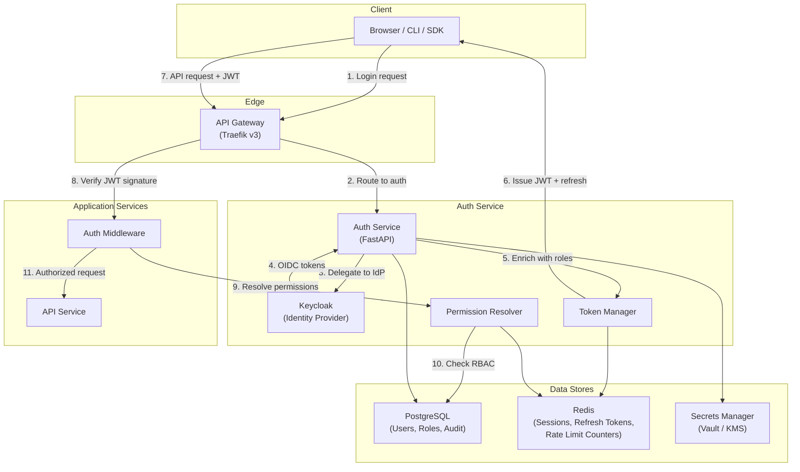

### Component Responsibilities

| Component | Responsibility |
|-----------|---------------|
| **API Gateway (Traefik v3)** | TLS termination, JWT signature verification (public key via ForwardAuth middleware), rate limiting (built-in middleware), request routing. Cloud-native with auto-discovery, native Docker/K8s integration. Rejects expired/malformed tokens before they reach application services. |
| **Keycloak** | Identity management, credential storage (passwords hashed with bcrypt/argon2), OIDC/SAML protocol handling, MFA enforcement, user federation (LDAP/AD). One realm per organization. |
| **Auth Service** | Orchestrates login flows, exchanges Keycloak tokens for rrag-system JWTs enriched with RBAC claims, manages refresh tokens, handles API key authentication. |
| **Token Manager** | Issues, validates, and revokes tokens. Manages refresh token rotation. Stores refresh tokens in Redis with TTL. |
| **Permission Resolver** | Resolves effective permissions for a (user, resource) pair by combining org role + workspace role + resource ownership. Caches permission sets in Redis (TTL: 5 min). |
| **Auth Middleware** | FastAPI dependency injected into every route. Extracts JWT, validates, resolves permissions, injects `AuthContext` into request state. |

---

## 3. Identity Model

### Hierarchy

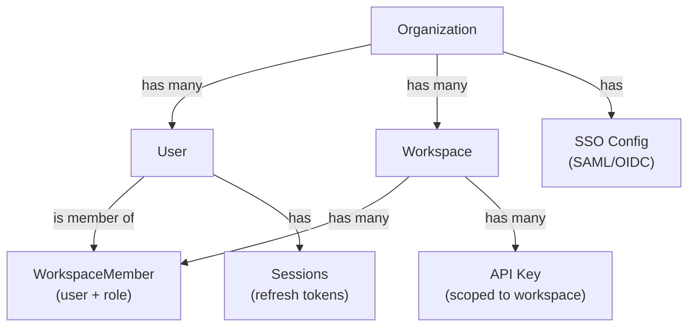

### Identity Sources

| Source | Flow | Use Case |
|--------|------|----------|
| **Email + Password** | Keycloak local credentials | Dev/free tier; small teams |
| **SAML 2.0** | Keycloak SAML IdP broker -> Okta, Azure AD, OneLogin | Enterprise SSO |
| **OIDC** | Keycloak OIDC IdP broker -> Google, GitHub, Azure AD | Developer convenience; enterprise |
| **API Key** | Direct header (`X-API-Key`) -> Auth Service validation | Programmatic access (SDK, CI/CD, deployed pipelines) |

### User Lifecycle

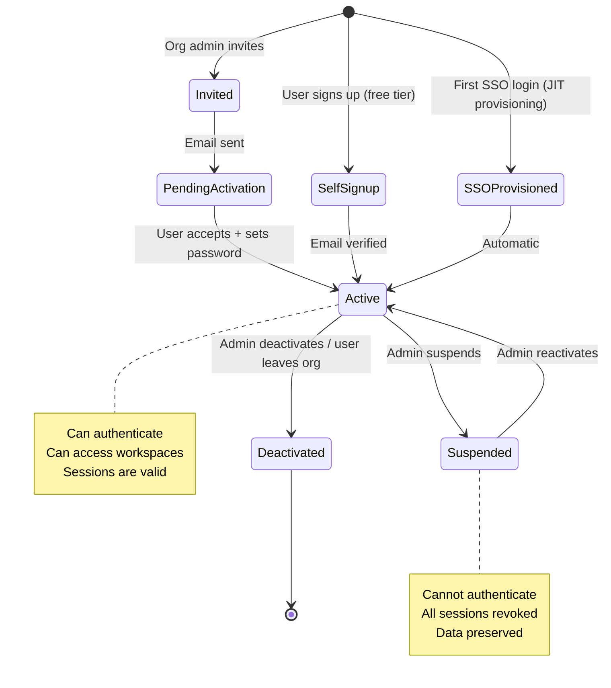

---

## 4. Authentication Flows

### 4.1 Email + Password Login

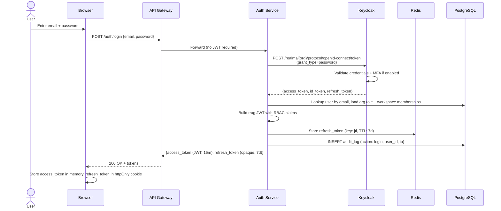

### 4.2 SSO / SAML Login

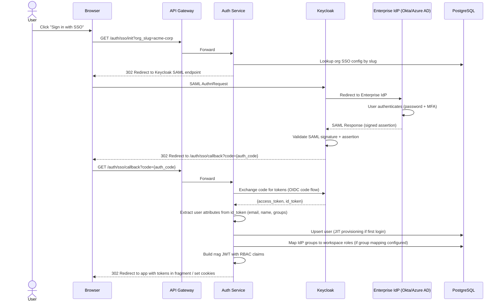

### 4.3 Token Refresh

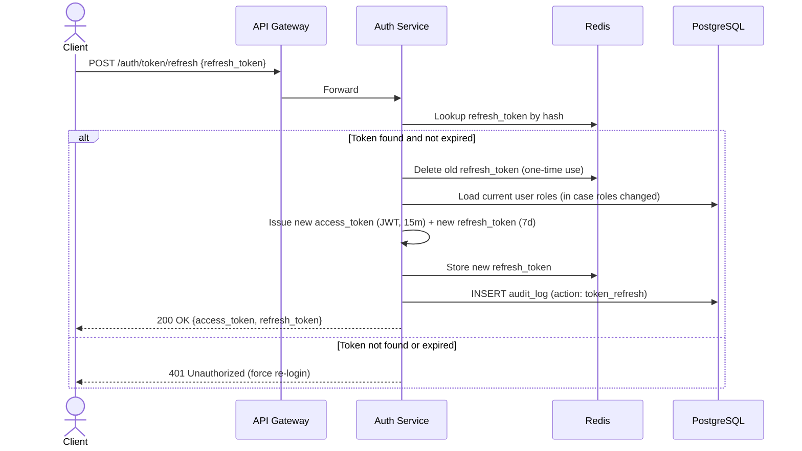

**Refresh token rotation:** Every refresh automatically issues a new refresh token and invalidates the old one. If a stolen refresh token is used after the legitimate user has already refreshed, the reuse is detected (token not in Redis) and all sessions for that user are revoked as a security measure.

### 4.4 Logout

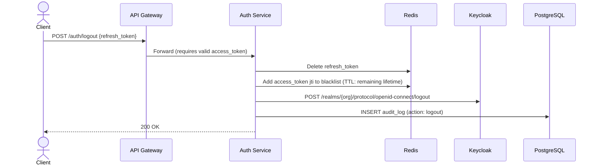

---

## 5. Authorization (RBAC)

### 5.1 Role Hierarchy

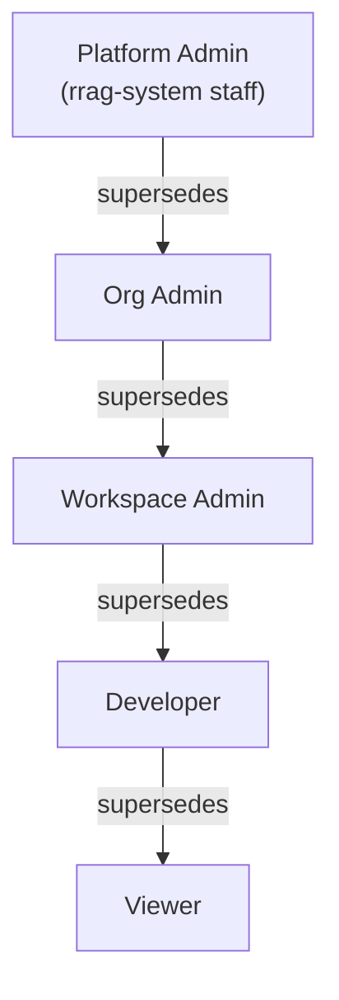

### 5.2 Role Definitions

| Role | Scope | Description |
|------|-------|-------------|
| **Platform Admin** | Global | rrag-system operators. Full access to all orgs for support/maintenance. Not exposed to customers. |
| **Org Admin** | Organization | Manages org settings, billing, SSO config, workspace creation, user invitations. Can access ALL workspaces within the org. |
| **Workspace Admin** | Workspace | Manages workspace settings, connections, members. Full CRUD on all resources within the workspace. |
| **Developer** | Workspace | Creates, edits, runs pipelines and experiments. Manages knowledge bases. Cannot manage workspace settings or members. |
| **Viewer** | Workspace | Read-only access to all workspace resources. Can view pipeline configs, run results, dashboards. Cannot create, edit, or execute. |

### 5.3 Permission Matrix

Permissions are expressed as `resource:action` pairs. A role grants a set of permissions.

| Resource | Action | Viewer | Developer | WS Admin | Org Admin |
|----------|--------|:------:|:---------:|:--------:|:---------:|
| **workspace** | read | Y | Y | Y | Y |
| **workspace** | update | - | - | Y | Y |
| **workspace** | delete | - | - | - | Y |
| **workspace.members** | read | Y | Y | Y | Y |
| **workspace.members** | manage | - | - | Y | Y |
| **workspace.connections** | read | Y | Y | Y | Y |
| **workspace.connections** | manage | - | - | Y | Y |
| **pipeline** | read | Y | Y | Y | Y |
| **pipeline** | create | - | Y | Y | Y |
| **pipeline** | update | - | Y | Y | Y |
| **pipeline** | delete | - | Y | Y | Y |
| **pipeline** | execute | - | Y | Y | Y |
| **knowledge_base** | read | Y | Y | Y | Y |
| **knowledge_base** | create | - | Y | Y | Y |
| **knowledge_base** | update | - | Y | Y | Y |
| **knowledge_base** | delete | - | Y | Y | Y |
| **knowledge_base.documents** | upload | - | Y | Y | Y |
| **knowledge_base.documents** | delete | - | Y | Y | Y |
| **experiment** | read | Y | Y | Y | Y |
| **experiment** | create | - | Y | Y | Y |
| **experiment** | execute | - | Y | Y | Y |
| **deployment** | read | Y | Y | Y | Y |
| **deployment** | create | - | - | Y | Y |
| **deployment** | update | - | - | Y | Y |
| **deployment** | delete | - | - | Y | Y |
| **deployment.traffic** | manage | - | - | Y | Y |
| **audit_log** | read | - | - | Y | Y |
| **api_key** | read | - | Y | Y | Y |
| **api_key** | manage | - | - | Y | Y |
| **org.settings** | read | - | - | - | Y |
| **org.settings** | update | - | - | - | Y |
| **org.billing** | read | - | - | - | Y |
| **org.billing** | manage | - | - | - | Y |
| **org.sso** | manage | - | - | - | Y |

### 5.4 Permission Resolution Algorithm

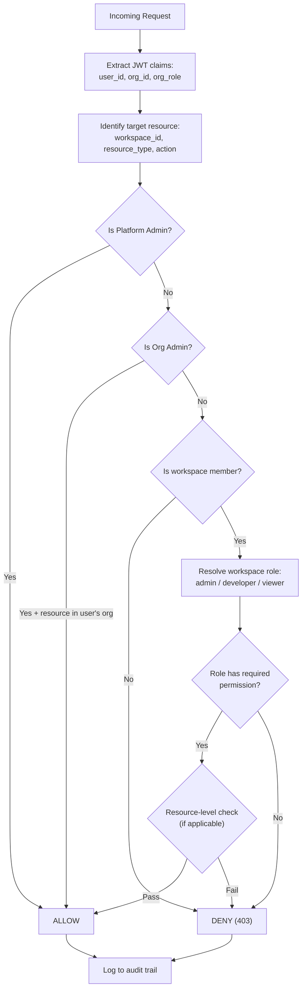

### 5.5 Implementation: FastAPI Dependency

```python
# auth/dependencies.py

from dataclasses import dataclass
from fastapi import Depends, HTTPException, Request

@dataclass
class AuthContext:
    user_id: str
    org_id: str
    org_role: str                         # "org_admin" | "member"
    workspace_memberships: dict[str, str] # {workspace_id: role}
    permissions: set[str]                 # Resolved for current workspace

def require_auth(request: Request) -> AuthContext:
    """Extract and validate JWT, build AuthContext."""
    token = request.headers.get("Authorization", "").removeprefix("Bearer ")
    if not token:
        raise HTTPException(401, "Missing authentication token")
    claims = verify_jwt(token)  # Validates signature, expiry, issuer
    return AuthContext(
        user_id=claims["sub"],
        org_id=claims["org_id"],
        org_role=claims["org_role"],
        workspace_memberships=claims.get("ws_roles", {}),
        permissions=set()  # Resolved lazily per workspace
    )

def require_permission(resource: str, action: str):
    """Factory for permission-checking dependencies."""
    def checker(
        request: Request,
        auth: AuthContext = Depends(require_auth),
        ws_id: str = None  # Extracted from path param
    ):
        ws_id = ws_id or request.path_params.get("ws_id")
        if not has_permission(auth, ws_id, resource, action):
            raise HTTPException(403, f"Insufficient permissions: {resource}:{action}")
        return auth
    return Depends(checker)
```

**Usage in routes:**

```python
@router.post("/workspaces/{ws_id}/pipelines")
async def create_pipeline(
    ws_id: str,
    body: PipelineCreate,
    auth: AuthContext = require_permission("pipeline", "create")
):
    # auth is guaranteed to have pipeline:create permission
    ...
```

---

## 6. Multi-Tenancy Isolation

### 6.1 Isolation Architecture

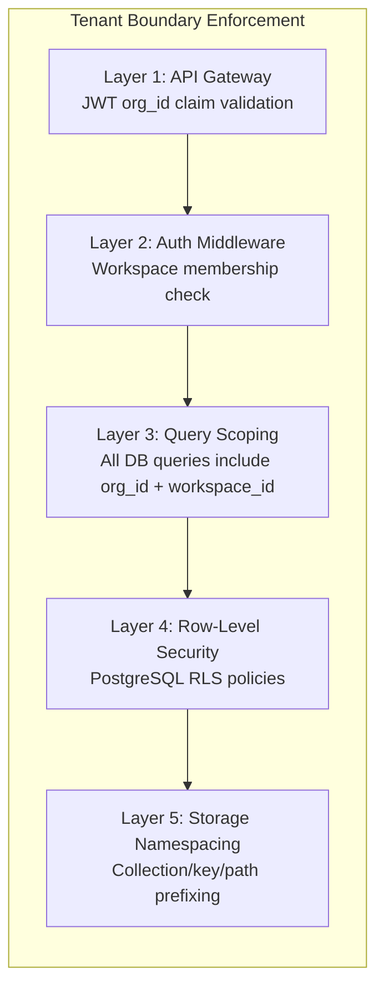

### 6.2 PostgreSQL Row-Level Security

Every table with tenant data has RLS policies:

```sql
-- Enable RLS on workspaces table
ALTER TABLE workspaces ENABLE ROW LEVEL SECURITY;

-- Policy: users can only see workspaces in their org
CREATE POLICY workspace_org_isolation ON workspaces
    USING (org_id = current_setting('app.current_org_id')::uuid);

-- Policy: workspace members can only see their workspaces
CREATE POLICY workspace_member_access ON workspaces
    USING (
        id IN (
            SELECT workspace_id FROM workspace_members
            WHERE user_id = current_setting('app.current_user_id')::uuid
        )
        OR current_setting('app.current_org_role') = 'org_admin'
    );

-- Set session variables before every query
-- (done in the DB connection middleware)
SET app.current_org_id = '{org_id}';
SET app.current_user_id = '{user_id}';
SET app.current_org_role = '{org_role}';
```

### 6.3 Storage Namespace Isolation

| Store | Isolation Mechanism | Namespace Pattern |
|-------|---------------------|-------------------|
| **PostgreSQL** | Row-Level Security + `org_id`/`workspace_id` columns | Implicit via RLS policies |
| **Vector DB (Qdrant)** | Collection per workspace | `{org_slug}--{ws_slug}` |
| **Graph DB (Neo4j)** | Database per organization, namespace per workspace | DB: `org_{org_id}`, Labels: `ws_{ws_id}:Entity` |
| **Redis** | Key prefixing | `{org_id}:{ws_id}:{key_type}:{key}` |
| **Object Storage (S3)** | Path prefixing | `s3://bucket/{org_id}/{ws_id}/documents/...` |

### 6.4 Cross-Workspace Access

By default, workspaces within the same organization are isolated. Cross-workspace access (e.g., one workspace querying another workspace's knowledge base) requires:

1. **Explicit grant** -- Workspace Admin of the source workspace creates an access grant
2. **Audit log entry** -- Every cross-workspace access is logged
3. **Read-only** -- Cross-workspace grants are read-only (no write/delete)

```sql
-- Cross-workspace access grants
CREATE TABLE workspace_access_grants (
    id              UUID PRIMARY KEY DEFAULT gen_random_uuid(),
    source_ws_id    UUID NOT NULL REFERENCES workspaces(id),
    target_ws_id    UUID NOT NULL REFERENCES workspaces(id),
    resource_type   VARCHAR NOT NULL,  -- 'knowledge_base'
    resource_id     UUID NOT NULL,
    permission      VARCHAR NOT NULL DEFAULT 'read',
    granted_by      UUID NOT NULL REFERENCES users(id),
    expires_at      TIMESTAMP,
    created_at      TIMESTAMP NOT NULL DEFAULT now()
);
```

---

## 7. API Key Authentication

API keys are used for programmatic access: deployed pipeline endpoints, Python SDK, CI/CD integrations.

### 7.1 Key Structure

```
rrag_ws_{workspace_id_short}_{random_32_chars}

Example: rrag_ws_a1b2c3d4_kf7Gx9Wq2mNpR4tY8vZaHj6LbCeD0sXi
```

### 7.2 Key Lifecycle

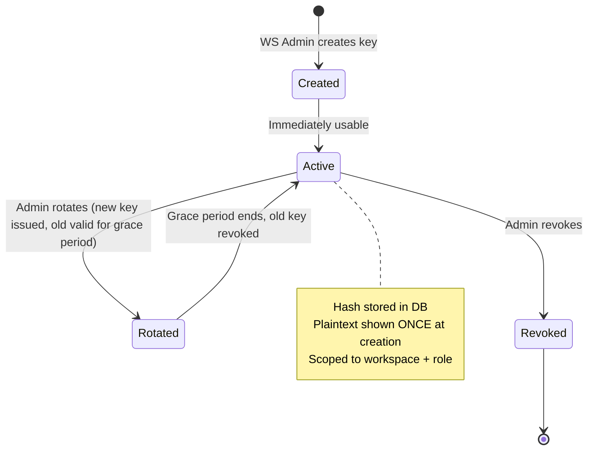

### 7.3 Key Authentication Flow

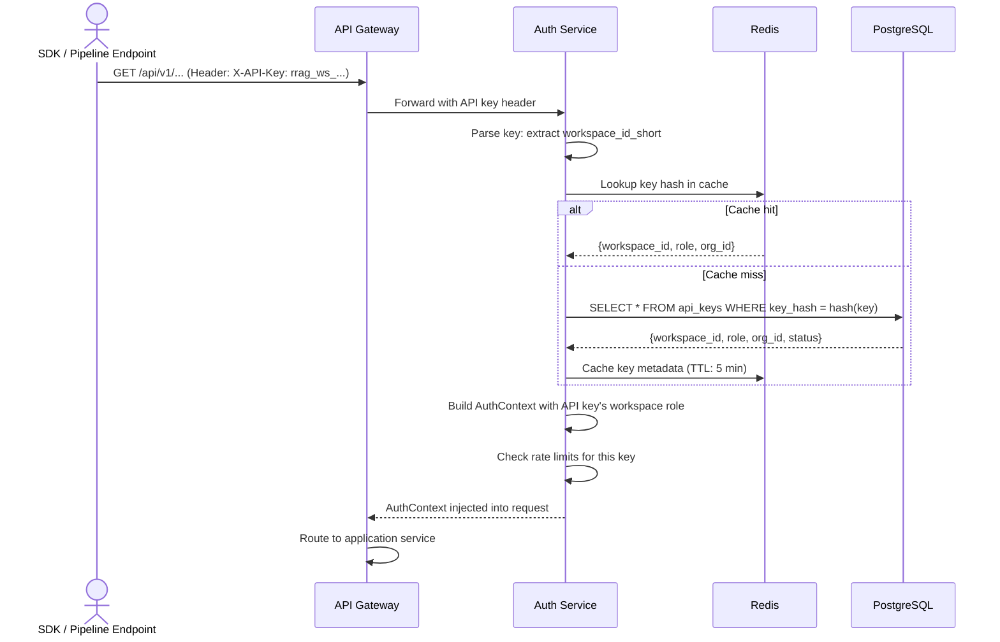

### 7.4 Data Model

```sql
CREATE TABLE api_keys (
    id              UUID PRIMARY KEY DEFAULT gen_random_uuid(),
    workspace_id    UUID NOT NULL REFERENCES workspaces(id),
    name            VARCHAR NOT NULL,            -- Human-readable label
    key_prefix      VARCHAR(16) NOT NULL,        -- First 8 chars for identification
    key_hash        VARCHAR(128) NOT NULL UNIQUE, -- bcrypt hash of full key
    role            VARCHAR NOT NULL DEFAULT 'developer', -- Permission level
    rate_limit_rpm  INT DEFAULT 600,             -- Requests per minute
    last_used_at    TIMESTAMP,
    expires_at      TIMESTAMP,                   -- NULL = no expiry
    status          VARCHAR NOT NULL DEFAULT 'active', -- active, revoked
    created_by      UUID NOT NULL REFERENCES users(id),
    created_at      TIMESTAMP NOT NULL DEFAULT now(),
    revoked_at      TIMESTAMP
);

CREATE INDEX idx_api_keys_hash ON api_keys(key_hash) WHERE status = 'active';
CREATE INDEX idx_api_keys_workspace ON api_keys(workspace_id) WHERE status = 'active';
```

---

## 8. Token Design

### 8.1 Access Token (JWT)

**Header:**
```json
{
  "alg": "RS256",
  "typ": "JWT",
  "kid": "rrag-2026-02"
}
```

**Payload:**
```json
{
  "iss": "https://auth.rrag.io",
  "sub": "usr_a1b2c3d4-e5f6-7890-abcd-ef1234567890",
  "aud": "https://api.rrag.io",
  "exp": 1740268200,
  "iat": 1740267300,
  "jti": "tok_unique-token-id",

  "org_id": "org_f1e2d3c4-b5a6-7890-fedc-ba0987654321",
  "org_role": "member",
  "email": "priya@acme-corp.com",
  "name": "Priya Sharma",

  "ws_roles": {
    "ws_11111111-2222-3333-4444-555555555555": "admin",
    "ws_66666666-7777-8888-9999-000000000000": "developer"
  }
}
```

| Claim | Type | Purpose |
|-------|------|---------|
| `sub` | UUID | User ID (prefixed `usr_` for readability) |
| `org_id` | UUID | Organization ID -- hard tenant boundary |
| `org_role` | string | `org_admin` or `member` |
| `ws_roles` | object | Map of workspace_id -> role for all workspace memberships |
| `jti` | string | Unique token ID for blacklisting on logout |

**Signing:** RS256 (RSA 2048-bit). Public key available at `/.well-known/jwks.json` for gateway verification without shared secrets. Key rotation every 90 days with overlapping validity.

### 8.2 Refresh Token

Refresh tokens are **opaque** (random 256-bit string, base64url encoded). They are NOT JWTs -- this prevents client-side inspection and enables server-side revocation.

**Storage (Redis):**
```
Key:    refresh:{hash(token)}
Value:  {user_id, org_id, device_id, issued_at, expires_at}
TTL:    7 days
```

### 8.3 Token Lifetimes

| Token | Lifetime | Storage | Revocation |
|-------|----------|---------|------------|
| Access token (JWT) | 15 minutes | Client memory only | Blacklist `jti` in Redis (TTL = remaining lifetime) |
| Refresh token | 7 days | Redis (server-side) | Delete from Redis |
| API key | Until revoked or expired | PostgreSQL (hash) | Set `status = revoked` |

### 8.4 Key Rotation

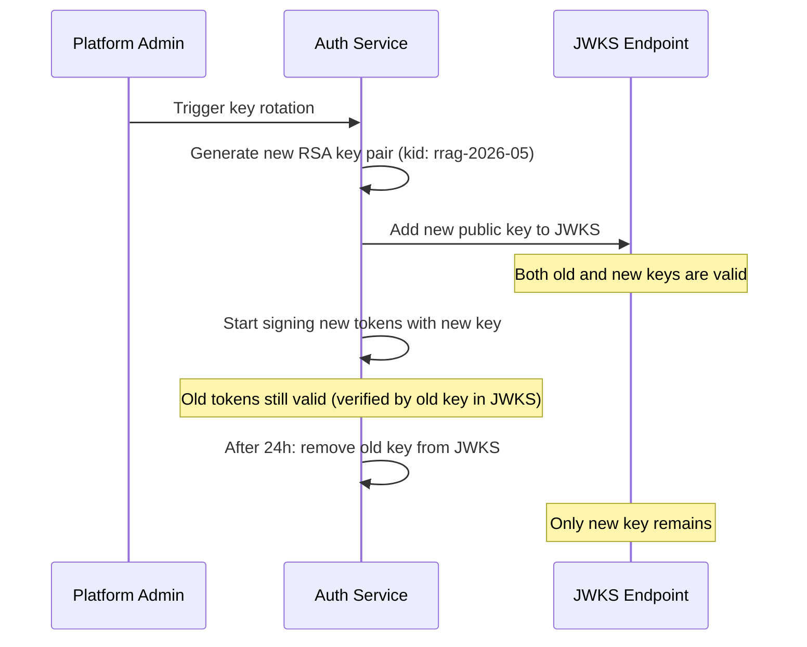

---

## 9. Audit Logging

### 9.1 What Gets Logged

Every API call that modifies state or accesses sensitive data is logged:

| Category | Actions Logged |
|----------|---------------|
| **Authentication** | login, login_failed, logout, token_refresh, mfa_challenge, password_change |
| **User Management** | user_invite, user_activate, user_suspend, user_deactivate, role_change |
| **Workspace** | workspace_create, workspace_update, workspace_archive, member_add, member_remove, member_role_change |
| **Pipeline** | pipeline_create, pipeline_update, pipeline_delete, pipeline_execute, pipeline_version_create |
| **Knowledge Base** | kb_create, document_upload, document_delete, kb_reindex |
| **Experiment** | experiment_create, experiment_execute |
| **Deployment** | deployment_create, deployment_update, traffic_change, rollback |
| **Connection** | connection_create, connection_delete, connection_test |
| **API Key** | api_key_create, api_key_revoke, api_key_rotate |
| **Admin** | sso_config_change, quota_change, org_settings_change |

### 9.2 Audit Log Schema

```sql
CREATE TABLE audit_logs (
    id              UUID PRIMARY KEY DEFAULT gen_random_uuid(),
    org_id          UUID NOT NULL,
    user_id         UUID,                       -- NULL for system actions
    action          VARCHAR(64) NOT NULL,
    resource_type   VARCHAR(64) NOT NULL,
    resource_id     UUID,
    workspace_id    UUID,                       -- NULL for org-level actions
    details         JSONB,                      -- Action-specific context
    ip_address      INET,
    user_agent      VARCHAR(512),
    request_id      UUID,                       -- Correlation ID
    status          VARCHAR(16) NOT NULL,       -- success, denied, error
    timestamp       TIMESTAMP NOT NULL DEFAULT now()
);

-- Partitioned by month for efficient querying and retention
CREATE INDEX idx_audit_org_time ON audit_logs(org_id, timestamp DESC);
CREATE INDEX idx_audit_user_time ON audit_logs(user_id, timestamp DESC);
CREATE INDEX idx_audit_resource ON audit_logs(resource_type, resource_id);
CREATE INDEX idx_audit_action ON audit_logs(action);
```

### 9.3 Immutability

Audit logs are **append-only**:
- No `UPDATE` or `DELETE` permissions granted to application database user
- Separate database role (`audit_writer`) with `INSERT`-only privileges
- Application service writes to audit log via a dedicated Celery task (async, non-blocking)
- Monthly partitions are archived to cold storage (S3/GCS) after 90 days

### 9.4 Audit Log Pipeline

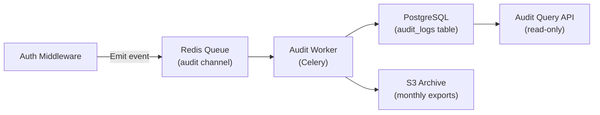

---

## 10. Data Model

### Complete Auth ER Diagram

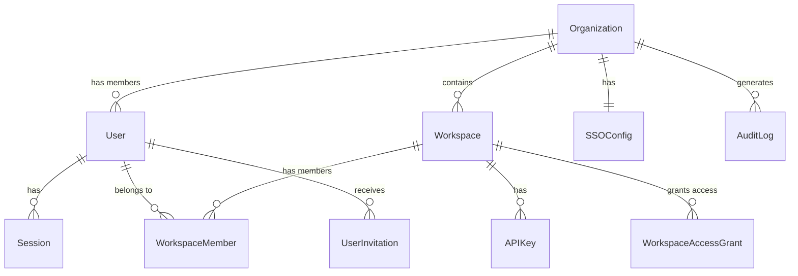

### Tables

#### SSOConfig
```sql
CREATE TABLE sso_configs (
    id              UUID PRIMARY KEY DEFAULT gen_random_uuid(),
    org_id          UUID NOT NULL UNIQUE REFERENCES organizations(id),
    protocol        VARCHAR NOT NULL,    -- 'saml' | 'oidc'
    provider_name   VARCHAR NOT NULL,    -- 'okta', 'azure_ad', 'google', etc.
    metadata_url    VARCHAR,             -- SAML metadata URL
    client_id       VARCHAR,             -- OIDC client ID
    client_secret   BYTEA,              -- Encrypted
    issuer_url      VARCHAR,             -- OIDC issuer
    certificate     TEXT,                -- SAML signing certificate
    group_mapping   JSONB,              -- {"idp_group": {"workspace_id": "role"}}
    auto_provision  BOOLEAN DEFAULT true,-- JIT user creation on first login
    enforce_sso     BOOLEAN DEFAULT false,-- Block password login when true
    created_at      TIMESTAMP NOT NULL DEFAULT now(),
    updated_at      TIMESTAMP NOT NULL DEFAULT now()
);
```

#### UserInvitation
```sql
CREATE TABLE user_invitations (
    id              UUID PRIMARY KEY DEFAULT gen_random_uuid(),
    org_id          UUID NOT NULL REFERENCES organizations(id),
    email           VARCHAR NOT NULL,
    workspace_id    UUID REFERENCES workspaces(id),
    role            VARCHAR NOT NULL DEFAULT 'developer',
    token_hash      VARCHAR(128) NOT NULL UNIQUE,
    status          VARCHAR NOT NULL DEFAULT 'pending', -- pending, accepted, expired
    invited_by      UUID NOT NULL REFERENCES users(id),
    expires_at      TIMESTAMP NOT NULL,
    created_at      TIMESTAMP NOT NULL DEFAULT now(),
    accepted_at     TIMESTAMP
);

CREATE INDEX idx_invitations_email ON user_invitations(email) WHERE status = 'pending';
```

#### Session (Refresh Token Tracking)
```sql
-- This table is supplementary to Redis storage.
-- Redis is the primary store (for speed). PostgreSQL is the backup for
-- session listing in the UI ("active sessions" view) and forced revocation.
CREATE TABLE sessions (
    id              UUID PRIMARY KEY DEFAULT gen_random_uuid(),
    user_id         UUID NOT NULL REFERENCES users(id),
    refresh_token_hash VARCHAR(128) NOT NULL UNIQUE,
    device_info     JSONB,              -- {browser, os, ip, geo}
    last_active_at  TIMESTAMP NOT NULL DEFAULT now(),
    expires_at      TIMESTAMP NOT NULL,
    created_at      TIMESTAMP NOT NULL DEFAULT now(),
    revoked_at      TIMESTAMP
);

CREATE INDEX idx_sessions_user ON sessions(user_id) WHERE revoked_at IS NULL;
```

---

## 11. API Endpoints

### 11.1 Authentication

| Method | Endpoint | Auth | Description |
|--------|----------|------|-------------|
| POST | `/auth/login` | None | Email + password login. Returns access + refresh tokens. |
| GET | `/auth/sso/init` | None | Initiates SSO flow. Query: `org_slug`. Returns redirect URL. |
| GET | `/auth/sso/callback` | None | SSO callback. Exchanges code for tokens. |
| POST | `/auth/token/refresh` | Refresh token | Issues new access + refresh tokens. |
| POST | `/auth/logout` | JWT | Revokes refresh token and blacklists access token. |
| POST | `/auth/logout/all` | JWT | Revokes all sessions for current user. |
| GET | `/auth/me` | JWT | Returns current user profile, org role, workspace memberships. |
| GET | `/auth/sessions` | JWT | Lists active sessions for current user. |
| DELETE | `/auth/sessions/{id}` | JWT | Revokes a specific session. |

### 11.2 User Management (Org Admin)

| Method | Endpoint | Auth | Description |
|--------|----------|------|-------------|
| GET | `/users` | JWT + org_admin | List org users with roles and status. |
| POST | `/users/invite` | JWT + org_admin | Invite user by email. |
| PUT | `/users/{id}/role` | JWT + org_admin | Update org-level role. |
| PUT | `/users/{id}/status` | JWT + org_admin | Suspend / reactivate user. |
| DELETE | `/users/{id}` | JWT + org_admin | Deactivate user (soft delete). |

### 11.3 Workspace Members

| Method | Endpoint | Auth | Description |
|--------|----------|------|-------------|
| GET | `/workspaces/{ws_id}/members` | JWT + ws member | List workspace members. |
| POST | `/workspaces/{ws_id}/members` | JWT + ws_admin | Add member (user must be in org). |
| PUT | `/workspaces/{ws_id}/members/{user_id}` | JWT + ws_admin | Update workspace role. |
| DELETE | `/workspaces/{ws_id}/members/{user_id}` | JWT + ws_admin | Remove member from workspace. |

### 11.4 SSO Configuration (Org Admin)

| Method | Endpoint | Auth | Description |
|--------|----------|------|-------------|
| GET | `/org/sso` | JWT + org_admin | Get current SSO configuration. |
| PUT | `/org/sso` | JWT + org_admin | Create or update SSO config. |
| DELETE | `/org/sso` | JWT + org_admin | Remove SSO config (revert to password). |
| POST | `/org/sso/test` | JWT + org_admin | Test SSO configuration. |

### 11.5 API Keys

| Method | Endpoint | Auth | Description |
|--------|----------|------|-------------|
| GET | `/workspaces/{ws_id}/api-keys` | JWT + ws member | List API keys (prefix only, never full key). |
| POST | `/workspaces/{ws_id}/api-keys` | JWT + ws_admin | Create API key. Returns full key ONCE. |
| PUT | `/workspaces/{ws_id}/api-keys/{id}/rotate` | JWT + ws_admin | Rotate key (new key, old key valid for grace period). |
| DELETE | `/workspaces/{ws_id}/api-keys/{id}` | JWT + ws_admin | Revoke API key immediately. |

### 11.6 Audit Logs

| Method | Endpoint | Auth | Description |
|--------|----------|------|-------------|
| GET | `/audit-logs` | JWT + org_admin or ws_admin | Query audit logs with filters (action, user, resource, date range). |
| GET | `/audit-logs/export` | JWT + org_admin | Export audit logs as CSV/JSON. |

---

## 12. Middleware Pipeline

Every request passes through a series of middleware layers in order:

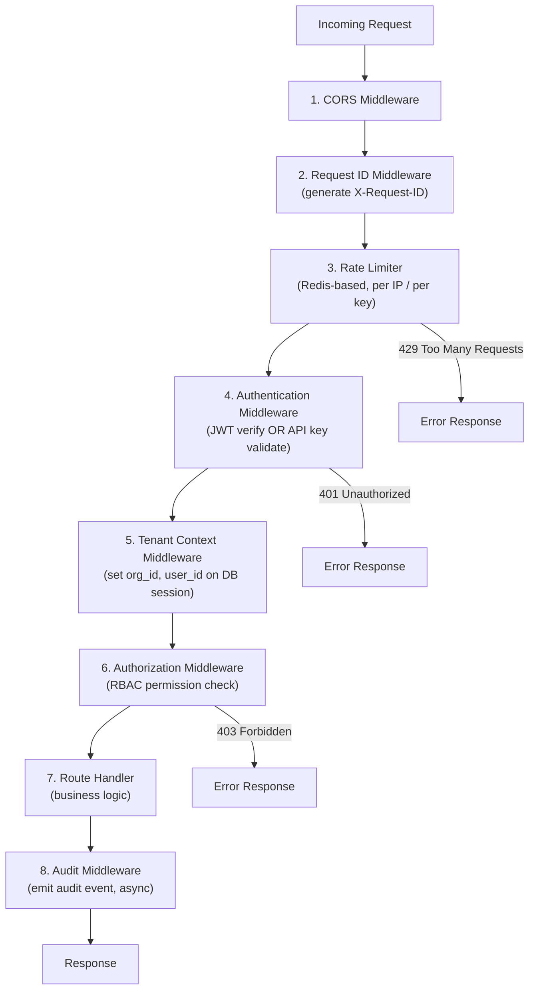

### Middleware Implementation Order

| # | Middleware | Runs Before Route | Runs After Route | Purpose |
|---|-----------|:-----------------:|:----------------:|---------|
| 1 | CORS | Y | Y | Set CORS headers, handle preflight OPTIONS |
| 2 | Request ID | Y | - | Generate `X-Request-ID` for tracing/correlation |
| 3 | Rate Limiter | Y | - | Check rate limits (Redis token bucket). 429 if exceeded. |
| 4 | Auth (AuthN) | Y | - | Verify JWT signature + expiry OR validate API key. 401 if invalid. Injects `AuthContext`. |
| 5 | Tenant Context | Y | - | Set PostgreSQL session variables (`app.current_org_id`, etc.) for RLS. |
| 6 | Auth (AuthZ) | Y | - | Check RBAC permissions for the target resource. 403 if insufficient. |
| 7 | Business Logic | - | - | Route handler executes. |
| 8 | Audit Logger | - | Y | Emit audit event to Redis queue (async). Includes request_id, user_id, action, status. |

### Rate Limiting Strategy

| Client Type | Limit | Window | Key |
|-------------|-------|--------|-----|
| Unauthenticated | 20 req | 1 min | IP address |
| Authenticated (JWT) | 300 req | 1 min | user_id |
| API Key (default) | 600 req | 1 min | api_key_id |
| API Key (custom) | Configurable | 1 min | api_key_id |

Implementation uses Redis-based sliding window rate limiting:

```python
async def check_rate_limit(key: str, limit: int, window_seconds: int) -> bool:
    """Returns True if within limit, False if exceeded."""
    now = time.time()
    pipe = redis.pipeline()
    pipe.zadd(f"rl:{key}", {str(now): now})           # Add current request
    pipe.zremrangebyscore(f"rl:{key}", 0, now - window_seconds)  # Remove old
    pipe.zcard(f"rl:{key}")                            # Count requests in window
    pipe.expire(f"rl:{key}", window_seconds)           # Set TTL
    _, _, count, _ = await pipe.execute()
    return count <= limit
```

---

## 13. Security Hardening

### 13.1 Password Policy

| Rule | Requirement |
|------|-------------|
| Minimum length | 12 characters |
| Complexity | At least 1 uppercase, 1 lowercase, 1 digit, 1 special character |
| Common password check | Reject top 100K common passwords (HIBP list) |
| History | Cannot reuse last 5 passwords |
| Hashing | Argon2id (via Keycloak) |
| Brute force protection | Lock account after 5 failed attempts for 15 minutes |

### 13.2 Token Security

| Threat | Mitigation |
|--------|------------|
| JWT theft (XSS) | Access tokens stored in JavaScript memory only (not localStorage). Short 15-min lifetime limits exposure window. |
| Refresh token theft | Refresh tokens in httpOnly, Secure, SameSite=Strict cookies. Rotation on every use (one-time). Reuse detection triggers full session revocation. |
| JWT forgery | RS256 signing with 2048-bit RSA keys. Public key at `.well-known/jwks.json`. Key rotation every 90 days. |
| Replay attack | `jti` claim for uniqueness. Blacklist revoked tokens in Redis. |
| Privilege escalation | RBAC claims in JWT are verified against PostgreSQL on sensitive operations (not just JWT claims). Permission cache TTL: 5 min. |

### 13.3 API Key Security

| Threat | Mitigation |
|--------|------------|
| Key exposure in logs | Keys are never logged. Log scrubbing middleware redacts `X-API-Key` and `Authorization` headers. |
| Key theft | Keys hashed with bcrypt in DB. Plaintext shown once at creation. Rotation support with grace period. |
| Scope creep | Keys scoped to a single workspace with a specific role. Cannot escalate to org admin. |
| Brute force | Rate limiting per IP. Key format includes workspace ID prefix for fast rejection of obviously invalid keys. |

### 13.4 CSRF Protection

- All state-changing requests require `Content-Type: application/json` (browsers can't send JSON via form submission)
- Refresh token endpoint additionally requires `X-CSRF-Token` header (value stored in a separate cookie)
- SameSite=Strict on all cookies

### 13.5 Secrets Management

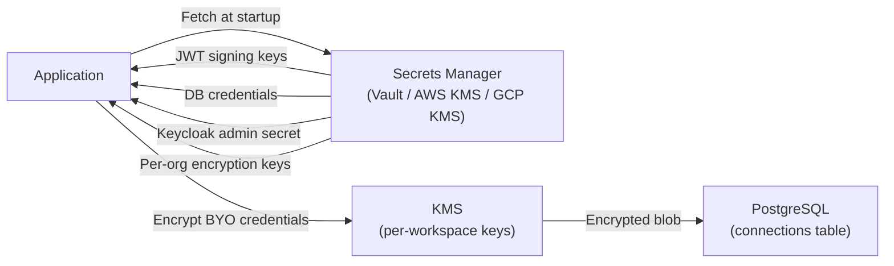

- JWT signing keys: Stored in Vault, loaded at application startup
- Database credentials: Injected via Vault agent sidecar (K8s)
- BYO credentials (API keys, connection strings): Encrypted with per-workspace KMS key before storage. Decrypted only when pipeline executes.
- No secrets in environment variables, config files, or source code

---

## 14. Client-Side Auth Integration

The frontend application (React/Next.js) integrates with the auth system through the Keycloak JavaScript adapter and a Zustand-based auth state manager. This section covers how authentication works in the browser -- from initial login redirect to silent token renewal.

### 14.1 Keycloak JS Adapter

The frontend uses `keycloak-js` to handle OIDC flows. The adapter is initialized at application startup:

```typescript
// auth/keycloak.ts
import Keycloak from "keycloak-js";

const keycloak = new Keycloak({
  url: import.meta.env.VITE_KEYCLOAK_URL,   // https://auth.rrag.io
  realm: orgSlug,                             // One realm per org
  clientId: "rrag-frontend",                  // Public client (no secret)
});

// Initialize with check-sso: silently check if user is already logged in
await keycloak.init({
  onLoad: "check-sso",
  silentCheckSsoRedirectUri: `${window.location.origin}/silent-check-sso.html`,
  pkceMethod: "S256",                         // PKCE for public client security
});
```

**Key configuration:**

| Setting | Value | Rationale |
|---------|-------|-----------|
| Client type | Public (no client secret) | Frontend cannot securely store secrets |
| PKCE | S256 | Required for public clients to prevent auth code interception |
| `onLoad` | `check-sso` | Silent SSO check on page load (no redirect if not logged in) |
| Flow | Authorization Code + PKCE | Standard OIDC flow (not implicit -- implicit is deprecated) |

### 14.2 Auth State Management (Zustand)

```typescript
// stores/auth-store.ts
interface AuthState {
  user: User | null;
  accessToken: string | null;           // In-memory only (never persisted)
  isAuthenticated: boolean;
  isLoading: boolean;
  orgId: string | null;
  orgRole: string | null;
  workspaceRoles: Record<string, string>; // {ws_id: role}

  login: () => Promise<void>;
  logout: () => Promise<void>;
  refreshToken: () => Promise<string>;
  getValidToken: () => Promise<string>;  // Returns token, refreshing if needed
}
```

**Token storage strategy:**

| Token | Storage | Reason |
|-------|---------|--------|
| Access token (JWT) | JavaScript memory (Zustand store) | XSS-resistant -- not accessible from localStorage/sessionStorage. Lost on page refresh (triggers silent renewal). |
| Refresh token | httpOnly, Secure, SameSite=Strict cookie | Set by the Auth Service backend. Not accessible to JavaScript. Sent automatically on `/auth/token/refresh` requests. |
| CSRF token | Non-httpOnly cookie | Read by JavaScript, sent as `X-CSRF-Token` header on state-changing requests |

### 14.3 Silent Token Renewal

The frontend preemptively refreshes the access token before it expires to avoid interrupted API calls:

```typescript
// auth/token-refresh.ts
const REFRESH_BUFFER_MS = 60_000; // Refresh 60s before expiry

function scheduleTokenRefresh(expiresAt: number) {
  const refreshAt = expiresAt - REFRESH_BUFFER_MS;
  const delay = refreshAt - Date.now();

  if (delay <= 0) {
    // Token already expired or about to -- refresh immediately
    return performRefresh();
  }

  setTimeout(async () => {
    await performRefresh();
  }, delay);
}

async function performRefresh(): Promise<void> {
  const response = await fetch("/auth/token/refresh", {
    method: "POST",
    credentials: "include",           // Send httpOnly refresh cookie
    headers: { "X-CSRF-Token": getCsrfToken() },
  });

  if (response.ok) {
    const { access_token, expires_in } = await response.json();
    authStore.setState({ accessToken: access_token });
    scheduleTokenRefresh(Date.now() + expires_in * 1000);
  } else {
    // Refresh failed -- redirect to login
    authStore.getState().logout();
  }
}
```

### 14.4 API Request Interceptor

All API requests pass through an interceptor that attaches the access token and handles 401 responses:

```typescript
// api/client.ts
const apiClient = axios.create({ baseURL: "/api/v1" });

apiClient.interceptors.request.use(async (config) => {
  const token = await authStore.getState().getValidToken();
  config.headers.Authorization = `Bearer ${token}`;
  return config;
});

apiClient.interceptors.response.use(
  (response) => response,
  async (error) => {
    if (error.response?.status === 401) {
      // Token expired mid-request -- try one refresh
      try {
        await authStore.getState().refreshToken();
        return apiClient.request(error.config); // Retry original request
      } catch {
        authStore.getState().logout();
      }
    }
    return Promise.reject(error);
  }
);
```

### 14.5 SSO Redirect Handling

For SSO-enabled organizations, the login flow uses a server-initiated redirect:

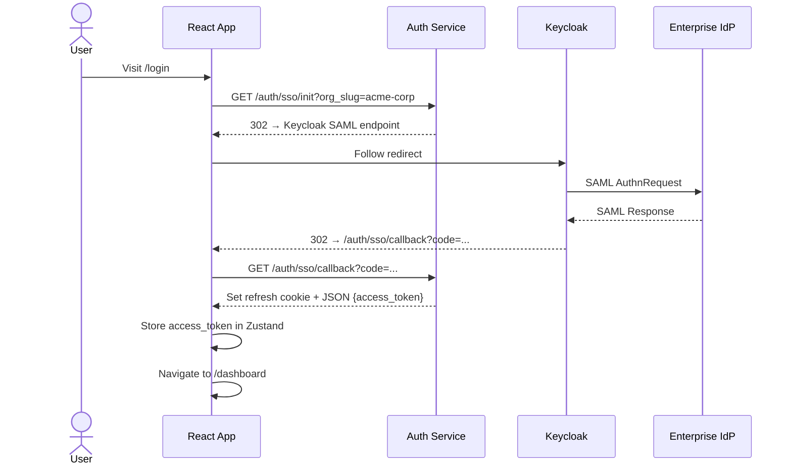

For non-SSO organizations, the frontend renders a standard email/password form and calls `POST /auth/login` directly.

---

## 15. Pipeline Credential Security

The RAG IDE handles sensitive credentials at multiple levels: BYO API keys for external services (OpenAI, Anthropic, Azure), connection strings for user-provided infrastructure (Qdrant, Neo4j), and secrets embedded in pipeline configurations. This section covers how the auth system protects these credentials throughout the pipeline lifecycle.

### 15.1 Connection Credential Model

Users configure **Connections** to external services at the workspace level. Each connection stores encrypted credentials:

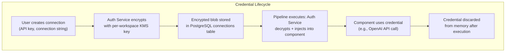

**Encryption scheme:**

| Layer | Mechanism | Key |
|-------|-----------|-----|
| At rest (DB) | AES-256-GCM | Per-workspace data encryption key (DEK) |
| DEK storage | Envelope encryption | Platform master key in Vault/KMS wraps the per-workspace DEK |
| In transit | TLS 1.3 | Between all services |
| In memory | Zeroized after use | Credential decrypted only for the duration of pipeline execution, then wiped |

### 15.2 Credential Access Control

Not all workspace members should have equal access to connection credentials:

| Action | Viewer | Developer | WS Admin | Org Admin |
|--------|:------:|:---------:|:--------:|:---------:|
| List connections (name only) | Y | Y | Y | Y |
| Use connection in pipeline | - | Y | Y | Y |
| View connection config (redacted) | - | Y | Y | Y |
| Create / update connection | - | - | Y | Y |
| Delete connection | - | - | Y | Y |
| View raw credentials | - | - | - | - |

**Raw credentials are never exposed** -- not even to Org Admins. The plaintext is shown once at creation time. After that, only redacted values (e.g., `sk-...7xKm`) are displayed. To change a credential, the admin must enter the new value (the old one cannot be retrieved).

### 15.3 Pipeline YAML Credential Handling

Pipeline YAML files reference connections by **name**, never by raw credential value:

```yaml
# CORRECT: Reference connection by name
components:
  generator:
    type: generator.openai
    params:
      model: "gpt-4o"
      connection: "acme-openai-prod"      # Resolved at runtime

# WRONG: Never embed raw credentials in YAML
components:
  generator:
    type: generator.openai
    params:
      model: "gpt-4o"
      api_key: "sk-abc123..."            # REJECTED by validation
```

**Enforcement:**
- The YAML parser rejects any parameter matching `format: password` in the component's `get_param_schema()` that contains a raw value instead of a connection reference
- Pipeline export strips any accidentally-included secrets and replaces with `$CONNECTION_NAME` placeholders
- Git commit hooks (recommended) scan for credential patterns before allowing commits

### 15.4 Deployed Pipeline Credential Injection

When a pipeline is deployed (Docker/K8s), credentials are injected at runtime, never baked into images:

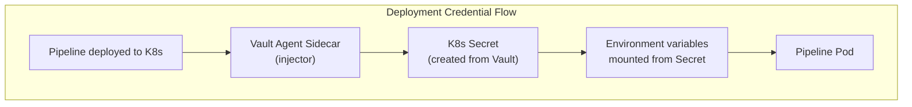

**For Docker Compose deployments:**
```yaml
# Auto-generated docker-compose.yaml
services:
  pipeline:
    build: .
    environment:
      # Credentials injected from .env file (not in image)
      RRAG_CONN_OPENAI_KEY: ${RRAG_CONN_OPENAI_KEY}
      RRAG_CONN_QDRANT_URL: ${RRAG_CONN_QDRANT_URL}
      RRAG_CONN_QDRANT_API_KEY: ${RRAG_CONN_QDRANT_API_KEY}
```

**For Kubernetes deployments:**
```yaml
# Auto-generated K8s deployment (credentials from Vault)
spec:
  containers:
    - name: pipeline
      env:
        - name: RRAG_CONN_OPENAI_KEY
          valueFrom:
            secretKeyRef:
              name: rrag-ws-{ws_id}-secrets
              key: openai-api-key
  serviceAccountName: rrag-pipeline-runner  # RBAC-scoped to workspace secrets
```

### 15.5 Pipeline Export Security

When users export pipelines (YAML, Docker Compose, Python Script), the export process:

1. **Strips all credential values** -- replaces with `$CONNECTION_NAME` placeholders
2. **Includes a `.env.example`** file listing required environment variables (without values)
3. **Warns the user** if any raw credential patterns are detected in component configs
4. **Records an audit log entry** (`pipeline_export` action) for compliance tracking

---

## 16. Component Execution Security

The RAG IDE supports third-party components via a plugin registry (Python entry points). Custom components execute within pipeline runs and have access to data flowing through the pipeline. This section defines the security boundaries.

### 16.1 Threat Model

When a user installs or an admin registers a third-party component:

| Threat | Risk | Mitigation |
|--------|------|------------|
| Data exfiltration | Component sends workspace data to external server | Network policy: pipeline execution pods have egress restricted to approved destinations |
| Cross-tenant access | Component reads data from another workspace | Tenant context enforcement: all DB connections carry workspace-scoped session variables (RLS) |
| Resource exhaustion | Component consumes excessive CPU/GPU/memory | Resource limits: per-component timeout, memory cap, GPU allocation quota |
| Credential theft | Component reads environment variables containing secrets | Credential injection via sealed memory (not env vars); components receive credentials only through the typed `run()` interface |
| Filesystem escape | Component reads/writes outside its sandbox | (Future) Container-level isolation: each pipeline step runs in a sandboxed subprocess with restricted filesystem view |

### 16.2 Component Trust Levels

| Trust Level | Source | Capabilities | Review Required |
|-------------|--------|-------------|-----------------|
| **Platform** | Bundled with rrag-system | Full access to infrastructure APIs | N/A (maintained by platform team) |
| **Verified** | Reviewed third-party (marketplace) | Full component capabilities within workspace scope | Platform team review + automated security scan |
| **Community** | Unreviewed third-party | Restricted: no network access, no filesystem write, memory cap | User accepts risk at installation |
| **Custom** | User-uploaded code | Same as Community; workspace-scoped only | Workspace Admin approval |

### 16.3 Runtime Isolation

During pipeline execution, each component runs within the tenant context established by the auth middleware:

```mermaid
graph TD
    subgraph "Pipeline Execution Context"
        AUTH["AuthContext<br/>(user_id, org_id, ws_id)"]
        TENANT["Tenant Context<br/>(RLS session vars set)"]
        COMPONENT["Component.run()"]
        DB["DB Connection<br/>(scoped via RLS)"]
        VECTOR["Vector Store<br/>(collection: org--ws)"]
        GRAPH["Graph Store<br/>(namespace: ws_id)"]
    end

    AUTH --> TENANT --> COMPONENT
    COMPONENT --> DB
    COMPONENT --> VECTOR
    COMPONENT --> GRAPH
```

Components cannot:
- Override the tenant context (session variables are set by the pipeline engine, not the component)
- Access collections/namespaces belonging to other workspaces
- Modify the pipeline state of other concurrently-running pipelines (state is isolated per execution)

### 16.4 Resource Limits

| Resource | Default Limit | Configurable |
|----------|--------------|:------------:|
| Execution timeout per component | 300 seconds | Y (per component in YAML) |
| Memory per component | 4 GB | Y (workspace-level setting) |
| GPU allocation | Shared pool (fair scheduling) | Y (org-level quota) |
| Network egress | Platform + Verified: allowed; Community + Custom: blocked | Y (workspace admin allowlist) |
| Disk write | `/tmp` only, 1 GB max, cleared after execution | N |

---

## 17. Keycloak Deployment & Operations

Keycloak is the identity provider backing rrag-system's authentication. This section covers deployment configuration, multi-tenancy setup, high availability, and operational procedures.

### 17.1 Realm-Per-Organization Model

Each organization gets a dedicated Keycloak realm, providing hard isolation of identity data:

```mermaid
graph TD
    KC["Keycloak Instance"]
    KC --> MASTER["master realm<br/>(platform admin only)"]
    KC --> R1["acme-corp realm<br/>(Acme Corp users)"]
    KC --> R2["globex-inc realm<br/>(Globex Inc users)"]
    KC --> R3["initech-llc realm<br/>(Initech LLC users)"]

    R1 --> R1U["Users, credentials"]
    R1 --> R1C["Client: rrag-frontend"]
    R1 --> R1I["IdP broker: Okta SAML"]

    R2 --> R2U["Users, credentials"]
    R2 --> R2C["Client: rrag-frontend"]
    R2 --> R2I["IdP broker: Azure AD OIDC"]
```

**Realm provisioning** happens automatically when a new organization is created:

1. Platform creates a new Keycloak realm via the Admin REST API
2. Registers the `rrag-frontend` client (public, PKCE-enabled)
3. Registers the `rrag-backend` client (confidential, for token exchange)
4. Configures default authentication flows (password + optional MFA)
5. Records the realm name in the `organizations` table

### 17.2 Docker Compose (Development)

```yaml
# docker-compose.yml (auth services excerpt)
services:
  keycloak:
    image: quay.io/keycloak/keycloak:26.0
    command: start-dev
    environment:
      KC_DB: postgres
      KC_DB_URL: jdbc:postgresql://keycloak-db:5432/keycloak
      KC_DB_USERNAME: keycloak
      KC_DB_PASSWORD: ${KC_DB_PASSWORD}
      KC_HOSTNAME: auth.localhost
      KC_HTTP_RELATIVE_PATH: /
      KEYCLOAK_ADMIN: admin
      KEYCLOAK_ADMIN_PASSWORD: ${KC_ADMIN_PASSWORD}
    ports:
      - "8180:8080"
    depends_on:
      - keycloak-db

  keycloak-db:
    image: postgres:16-alpine
    environment:
      POSTGRES_DB: keycloak
      POSTGRES_USER: keycloak
      POSTGRES_PASSWORD: ${KC_DB_PASSWORD}
    volumes:
      - keycloak-db-data:/var/lib/postgresql/data

  traefik:
    image: traefik:v3.2
    command:
      - "--api.insecure=true"
      - "--providers.docker=true"
      - "--entrypoints.web.address=:80"
      - "--entrypoints.websecure.address=:443"
    ports:
      - "80:80"
      - "443:443"
      - "8080:8080"   # Traefik dashboard
    volumes:
      - /var/run/docker.sock:/var/run/docker.sock:ro
```

### 17.3 Kubernetes (Production)

```yaml
# helm/values-keycloak.yaml
keycloak:
  replicas: 2                    # HA: minimum 2 replicas
  image:
    repository: quay.io/keycloak/keycloak
    tag: "26.0"
  command: ["start"]
  extraEnv:
    KC_DB: postgres
    KC_DB_URL: jdbc:postgresql://keycloak-db:5432/keycloak
    KC_HOSTNAME: auth.rrag.io
    KC_PROXY_HEADERS: xforwarded    # Behind Traefik
    KC_CACHE: ispn                  # Infinispan distributed cache for HA
    KC_CACHE_STACK: kubernetes      # KUBE_PING for cluster discovery
    KC_HEALTH_ENABLED: "true"
    KC_METRICS_ENABLED: "true"      # Prometheus metrics at /metrics
  resources:
    requests:
      cpu: 500m
      memory: 1Gi
    limits:
      cpu: 2
      memory: 2Gi
  livenessProbe:
    httpGet:
      path: /health/live
      port: 8080
  readinessProbe:
    httpGet:
      path: /health/ready
      port: 8080
```

### 17.4 High Availability

| Concern | Strategy |
|---------|----------|
| Session replication | Infinispan distributed cache (`KC_CACHE=ispn`) with KUBE_PING for K8s cluster discovery |
| Database failover | PostgreSQL with streaming replication (primary + standby) or managed PostgreSQL (RDS/Cloud SQL) |
| Load balancing | Traefik IngressRoute with sticky sessions (`stickiness.cookieName: KC_AUTH`) |
| Rolling upgrades | K8s rolling deployment with `maxUnavailable: 0`, readiness gates on `/health/ready` |
| Backup | Nightly realm export via Keycloak Admin CLI (`kcadm.sh export --realm <realm> --dir /backup`) |
| Disaster recovery | Realm JSON exports stored in S3; restore via `kcadm.sh import` |

### 17.5 Realm Configuration Standards

Every auto-provisioned realm follows these defaults:

| Setting | Value | Overridable by Org Admin |
|---------|-------|:------------------------:|
| Token lifespan (access) | 15 min | N (platform policy) |
| Token lifespan (refresh) | 7 days | N |
| Brute force detection | Enabled (5 failures → 15 min lockout) | N |
| Password policy | 12 chars, complexity, HIBP check | Org can make stricter |
| MFA | Optional (Org Admin can enforce) | Y |
| Remember Me | Disabled | N |
| User registration | Disabled (invite-only) | Org Admin can enable for free tier |
| Email verification | Required | N |
| Login theme | rrag-system branded theme | N |

---

## 18. Auth Observability & Tracing

Auth events are instrumented with OpenTelemetry for distributed tracing and monitored with Prometheus metrics, consistent with the platform's overall observability stack (Prometheus + Grafana + Jaeger + Langfuse).

### 18.1 OpenTelemetry Instrumentation

Every auth operation is wrapped in an OpenTelemetry span:

```python
# auth/tracing.py
from opentelemetry import trace

tracer = trace.get_tracer("rrag.auth")

async def login(email: str, password: str) -> AuthTokens:
    with tracer.start_as_current_span("auth.login") as span:
        span.set_attribute("auth.method", "password")
        span.set_attribute("auth.email_domain", email.split("@")[1])
        # Do NOT log email or password as span attributes

        try:
            tokens = await keycloak_client.token_exchange(email, password)
            span.set_attribute("auth.success", True)
            span.set_attribute("auth.user_id", tokens.user_id)
            return tokens
        except AuthenticationError as e:
            span.set_attribute("auth.success", False)
            span.set_attribute("auth.failure_reason", e.reason)
            span.set_status(trace.Status(trace.StatusCode.ERROR, str(e)))
            raise
```

### 18.2 Auth Spans

| Span Name | Attributes | Parent |
|-----------|-----------|--------|
| `auth.login` | method, email_domain, success, user_id, failure_reason | HTTP request span |
| `auth.sso_init` | org_slug, sso_provider | HTTP request span |
| `auth.sso_callback` | org_slug, sso_provider, jit_provisioned | HTTP request span |
| `auth.token_refresh` | user_id, refresh_token_age_hours | HTTP request span |
| `auth.token_verify` | token_type (jwt/api_key), valid, rejection_reason | HTTP request span |
| `auth.permission_check` | resource, action, workspace_id, allowed, cache_hit | auth.token_verify |
| `auth.logout` | user_id, session_count_revoked | HTTP request span |

### 18.3 Prometheus Metrics

| Metric | Type | Labels | Purpose |
|--------|------|--------|---------|
| `rrag_auth_login_total` | Counter | method, status (success/failure), org_id | Login attempt rate and success ratio |
| `rrag_auth_login_duration_seconds` | Histogram | method | Login latency distribution |
| `rrag_auth_token_refresh_total` | Counter | status | Token refresh rate |
| `rrag_auth_token_verify_total` | Counter | token_type, valid | Token verification rate |
| `rrag_auth_permission_check_total` | Counter | resource, action, allowed, cache_hit | Permission check rate and cache effectiveness |
| `rrag_auth_active_sessions` | Gauge | org_id | Current active session count per org |
| `rrag_auth_api_key_usage_total` | Counter | workspace_id | API key authentication rate per workspace |
| `rrag_auth_rate_limit_exceeded_total` | Counter | client_type, endpoint | Rate limit hit frequency |
| `rrag_auth_brute_force_lockout_total` | Counter | org_id | Account lockout events |

### 18.4 Grafana Dashboard Panels

The auth observability dashboard includes:

| Panel | Visualization | Data Source |
|-------|--------------|-------------|
| Login success rate (24h) | Stat (percentage) | `rrag_auth_login_total{status="success"} / rrag_auth_login_total` |
| Login latency (P50, P95, P99) | Time series | `histogram_quantile(0.95, rrag_auth_login_duration_seconds)` |
| Failed logins by org | Table | `rrag_auth_login_total{status="failure"}` grouped by org_id |
| Active sessions over time | Time series | `rrag_auth_active_sessions` |
| Token refresh rate | Time series | `rate(rrag_auth_token_refresh_total[5m])` |
| Permission denials | Time series | `rrag_auth_permission_check_total{allowed="false"}` |
| Rate limit violations | Time series | `rate(rrag_auth_rate_limit_exceeded_total[5m])` |
| Brute force lockouts | Alert panel | `rrag_auth_brute_force_lockout_total` (alert if > 5/hour) |

### 18.5 Alerting Rules

```yaml
# prometheus/alerts/auth.yml
groups:
  - name: auth_alerts
    rules:
      - alert: HighLoginFailureRate
        expr: rate(rrag_auth_login_total{status="failure"}[5m]) > 10
        for: 5m
        labels:
          severity: warning
        annotations:
          summary: "High login failure rate ({{ $value }}/s)"

      - alert: BruteForceDetected
        expr: rate(rrag_auth_brute_force_lockout_total[15m]) > 5
        for: 1m
        labels:
          severity: critical
        annotations:
          summary: "Possible brute force attack: {{ $value }} lockouts in 15m"

      - alert: TokenRefreshFailureSpike
        expr: rate(rrag_auth_token_refresh_total{status="failure"}[5m]) > 5
        for: 5m
        labels:
          severity: warning
        annotations:
          summary: "Elevated token refresh failures -- possible token theft or clock skew"

      - alert: KeycloakUnhealthy
        expr: up{job="keycloak"} == 0
        for: 2m
        labels:
          severity: critical
        annotations:
          summary: "Keycloak is unreachable -- all logins will fail"
```

---

## 19. Phased Implementation

### Phase 1 (Months 1-4): Foundation Auth

| Feature | Details |
|---------|---------|
| Email + password auth | Keycloak local realm, bcrypt passwords |
| JWT access tokens | RS256, 15-min expiry, basic claims (user_id, org_id) |
| Refresh tokens | Opaque, Redis-backed, 7-day TTL, rotation |
| Basic RBAC | 2 workspace roles (admin, developer); org_admin role |
| Auth middleware | JWT verification in FastAPI |
| Tenant scoping | org_id injected into all queries (no RLS yet) |
| Basic audit | Login/logout events only |
| Keycloak deployment | Single-instance Keycloak in Docker Compose, manual realm setup |
| Frontend auth | Keycloak JS adapter, Zustand auth store, basic silent renewal |
| Traefik gateway | ForwardAuth middleware for JWT verification |
| Basic credential storage | AES-256 encrypted connection credentials in PostgreSQL |

### Phase 2 (Months 5-8): Multi-User & RBAC

| Feature | Details |
|---------|---------|
| Full RBAC | Viewer role added; complete permission matrix |
| User invitations | Email-based invite flow with token |
| Workspace membership | Add/remove/change roles |
| API key auth | Per-workspace API keys with bcrypt hashing |
| Rate limiting | Redis-based sliding window per user and per API key |
| Permission caching | Redis-based permission set cache (5-min TTL) |
| Expanded audit | All CRUD actions logged; audit query API |
| Connection access control | Per-role credential access (Developers can use, WS Admins can manage) |
| Pipeline credential validation | YAML parser rejects raw secrets; connection-by-name enforcement |
| Auth metrics | Prometheus metrics for login, token, and permission operations |
| Grafana auth dashboard | Login success rate, latency, active sessions panels |

### Phase 3 (Months 9-12): Enterprise Auth

| Feature | Details |
|---------|---------|
| SSO/SAML | Keycloak SAML broker for Okta, Azure AD, OneLogin |
| OIDC | Keycloak OIDC broker for Google, GitHub |
| JIT provisioning | Automatic user creation on first SSO login |
| IdP group mapping | Map IdP groups to workspace roles |
| Enforce SSO | Block password login per org |
| PostgreSQL RLS | Row-level security policies on all tenant tables |
| Session management | UI for viewing/revoking active sessions |
| Audit export | CSV/JSON export; S3 archival for retention |
| MFA | Enforced via Keycloak (TOTP, WebAuthn) |
| Keycloak HA | 2+ replicas with Infinispan distributed cache on K8s |
| Auto realm provisioning | Automatic Keycloak realm creation on org signup via Admin REST API |
| OpenTelemetry tracing | Auth spans for login, SSO, token refresh, permission checks |
| Auth alerting | Prometheus alerts for brute force, login failure spikes, Keycloak health |
| Component trust levels | Platform/Verified/Community/Custom classification with capability restrictions |

### Phase 4 (Months 13-18): Hardening

| Feature | Details |
|---------|---------|
| Key rotation automation | Automated 90-day JWT key rotation |
| Vault integration | All secrets migrated to HashiCorp Vault / AWS KMS |
| Cross-workspace grants | Explicit read-only access grants between workspaces |
| API key rotation | Grace period rotation without downtime |
| Advanced rate limiting | Per-endpoint rate limits; burst allowance |
| Compliance audit mode | 7-year retention; tamper-proof audit log export |
| Penetration test | First third-party pen test on auth system |
| Envelope encryption | Per-workspace DEKs wrapped by KMS master key for connection credentials |
| Pipeline export security | Automated credential stripping, `.env.example` generation, audit logging |
| K8s secret injection | Vault Agent sidecar for deployed pipeline credential injection |
| Component network policies | Egress restrictions for Community/Custom components; admin allowlists |
| Keycloak DR | Automated nightly realm exports to S3; documented restore procedure |
